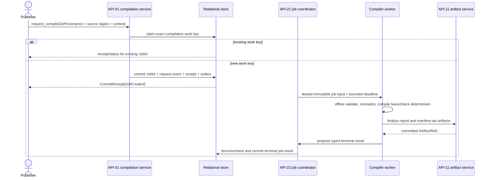

# API-01 Command and Failure Sequences

| Field | Value |
| --- | --- |
| Status | Draft |
| Contract revision | `0.2` |
| Owner | Unassigned |
| Last updated | 2026-07-20 |
| Depends on | [Authoring/publication contract](authoring-and-publication.md), [manifest boundary](manifests-and-packaging.md), shared [commands/receipts](../shared-kernel/commands-receipts-and-errors.md), [ADR 0013](../../decisions/0013-git-native-study-versioning.md), [ADR 0015](../../decisions/0015-governance-out-of-scope.md), and API-11/API-22 draft ports |

These sequences make the intended acknowledgment and crash boundaries explicit.
They do not select a database/object-store/job implementation.

## Capture a named git state and finalize source

```mermaid
sequenceDiagram
    actor Author
    participant C as Local capture (mug tooling)
    participant O as API-11 artifact service

    Author->>C: publish(version_string, note)
    C->>C: resolve HEAD commit SHA
    C->>C: diff working tree; if dirty, produce patch bytes
    C->>O: stage/finalize normalized AuthoringDocument
    O-->>C: committed source ArtifactRef
    C->>O: stage/finalize patch artifact (dirty trees only)
    O-->>C: committed patch ArtifactRef
    C->>C: bind GitProvenance {commit, branch?, remote?, dirty, patch?}
```

Capture creates no platform aggregate state. A commit that cannot be resolved
is `git.provenance_unavailable`; a dirty tree whose patch cannot be captured
is `git.patch_capture_failed`. A finalized artifact left behind by a later
conflict is an unreferenced object under API-11 orphan policy. The captured
pair (commit + patch) plus the finalized source digest names the exact
compilation input; there is no draft head to race against.

## Request and complete compilation



Scientific invalidity completes the job with a `valid=false` report and no
publishable candidate. Worker crash/dependency outage is a job failure/retry,
not an invalid study. Equal work inputs with unequal output quarantine the
compiler build; neither output becomes a terminal publishable candidate.

## Publish novel content under a version string

```mermaid
sequenceDiagram
    actor Publisher
    participant G as Request gateway
    participant P as API-01 publication service
    participant O as API-11 artifact service
    participant D as Relational Unit of Work
    participant X as Outbox consumers

    Publisher->>G: publish(candidate, version_string, expected study, warnings, idem key)
    G->>P: exact validated payload + trusted context
    P->>O: verify finalized/readable transitive artifact closure (incl. patch)
    O-->>P: committed integrity/status generation
    P->>P: validate schemas, privacy, closure, candidate, string
    P->>D: begin; lock Study
    P->>D: recheck study revision and API-11 committed metadata generation
    P->>D: enforce unique (study, scientific digest) + string reservation
    P->>D: insert version + string binding + GitProvenance + receipt + event + outbox
    D-->>P: atomic commit with stream position
    P-->>Publisher: CommitReceipt[StudyVersionPublished]
    D-->>X: deliver outbox after commit
```

No object-store or provider I/O occurs while the relational transaction is
open. Live readability is verified immediately before it; the transaction
rechecks the committed API-11 artifact metadata/integrity generation. An outage
that begins after commit is a later availability incident and does not falsify
the historical receipt.

## Lost reply, identical-content resolution, and string collisions

```mermaid
sequenceDiagram
    actor Publisher
    participant P as API-01 publication service
    participant D as Relational Unit of Work

    Publisher->>P: publish(candidate A, string "2.1", key K1)
    P->>D: atomic novel publication
    D-->>P: committed receipt R1/version V
    Note over P,Publisher: reply is lost
    Publisher->>P: retry exact command with K1
    P->>D: lookup same scope/key/fingerprint
    D-->>Publisher: byte-equivalent original R1; no new event

    Publisher->>P: publish byte-equal candidate, string "2.1", new key K2
    P->>D: preflight; lock; find V by unique digest + string
    P->>D: commit reuse event + receipt R2; no version/ordinal mutation
    D-->>Publisher: R2 resolves existing V

    Publisher->>P: publish byte-equal candidate under NEW string "2.2"
    P-->>Publisher: publication.content_already_published (names "2.1")

    Publisher->>P: publish different candidate under USED string "2.1"
    P-->>Publisher: publication.version_string_reserved
```

`R2` cannot be `R1`: a receipt's command ID and idempotency key are immutable.
The explicit `study_version.publication_resolved_existing` fact gives `R2` a
canonical stream position while preserving exactly one version and one
`study_version.published` fact. Both collision rejections are terminal domain
errors with no catalog effect and no consumed ordinal or reservation.

## Crash and conflict table

| Failure point | Durable/visible result | Safe continuation |
| --- | --- | --- |
| Before idempotency/work claim | Nothing | Retry same command |
| Commit unresolvable or patch capture fails | Nothing | Fix repository state; retry |
| After source/patch artifact finalization, before job or publication commit | Unreferenced artifacts only | Retry; orphan cleanup later |
| During publication relational Unit of Work | No partial version/string/event/receipt/outbox | Retry same command |
| After relational commit, before reply | Complete immutable receipt and effect | Same key returns original receipt |
| Compiler worker lost before terminal job commit | Existing nonterminal job, no candidate | API-22 retries under lease policy |
| Candidate or patch artifact unavailable during preflight | No publication effect | Restore the artifact or compile a new candidate |
| Study revision changed before commit | Terminal state conflict, no mutation | Refresh and use a new command key |
| Version-string collision detected in transaction | Terminal domain error, no mutation | Choose a new string or republish identical content under the existing one |
| Digest match but canonical bytes differ | Integrity incident/quarantine, no reuse/publication | Operator investigation; never choose one silently |
| Study archived during compilation | Candidate may finish but is not publishable in the archived state | Explicit restore plus fresh preflight |
