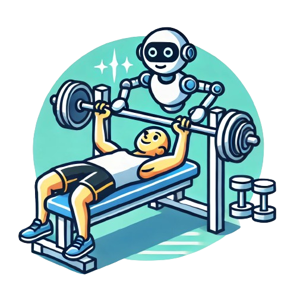

# Multi-User Gymnasium (MUG)


<div align="center">
  
</div>

Multi-User Gymnasium (MUG) converts [Gymnasium](https://gymnasium.farama.org/) and [PettingZoo](https://pettingzoo.farama.org/) environments into browser-based, multi-user experiments. It enables Python simulation environments to be accessed online and run directly in the browser, allowing humans to interact with them individually or alongside AI agents and other participants.

## Installation

```bash
pip install multi-user-gymnasium
```

## From Local Training to Browser-Based Human-AI Experiment

Take any [Gymnasium](https://gymnasium.farama.org/) or [PettingZoo](https://pettingzoo.farama.org/) `ParallelEnv` environment, a policy trained in it, and put them in a participant's browser for human-AI interaction experiments.

<div align="center">
  <video src="assets/images/overcooked_human_ai_experiment.webm" autoplay loop muted playsinline width="600">
    Your browser does not support the video tag.
  </video>
</div>

=== "1. Select an Environment"

    Any Gymnasium or PettingZoo (`ParallelEnv`) environment works. We'll use [CoGrid](https://github.com/chasemcd/cogrid)'s Overcooked Cramped Room for demonstration (see other examples in the sidebar):

    ```python
    import cogrid

    # Standard environment with dict-based observations, actions, and rewards
    # following PettingZoo ParallelEnv interface
    env = cogrid.make("Overcooked-CrampedRoom-V0")
    ```

=== "2. Train an AI Policy"

    MUG doesn't ship a trainer — bring your own ([CleanRL](https://github.com/vwxyzjn/cleanrl), [RLlib](https://docs.ray.io/en/latest/rllib/index.html), [Stable-Baselines3](https://github.com/DLR-RM/stable-baselines3), etc.) and export the resulting policy to ONNX. MUG runs the exported model in the browser via `onnxruntime-web`:

    ```python
    # Train a policy with your algorithm and library of choice,
    # e.g., PPO from RLlib or CleanRL
    policy = ppo.train(env)

    # After training with your framework of choice, export to ONNX:
    policy.export_onnx("cramped_room_policy.onnx")
    ```

    For an end-to-end run on this environment, see CoGrid's [Overcooked JAX training example](https://github.com/chasemcd/cogrid/blob/main/examples/train_overcooked_jax.py).

=== "3. Launch Your Human-AI Experiment"

    MUG renders through the [Surface API](core-concepts/surface-api.md): subclass the env and override `render()` to describe each frame with Surface draw calls.

    ```python
    from cogrid.cogrid_env import CoGridEnv
    from mug.rendering import Surface

    class OvercookedMUG(CoGridEnv):
        def __init__(self, **kwargs):
            super().__init__(**kwargs)
            self.surface = Surface(width=225, height=180)

        def render(self):
            # Draw terrain, agents, held items, etc. with self.surface.image(...),
            # self.surface.circle(...), self.surface.text(...), and so on. Overcooked
            # uses sprites from Carroll et al. (2019).
            return self.surface.commit()
    ```

    Then wire the env and your ONNX policy into a `GymScene`, selecting who (human or AI) will control each agent.

    ```python
    import eventlet
    eventlet.monkey_patch()

    from mug.configurations import experiment_config
    from mug.configurations.configuration_constants import ModelConfig, PolicyTypes
    from mug.scenes import gym_scene, stager, static_scene
    from mug.server import app

    policy_mapping = {
        0: PolicyTypes.Human,
        1: ModelConfig(
            onnx_path="cramped_room_policy.onnx",
            obs_input="input",
            logit_output="logits",
        ),
    }

    game = (
        gym_scene.GymScene()
        .scene(scene_id="overcooked_game")
        .policies(policy_mapping=policy_mapping)
        .rendering(fps=30, game_width=540, game_height=720)
        .runtime(
            # A file that initializes the environment
            # and stores it in a global variable `env`
            #   from overcooked_mug_env import OvercookedMUG
            #   env = OvercookedMUG()
            environment_initialization_code_filepath="overcooked_mug_env.py",
        )
    )

    start = static_scene.StartScene().scene(scene_id="start").display(
        scene_header="Welcome",
        scene_body="You'll play Overcooked with an AI partner. Press continue to begin.",
    )
    end = static_scene.EndScene().scene(scene_id="end").display(
        scene_header="Thanks!",
        scene_body="You're all done.",
    )

    app.run(
        experiment_config.ExperimentConfig()
        .experiment(
            stager=stager.Stager(scenes=[start, game, end]),
            experiment_id="overcooked_hai",
        )
        .hosting(port=8000)
    )
    ```

    The CoGrid env and the ONNX policy both run in the participant's browser via Pyodide — the MUG server only ships scene state and collects data.

!!! note "Server-side mode"

    Environments with dependencies that can't be compiled to WebAssembly (heavy C/C++, CUDA, ...) can instead run on the host, with state streamed to the browser each step. See [Server Mode](core-concepts/server-mode.md) for the server-side execution path.

## Getting Started

- [Installation](getting-started/installation.md) — Complete installation guide including prerequisites and verification steps.
- [Quick Start: Single Player](getting-started/quick-start.md) — Step-by-step walkthrough creating a Mountain Car experiment with custom rendering and Pyodide.
- [Quick Start: Multiplayer](getting-started/quick-start-multiplayer.md) — Step-by-step walkthrough creating a two-player Slime Volleyball experiment with P2P synchronization and GGPO rollback netcode.

## Next Steps

After completing the installation and quick start guides:

- **Learn the architecture**: [Core Concepts](core-concepts/scenes.md) explains how MUG works
- **Explore examples**: [Examples](examples/index.md) shows complete experiments
- **Read detailed guides**: Browse the Core Concepts section for in-depth documentation
