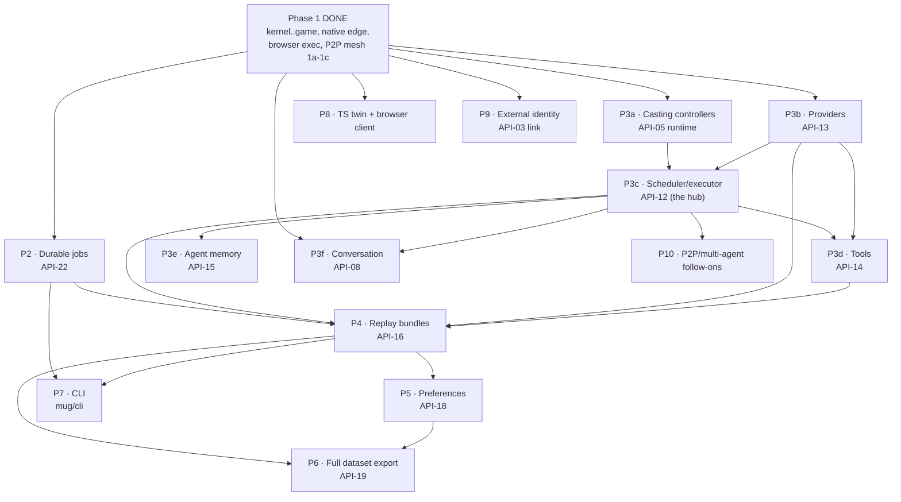

# MUG implementation plan and coding standard (working document)

| Field | Value |
| --- | --- |
| Status | Live v0.3 — Phase-1 native demo COMPLETE (single + multiplayer P2P); records-only foundation COMPLETE for all 22 families; **durable-jobs runtime BUILT (API-22 `mug/workers`)**; **agent stack BUILT through P3f** (P3a casting controllers, P3b providers, P3c scheduler, LLMAgent facade + episode/multi-seat/AEC runners + durable thought tape, **P3d tools, P3e memory, P3f conversation**), now **wired onto the websocket transport** (agent + turn-based game modes) with the **decision tape folded into a replay bundle**; **P4 replay COMPLETE** (`mug/replay/` bundle + safe player/branching + p2p evidence + experienced-stream, contract frozen); **P5 preferences BUILT** (`mug/preferences/runtime.py` annotation loop, contract frozen); **P6 dataset export, P7 CLI, P8 kernel-twin + TS client, P9 external identity, P10 P2P/multi-agent follow-ons all BUILT**; P10 grew into the **authenticated browser P2P transport, built and mounted** (API-09 rev 0.4). EVERY PLANNED PHASE IS DONE, but a **2026-07-26 requirements audit** found four of the seven required north-star capabilities unreachable by a participant and three phases (P4 replay, P5 preferences, API-07 capture) reported complete on a runtime with no caller -- see **§13**, which is now the list of what is left. **W1-W16 and W18-W23 are DONE (2026-07-27)** -- a run records what happened, a participant reaches a preference over trajectories and over model outputs, a form records what was answered, and the study that runs is compiled and published; a study screens who may enter and who may stay, both clients draw every primitive parity asks for and keep an object model, a study declares its assets and they are served by digest, one activity plays several rounds, an interaction records why it ended where an operator can read it, a conversation survives a refresh, two participants and any number of model seats share one conversation with one canonical order, a channel one participant is not in never reaches them, and **the north-star acceptance story runs**: a study writes one map of who plays each of the environment's agents, and two participants, a model partner that plays and talks, and a chat-only coach are one interaction over one stepped environment, which a participant who reloads mid-game comes back into at the seat they left. So capabilities 1, 2, and 4 to 7 are reachable, a questionnaire is no longer discarded, a study can manipulate something and record which condition each participant was given and reached, `mug export` can export a real run, and **legacy removal's two blockers (W12 and W15) are cleared**. **W18 is done too**: the waiting room moved into the shared store behind the store's own revision fence, and both peer-to-peer runtimes now work across processes, so a deployment of several replicas matches two participants with each other rather than leaving each to wait alone. **W19 is done too**: a participant is shown two replies to what they just said, picks one, and the conversation goes on from it -- judged on the author's own axes and with a tie recordable (API-18 revision 0.3, the first schema change since the freeze was gated) -- and the judgement leaves the platform as the flat prompt/chosen/rejected rows a reward model is trained on. **Every item of the §13 register is now closed**, and legacy removal is unblocked. Wiring the export found three records whose own producer overwrote them and one that was never committed at all; each record now heads its own aggregate. **W19-W23 were all added 2026-07-26** by a records-with-no-producer sweep the original audit did not run; the largest was **W21**, now done (see §13e). Gate **2852 pass / 183 skip**. What remains is finishing work, not new families (§0c): the **contract freeze is now pinned and gated for all 22 bundles, with every declared record evidenced** (§12r, §12s; open: no owner sign-off), and **production hardening is BUILT** (§12t: cold-restart job takeover, transport admission and backpressure, telemetry + trace context + operator probes, and the deployment topology note), leaving legacy removal |
| Date | 2026-07-25 |
| Purpose | Track the plan, the repo structure, the coding rules, and the current build state for the MUG runtime |
| Style | This document uses ASD-STE100 Simplified Technical English |

**How we work this document.** §1–§8 and §10 are the governing choices, principles,
and rules; they are settled and still bind the code. §0 is the living status: it
records what is built, what is a demo, and what a complete project still needs.
§3 (structure), §4 (layer graph), and §9 (increments) are kept current with the
landed code. §11 is historical (the Q-\* forks are long resolved). The coding
standard and the repo structure are folded into
`docs/architecture/implementation/` (`coding-standard.md`, `repo-structure.md`).

---

## 0. Where we are now (2026-07-26)

**One-line answer.** Every planned phase (P2–P10) is built. The runtime now
covers all 20 non-tombstoned families, and the maintained gate is **2486 pass,
179 skip**. What remains is not new families. The browser P2P executor, the chat
screen, the mechanical half of the contract freeze, and production hardening are
now done; what is left is the human half of that freeze and the removal of the
12.8k-line legacy runtime that still sits beside the rewrite.

### 0a. Demo vs. complete

**The demo (Phase-1 native slice) -- DONE and green (live Postgres).**
A real participant runs a whole study natively, with no legacy bridge:

- launch-ticket gate (opt-in) admits the participant and enrolls a durable
  pseudonymous identity;
- the flow presents a consent form, then a survey (API-17 content);
- the game activity runs in any of three execution modes over one websocket:
  **server-stepped** (the env steps on the server), **browser** (the env steps in
  the browser through Pyodide and the client reports its run, which the server
  re-executes and verifies), or **peer-to-peer mesh** (two participants rendezvous
  through matchmaking + mesh formation, each runs a deterministic rollback engine,
  and they play one shared, parity-verified episode);
- the flow reaches a debrief, a completion code, and a signed return link;
- the whole visit is durable on Postgres (a restart resumes it), the return link
  survives a restart with a stable signing key, and a researcher exports the
  visit's canonical lineage as JSONL.

This proves the hard cross-cutting shape once on a real slice: typed commands,
receipts, idempotency, the canonical ledger, fencing, privacy, determinism
verification, and durable resume.

**The complete project -- the family runtime is in; the finishing work is not.**
"Complete" meant all 20 non-tombstoned API families with their runtime, plus the
agent stack, the annotation/preference stack, replay bundles, the CLI, the
TypeScript kernel twin and browser client, and external identity. **All of that
is now built** (§12b–§12j). The remaining work changed shape: it is no longer
"write the next family", it is finishing, freezing, and subtracting. See §0c.

### 0b. Family status (all 22 contracts frozen; runtime varies)

| Family | Contract (records + conformance) | Runtime built? |
| --- | --- | --- |
| Shared kernel (L0) | ✅ rev 0.2 | ✅ `mug/kernel` |
| API-11 storage / API-10 events (ledger, UoW, outbox) | ✅ | ✅ `mug/storage` (InMemory/SQLite/Postgres) + `mug/runtime.py` |
| API-22 durable jobs | ✅ records | ✅ runtime: `mug/workers` (idempotent submit + fenced lease + write-once result; `JobQueue` rediscovers queued work after a restart via `Store.scan_aggregates`; `WorkerPool` drains with N concurrent workers); `mug simulate` CLI + mid-flight-crash takeover + contract freeze deferred |
| API-01 authoring / API-02 platform | ✅ | ✅ `mug/authoring`, `mug/platform` |
| API-03 identity / API-04 visits | ✅ | ✅ `mug/identity`, `mug/visits` (+ launch/returns edge); **P9 external identity link built** (`mug/identity/linking.py` one-way blinding + `link_identity` handle-keyed token + `mug/linking.py` boundary: `provision_identity_link`/`resolve_enrollment` round-trip a Prolific/OIDC id to a pseudonymous enrollment with no raw id in any record/event) |
| API-05 casting / API-06 interactions / API-09 client | ✅ (API-09 now rev `0.4`) | ✅ interactions (incl. mesh formation); **P3a casting controllers built** (`mug/game/controllers.py`: local Heuristic/ONNX seat controllers + registry + seat binder over the game loop's `SeatActionSource` seam); **authenticated browser P2P transport built + mounted** (API-09 rev 0.4 added the 11 P2P wire records: `mug/game/p2p_room.py` room core with effect-time authority, `p2p_capture.py` reconciliation, `p2p_pool.py` formation, `mug/client/ice.py` one-use scoped ICE grants, `mug/participant_p2p*.py` coordinator + wire edge, `build_demo_app(browser_p2p=...)`); **the browser game executor is now built too** -- `mug/game/browser_mesh.py` ships the platform's own engine, codec, and driver verbatim into Pyodide, `ts/src/client/p2pGame.ts` plays the episode over the handed-over channels, and the server re-derives the trajectory identity and records one peer-authority episode |
| API-07 game | ✅ | ✅ `mug/game` (server + browser + P2P mesh, capture, determinism verify) |
| API-17 content | ✅ | ✅ `mug/content` (forms, presentation) |
| API-19 export | ✅ | ✅ **P6 COMPLETE** (`mug/export/dataset.py` `export_study_dataset`: reads the whole ledger once, sorts each canonical event into the kinds it belongs to (every event → `events`; api-07 → `trajectories`; api-18 → `preferences`; api-08 → `conversations`), stages one ndjson `ExportBundle` per non-empty kind + a `LineageRecord` naming its source streams + git provenance; rows are payload-free canonical envelopes (digest per row, no raw value), deterministically ordered (stream id then sequence) so the same ledger + injected ids reproduce byte-identical artifacts + digests; per-visit `export_visit` is the seed) |
| API-16 replay | ✅ records | ✅ **P4 COMPLETE** (`mug/replay/bundle.py` `build_replay_bundle`/`validate_replay_bundle`: canonical streams + decision tape + schema bundle as content-addressed artifacts through the `ArtifactStore` seam, pinned in a `ReplayManifest` with an integrity digest, re-read to refuse a divergent bundle; `experienced=ExperiencedInput` widens the scope to the client-side experienced stream + its lineage) + **safe player + branching** (`mug/replay/player.py` `replay_episode`: hermetic re-execution over a snapshot env + recorded actions → per-frame `StateHashCheck` chain + verdict, makes no external call; `fork_replay`: restore a frame + continue under alternate actions) + **p2p evidence** (`mug/replay/p2p.py` `build_p2p_replay_bundle`: closes over mesh membership + frame finalities + episode boundaries + bot authorities + decision results + tape, derives the `P2PFinalityOutcome`, emits a p2p `ReplayManifest`) + browser re-exec verify + `build_decision_tape`; contract frozen against the running code (conformance binds every model to the frozen fixtures) |
| API-08 conversation | ✅ | ✅ **P3f built + MOUNTED** (`mug/conversation/runtime.py` `ConversationChannel`: per-channel sequence ordering + delivery + context snapshots through the command spine, the chat analog of the game loop; `mug/conversation/turns.py` pure `may_activate` turn policy; the scheduler/provider-driven agent reply is `mug/agents/chat.py` `ChatAgent`, above both). **The transport mounts it**: `mug/participant_chat.py` `run_chat_activity` + `ChatSpec`/`ChatSeatSpec` own the socket for the chat activity, `build_chat_on_game` in `mug/participant.py` advances the flow past it, and `build_demo_app(chat=...)` selects chat mode beside the game modes, so a participant reaches a recorded conversation over `/ws` |
| API-12 scheduling / API-13 providers / API-14 tools / API-15 memory | ✅ | ✅ **P3b providers** (`mug/providers/runtime.py` `ModelProvider`) + **P3c scheduler** (`mug/scheduling/runtime.py` `Scheduler.decide` + `ScheduledSeat`) + **P3d tools** (`mug/tools/runtime.py` `ToolBroker`: request→approval→result lifecycle under the approval + egress gates over an injected executor, idempotent replay; `EnvironmentMailbox`) + **P3e memory** (`mug/memory/runtime.py` `MemoryLedger`: read + compare-and-swap with stale-base refusal + provenance) |
| API-18 preferences | ✅ records | ✅ **P5 built** (`mug/preferences/runtime.py` `PreferenceService`: the annotation loop over the command spine -- `assign` (blinded, seed-committed, deterministic display-order permutation) → `respond` (one choice over the presented order) → `attest_quality`, one aggregate per assignment, three-stage stream; idempotent + single-response over the store's fencing: a retry replays, a different second response is fenced, an attestation before the response is refused; `candidate_from_artifact` wires candidates from recorded evidence, e.g. a P4 replay bundle's artifact); contract frozen against the running code |
| API-20 / API-21 | tombstones (removed / retracted) | — |

### 0c. What "complete" still needs

**This list was wrong until 2026-07-26.** It was assembled from the plan's own
history, so it recorded what we knew we had not finished and could not record what
we had never started. A requirements audit against `north-star.md`,
`acceptance-scenarios.md`, and `functional-parity.md` found that **four of the
seven required north-star capabilities are not reachable by a participant**, and
that three phases were reported complete on the strength of a runtime with no
caller.

**§13 is now the list.** It holds the gap register (W1 to W18), what to build for
each, the end-to-end proof that closes it, and the order. In summary:

1. **W1 -- what a run records.** The ledger binds a digest per frame and stores no
   action, reward, observation, termination, or `info`, and no render packet. So a
   trajectory preference has nothing to show, a deterministic replay has no actions
   to re-execute, a visual replay has no frames (and both bundle builders claim
   `visual=True` anyway), and an export carries no dependent variable. This is
   first, and everything else waits for it.
2. **W2, W3 -- preference elicitation.** The runtime and the author facade are
   built and frozen and have no caller; `Study` has no annotation activity, so no
   participant can ever be shown a comparison. Model generations are not durable
   artifacts, so they cannot be candidates.
3. **W4 to W8 -- who can be in a room together. All five are now DONE.**
   Two participants and any number of model seats share one conversation with one
   canonical order, a channel one participant is not in never reaches them, and one
   activity is a game **and** a conversation -- one interaction with both channels,
   each ordered as what it is, related by causation and by which frame was on
   screen when each thing was said, and a model partner plays **and** comments --
   reading one reply for an action, a thought, and the words the others read. And
   **the north-star acceptance story runs**: a study writes one map of who plays
   each of the environment's agents (`seats={"car": Human(), "traffic-light":
   Model(controller)}`), two participants and a model partner step one environment
   in one interaction, and a participant who reloads mid-game sits back down at the
   seat they left.
4. **W9 to W11, W14, W16 -- study composition. All five are now DONE.** A study
   manipulates something and records which condition each person was given and
   reached, it screens who may enter and who may stay, one activity plays several
   rounds, a conversation outlives its connection, and what a participant carries
   between activities is a declared namespace with a read/write policy that a
   later part of the study receives only if it declares it (NS-08).
5. **W12, W13, W15 -- what legacy still did better. All three are now DONE.** Both
   clients draw every required primitive and keep an object model, a study declares
   its assets and they are served by digest, and an interaction records why it ended
   where an operator can read it. **These were legacy removal's blockers, and they
   are cleared.**
6. **W17 and the two standing items.** The Unity and WebGL adapter is an owner
   decision (build, or remove by ADR). **W18 is now DONE**: two participants the load
   balancer sent to two replicas are matched with each other, and both peer-to-peer
   runtimes work across processes (§12t). **Legacy removal** (§10) is now unblocked,
   with the parity fixtures as its gate. **No bundle carries an owner sign-off**
   (§12r) -- the adversarial panel is a person's work.

What *is* finished, and audited as finished: the evidence spine and the three
store backends, publication and deployment, launch tickets and signed return links,
blinded external identity, peer-to-peer rollback with reconciliation and
quarantine, browser execution with server verification, durable jobs, the CLI, the
contract freeze, and production hardening (§12t). NS-08, NS-09, NS-11, and NS-12
hold up.

### 0d. How the demo maps to the plan's increments

Increments 1–4 (§9) are done, and the build then went past the plan into a
**native realtime demo spine** (milestones M0–M8) plus **durable/deployable**,
**browser execution + verification**, **launch auth**, **signed return links**,
and **multiplayer P2P (Phases 1a–1c)**. §9 now tracks this.

---

## 1. Locked foundational choices (from your decisions, 2026-07-20)

| Choice | Decision | Consequence for this plan |
| --- | --- | --- |
| Typed objects + validation | **Pydantic v2 models; the frozen JSON-Schema corpus stays the authoritative contract** | Pydantic gives the FastAPI edge and (de)serialization for free. A conformance test binds the models to the frozen schemas, so the models never drift into a second source of truth. |
| Concurrency | **asyncio-native** | The server, the workers, and all I/O use `async`/`await`. `env.step()` and pure compile/validation stay synchronous. No monkeypatch. |
| Repo layout | **Fresh `mug/` package + a `ts/` workspace** | Build a clean Python package. Remove the legacy runtime; git keeps its history. Add a small TypeScript workspace for the browser kernel twin. |
| Transport framework | **FastAPI (edge only)** | FastAPI owns routing, websockets, dependency injection, and OpenAPI. It does not own domain modeling. |

### 1a. Pydantic with a schema-authority rule (no drift)

Pydantic pairs naturally with FastAPI, so the edge gets typed routing,
(de)serialization, and OpenAPI for free. The risk is that a Pydantic model
becomes a second, drifting copy of the contract. We remove that risk with one
rule: **the frozen JSON-Schema corpus stays the authority; the Pydantic models
serve it.** Concretely:

- One Pydantic v2 model per contract typed object. FastAPI uses these models
  directly at the edge.
- A conformance test binds the models to the frozen schemas: every frozen
  fixture that the schema accepts must parse into its model, and every model must
  reject what the schema rejects. This test fails the build on any drift.
- Canonicalization and digests never use Pydantic's serializer. Digested content
  passes through the kernel RFC 8785 canonicalizer on `model_dump(mode="json")`
  output. The schema corpus and `canonical.py` remain the only contract authority.
- Pydantic's model machinery (its metaclass and validators) is an accepted
  dependency at the data-definition layer. The "no magic" rule (P4) still binds
  our own code: no metaclasses or dynamic attribute tricks in domain or service
  logic.

This keeps the contract single-sourced in the schema, keeps digests independent
of Pydantic, and still gives us the FastAPI ergonomics.

---

## 2. Coding principles (the core of what you asked for)

These principles rank **simplicity, readability, and minimal abstraction** above
cleverness, reuse, and speculative flexibility. The legacy runtime shows the
failure mode we reject: `app.py` is 107 KB, `game_manager.py` is 76 KB, and
`gym_scene.py` is 50 KB. These are god-modules. The rules below prevent them.

### P1 — Write data and functions first; add a class only for real state

- Represent contract objects as frozen Pydantic models. They hold data, not
  behavior. Do not add methods that carry domain logic to a model.
- Write behavior as module-level functions that take data and return data.
- Add a stateful class only when an object owns mutable state and identity (for
  example a live interaction, a lease holder, a unit of work). Do not model these
  with Pydantic; they are runtime state, not wire data.
- Do not wrap a single function in a class. Do not build a "Manager" or
  "Service" class that only groups functions; a module already groups functions.

### P2 — Abstract only at proven seams; never speculatively

- Define an interface (a `typing.Protocol`) only at a true external seam:
  storage, object store, model provider, tool transport, clock, and the wire.
  These are the MUG-owned protocols the API standard already names.
- Do not define an interface for internal code. Call the function directly.
- Apply the rule of three: do not extract a shared abstraction until three real
  call sites need it. Two call sites duplicate; the third justifies the shape.
- A small amount of duplication is cheaper than the wrong abstraction.

### P3 — Keep a pure core and an imperative shell

- Domain logic (compile, validate, randomize, order, classify, fingerprint) is
  pure and synchronous. It takes data and returns data or a typed error.
- I/O lives at the edges (the server, the repositories, the adapters) and is
  `async`. The pure core never calls the network, the database, or the clock.
- This makes the core easy to test with plain values and no mocks.

### P4 — Make control flow explicit

- Do not use metaclasses, `__getattr__`/`__setattr__` magic, dynamic attribute
  injection, or import-time side effects.
- Do not hide control flow in decorators. A decorator may add a cross-cutting
  concern (tracing, retry at a seam). It must not change what a function returns.
- Prefer an explicit `if` to a registry lookup when the set of cases is small
  and closed. Closed vocabularies stay closed (ADR 0015).

### P5 — Keep modules and functions small

- A module has one clear responsibility. Soft cap: **400 lines**. Above it,
  split by responsibility, not by line count.
- A function does one thing. Soft cap: **40 lines**. A function above the cap
  usually hides two functions.
- A public function takes few arguments. Above four, pass a small frozen object.
  Use a Pydantic model for a wire or contract object; a plain frozen dataclass is
  fine for a purely internal parameter bundle.

### P6 — Let dependencies point inward, along the layer graph

- The kernel depends on nothing in MUG. Each family depends only on the kernel
  and on the families the layer graph (§4) allows.
- A family never imports a sibling that its contract does not list as a
  dependency. We enforce this with an import linter in CI (§9).
- A lower layer never imports a higher layer.

### P7 — Errors are typed values from the shared taxonomy

- Return or raise only the kernel `DomainError` taxonomy across a boundary.
- Never leak a provider stack trace, a credential, prompt text, or protected
  participant data into an error (API standard §Errors).
- Fail closed. An unknown state, an expired lease, or a stale generation rejects
  the effect.

### P8 — Name code after the contract vocabulary

- Use the glossary terms for types, functions, and files (enrollment, visit,
  seat, actor, controller, interaction, lease, receipt). One term, one meaning.
- Do not invent a synonym for a contract term. Consistent names make the code
  readable next to the contracts.

### P9 — Type everything; run the checker strict

- Every function has full type hints. `from __future__ import annotations` at
  the top of every module.
- The type checker runs in strict mode in CI. New code adds no `type: ignore`
  without a reason comment.

### P10 — Comments and docstrings state intent, in Simplified Technical English

- Write a docstring for every public function, class, and module. State what it
  does and the contract it serves. Keep sentences short and active.
- Do not comment on obvious code. Comment on a non-obvious decision or a
  contract rule the code enforces.

---

## 3. Repo and package structure

One repository. The domain packages live under `mug/`. Name a package after the
domain, not the API number. The legacy runtime stays in the tree under
`mug/server`, `mug/scenes`, `mug/configurations`, `mug/rendering`, `mug/utils`,
`mug/webclient`; the import linter forbids the new runtime from importing it, and
we port behavior, not code. The `mug/cli` package is built (§12g). The `ts/`
TypeScript workspace now holds the **kernel twin** (§12h); its browser
participant client half stays planned.

**Landed shape (2026-07-22).** The families keep the uniform §3a shape. Two things
differ from the original sketch:

1. The evidence-foundation runtime (the canonical ledger, the unit of work, the
   outbox, and the command/receipt spine) is centralized in **`mug/runtime.py`**
   plus **`mug/storage/`**, not spread into `events`/`jobs` service modules. The
   `events` and `jobs` packages hold their frozen records.
2. The ASGI edge is **not** one `mug/server` package. It is a set of top-level
   runtime modules that compose the demo: `app.py` (the composition root),
   `edge.py` (the HTTP command surface), `realtime.py` (the websocket transport),
   `gateway.py` (the one entropy + context boundary), `participant.py` (the flow +
   game + mesh glue), `launch.py` (launch tickets), `returns.py` (signed return
   links), and `runtime.py` (the command/ledger spine).

```text
mug/                          # Python package (the runtime)
  kernel/                     # L0 — ids, refs, canonical, schema, typed_object,
                              #      command(+types), errors, clock, privacy, _base
  storage/                    # API-11 — store.py, ports.py, InMemory/SQLite/PgStore
  events/  jobs/              # API-10 / API-22 — frozen records (ledger runtime is in runtime.py)
  runtime.py                  # the command + canonical-ledger spine (commit_command/commit_capture)
  authoring/  platform/       # API-01 / API-02 — compiler + publication; deploy + secrets
  identity/  visits/          # API-03 / API-04 — enroll + tickets; visit plan + flow lifecycle
  casting/  interactions/  client/   # API-05 / API-06 / API-09 — records; mesh-formation service
  game/                       # API-07 — env, surface, runtime(server loop), browser, capture,
                              #      determinism, mesh(rollback engine), multiagent, mesh_session, spec
  conversation/               # API-08 — frozen records (runtime not built)
  scheduling/ providers/ tools/ memory/   # API-12–15 — frozen records (agent runtime not built)
  replay/                     # API-16 — records + verify.py (browser re-exec); bundles deferred
  content/                    # API-17 — forms + presentation service
  preferences/                # API-18 — frozen records (annotation runtime not built)
  export/                     # API-19 — JSONL query/export/lineage service
  # the ASGI edge (top-level runtime modules, not a package):
  app.py  edge.py  realtime.py  gateway.py  participant.py  launch.py  returns.py
  webclient/                  # the static client shell the demo serves (index.html + assets)

  # legacy runtime (kept in tree, import-forbidden, ported by behavior only):
  server/  scenes/  configurations/  rendering/  utils/

examples/                     # study entrypoints (mountain_car native/browser demos,
                              #   cogrid overcooked, footsies, slime_volleyball)

ts/                           # ✅ P8 COMPLETE (§12h) — src/kernel = @mug/kernel twin
                              #   (canonical, digest, ids, typed-object) + src/client =
                              #   the participant client (wire, session, renderer,
                              #   browserGame, ui, client, bootstrap). tsc 5.9 on node 20;
                              #   CJS build (conformance) + ESM web build (build:web),
                              #   zero runtime deps. Cross-language conformance vectors +
                              #   client wire test + Chromium study-completion e2e.
mug/cli/                      # ✅ BUILT — mug publish/deploy/export/replay/simulate (§12g)

tests/
  architecture/              # the frozen contract corpus + conformance (per-API fixtures)
  unit/                      # per-module + per-family tests (kernel..app, game, mesh)
  e2e/  e2e_native/          # legacy parity e2e + native browser (playwright) slice
```

### 3a. Inside a family package (uniform shape)

Every family package uses the same internal shape. The shape makes any family
readable once you learn one.

```text
mug/<family>/
  __init__.py        # the public surface of the family (re-exports only)
  types.py           # frozen Pydantic models for the family's typed objects
  service.py         # the application command/query functions (async at the edge)
  <domain>.py        # pure domain logic modules, split by responsibility
  ports.py           # Protocols this family needs from lower layers (if any)
  errors.py          # family-specific error detail shapes (codes stay in kernel)
```

- `service.py` holds the command handlers. A handler validates, builds context,
  calls pure domain functions, and commits through a repository port.
- Pure domain logic never sits in `service.py`. It sits in a `<domain>.py`
  module and returns data.

---

## 4. The layer graph (as enforced by import-linter)

Dependencies point inward. This is the **actual** `import-linter` "Layered
architecture" contract in `pyproject.toml` (top = outermost), kept in sync with
the code. A `|` row lists independent siblings that do not import one another.

```text
mug.app                                   # composition root
mug.participant | mug.launch              # flow/game/mesh glue; launch tickets
mug.edge | mug.realtime                   # HTTP command surface; websocket transport
mug.gateway                               # the entropy + context boundary
mug.export                                # API-19
mug.replay | mug.content | mug.preferences
mug.scheduling | mug.providers | mug.tools | mug.memory
mug.game | mug.conversation               # API-07 / API-08
mug.casting | mug.interactions | mug.client
mug.identity | mug.visits
mug.authoring | mug.platform
mug.runtime                               # command + ledger spine
mug.storage | mug.events | mug.jobs | mug.returns
mug.kernel                                # depends on nothing in mug
```

A second contract, "New runtime does not import the legacy runtime," forbids every
new module from importing `mug.server`, `mug.scenes`, `mug.configurations`,
`mug.rendering`, or `mug.utils`. Both contracts are green.

Note the graph grew past the original L0–L8 sketch: the edge is now several
top-level layers (`app` > `participant|launch` > `edge|realtime` > `gateway`), and
`runtime`/`returns` were added as their own layers. The API-family → package
mapping in §0b still holds; the ordering here is the one CI enforces.

---

## 5. Implementation rules that bind to the contracts

These rules make the code match the API design standard and the shared kernel.

### 5a. Typed objects

- One frozen Pydantic v2 model per contract typed object
  (`model_config = ConfigDict(frozen=True, extra="forbid")`).
- The model field names match the schema property names exactly.
- The model parses and validates the payload. A conformance test binds the
  model to the frozen schema (§1a), so the schema stays the authority.

### 5b. The wire boundary

- Every inbound payload parses into its Pydantic model at the edge. The model
  and the frozen schema agree by the §1a conformance test.
- Every outbound object serializes with `model_dump(mode="json")`.
- A digest never uses the Pydantic serializer. Digested content passes through
  the kernel `canonical.py` (RFC 8785) on the dumped JSON. No other canonicalizer
  exists in the code.

### 5c. Commands and receipts

- A command handler returns a typed receipt (`IngressReceipt`, `CommitReceipt`,
  or `ArtifactCommitReceipt`) or a `DomainError`. It never returns a bare success.
- The gateway builds the trusted `CommandContext` from verified state. A handler
  never trusts a client-supplied scope.
- A `CommitReceipt` commits the aggregate, the idempotency record, the canonical
  event, and the outbox in one unit of work.

### 5d. Idempotency and concurrency

- Each command declares one retry policy from the kernel set.
- The unit of work checks the expected revision. A scientific decision
  (randomization, preference assignment) never silently retries on conflict.

### 5e. Async rules

- The server, the repositories, the workers, and the adapters are `async`.
- No code performs provider, tool, database, or object-store I/O while it holds
  an environment mutation lock (API standard §Async).
- A blocking call (a CPU-bound compile, a sync library) runs in a thread via
  `asyncio.to_thread`. The core stays pure and sync; the shell offloads it.

### 5f. Privacy and secrets

- Every persisted field carries or inherits a `DataHandlingRef`. The classifier
  lives in `kernel/privacy.py`.
- Secret material never enters a model, an event, an artifact, a log, or an
  export. Code references a secret only by `SecretRef`.

---

## 6. The kernel twin (Python and TypeScript)

- The Python `kernel` and the TypeScript `ts/kernel` implement the same wire
  behavior: canonicalization, digest, ID encoding, and typed-object envelopes.
- The two share one set of conformance vectors under `tests/conformance`. A CI
  job runs the vectors in both languages and asserts byte-identical output.
- The G5 work already proved this for canonicalization. We extend the same
  pattern to IDs and the typed-object envelope.
- The TypeScript side stays small. It holds only what the browser needs.

**Status (2026-07-23): BUILT.** The `ts/` workspace holds `@mug/kernel` — the twin
of canonicalization, digest, ID encoding, the shared scalar formats, and the
typed-object envelope. Shared conformance vectors under `tests/conformance/`
prove Python == TypeScript byte for byte (§12h). The twin is now the base of the
native TypeScript participant client under `ts/src/client/` (§12h): the client
mints its `RealtimeCommand` payload digests through the twin, so it digests a
value exactly as the server does, and a browser-free wire test asserts each
digest equals the Python digest byte for byte on a real wire payload.

---

## 7. Testing strategy

- **Contract fixtures are the acceptance tests.** Each family's frozen
  valid/invalid/duplicate/conflicting fixtures become the pass/fail gate for its
  `types.py` and `service.py` (backlog exit condition).
- **Unit tests** cover the pure domain modules with plain values. No mocks.
- **Integration tests** run a family against a real local backend (Postgres via
  `asyncpg`, local-filesystem object store) with fault injection from the failure
  matrix.
- **Conformance tests** run the kernel vectors in Python and TypeScript.
- **E2E tests** run the Phase-1 slice in a real browser with Playwright.
- Test files mirror the package path. `mug/identity/service.py` →
  `tests/integration/identity/test_service.py`.

---

## 8. Tooling

| Concern | Tool | Note |
| --- | --- | --- |
| Package + venv | **uv** | Already in use. |
| Lint + format + import sort | **ruff** | Replaces isort/pyupgrade/pycln. One tool, fast. |
| Type check | **pyright** (strict) | Native Pydantic v2 inference, no plugin. |
| Import boundaries | **import-linter** | Enforces the §4 layer graph in CI. |
| Tests | **pytest** + **pytest-asyncio** | asyncio mode. |
| TS toolchain | **tsc 5.x** on **node 20** (`ts/.nvmrc`, `engines: node>=18`) | Kernel twin built; zero runtime deps. Compile `target` stays ES2019 so the shipped browser twin and the conformance runner run on any modern browser or an old node. |
| Pre-commit | modernized | Replace the aging hook set with ruff + the type checker. |

---

## 9. Increments — status and roadmap

The plan built the smallest end-to-end vertical first, then scaled it. Increments
1–4 are done; the build then went past the plan into a runnable native demo.

### 9a. Done

- **Increment 1 — kernel + evidence foundation.** ✅ `kernel`, `storage`
  (InMemory + SQLite + Postgres/asyncpg, unit of work, outbox), the canonical
  ledger + command/receipt spine (`runtime.py`), errors, clocks, privacy. Every
  hard cross-cutting rule (idempotency, receipts, fencing, privacy) is proven.
- **Increment 2 — authoring + deploy.** ✅ `authoring` (compiler, git provenance,
  publication), `platform` (deploy/stop, deployment revisions, secret refs).
- **Increment 3 — identity + visits.** ✅ `identity` (enroll, launch ticket),
  `visits` (visit plan, flow, lifecycle).
- **Increment 4 — interaction fabric + game.** ✅ `casting`, `interactions`
  (incl. the mesh-formation runtime), `client`, `game` (server loop, browser
  exec, capture), `content` (forms), `export` (JSONL).
- **Native realtime demo spine (M0–M8, past the original plan).** ✅ The FastAPI
  edge + websocket transport + gateway + participant glue that runs one study end
  to end: forms → game → debrief → completion code. M5 canonical capture, M6
  completion + JSONL export, M8 browser/Pyodide execution.
- **Durable + deployable.** ✅ Non-destructive `PgStore.open`, `MUG_PG_DSN`-driven
  store selection, reconnect-resume, real-browser Playwright e2e.
- **Determinism verification.** ✅ The server re-executes a browser run and refuses
  a divergent one (shared state-hash hook + verifier).
- **Launch auth + signed return links.** ✅ Opt-in launch-ticket gate; HMAC-signed,
  restart-stable resume tokens.
- **Multiplayer P2P (Phases 1a–1c).** ✅ 1a: the deterministic GGPO rollback engine
  (`game/mesh.py`). 1b: the PettingZoo-parallel multi-agent replica adapter
  (`game/multiagent.py`, the CoGrid Overcooked shape) + the mesh-formation runtime
  (`interactions/service.py`). 1c: the end-to-end app-layer glue
  (`game/mesh_session.py` `MeshSession` + `participant.py` `MeshMatchmaker` +
  `app.py` `mesh_game` mode) -- two participants rendezvous, play one shared
  parity-verified episode, and complete.

State: the maintained tree is **2084 pass, 175 skipped**, observed, not projected.
The selection is `tests/unit tests/conformance tests/architecture` with nvm node
20 sourced and the four legacy eventlet modules ignored
(`test_heuristic_policy`, `test_latency_fifo_integration`,
`test_server_game_integration`, `test_server_game_lifecycle`); `tests/e2e` stays
out, because its event-loop policy pollutes async collection for the shared unit
tree. Ruff and strict Pyright are clean over every included path in `mug/`, and
both import-linter contracts hold. Pyright still reports a standing backlog in
the five excluded legacy test modules; that backlog predates the rewrite and is
untouched.

Run the node-20 build of `ts/` before the gate: `tests/conformance` executes the
TypeScript kernel twin, the client wire, and the browser P2P edge from `ts/dist`,
so a stale `dist` hides a real regression rather than failing.

### 9b. Remaining (to a complete project)

**The phase roadmap is finished.** P2 (durable jobs) → P3 (the agent stack) → P4
(replay bundles) → P5 (preferences) → P6 (full export) → P7 (CLI) → P8 (browser
twin + client) → P9 (external identity) → P10 (P2P follow-ons, and the
authenticated browser P2P transport it grew into) are all built; §12 keeps the
per-phase detail and each one's definition of done.

What remains is finishing work, not new families -- see **§0c** for the list and
the order. In short: the human half of the per-family contract freeze (G0–G8,
mechanically done in §12r and evidenced in §12s) and removing the 12.8k-line legacy
runtime. The browser P2P game executor, the chat transport mount, and production
hardening (§12t) are done.

Each family still lands under the §9c definition of done and freezes its contract
bytes against the running code (the deferred per-family G0–G8 from the Phase-0
close). That freeze is now half done: §12r pins every bundle's
bytes to the digest the running code loads and gates any change that is not
recorded, §12s closes the last records no fixture reached, and
`docs/architecture/phase-0/contract-freeze.md` tracks the state. What is left is
the human half -- the adversarial panel and the owner's sign-off.

### 9c. Definition of done for a work item

A work item is done when:

1. Its package matches the §3a shape and the §2 principles.
2. Its contract fixtures pass as acceptance tests.
3. Its failure-matrix rows have fault-injection tests.
4. The type checker and the import linter pass.
5. **The family's contract bytes freeze against the running code** — this is the
   deferred per-family G0–G8 from the Phase-0 close. We freeze each family when
   its code proves the shape, not before.

---

## 10. What we remove and what we keep from the legacy runtime

- **Remove** the legacy `mug/server/app.py`, `game_manager.py`, the eventlet
  stack, and the flask-socketio edge. The rewrite does not port the god-modules.
- **Keep as reference** (in git history) the parity-audit intricacies register:
  the preserve/fix/do-not-port findings (RP-1..RP-10). We port behavior, not code.
- The parity fixtures become integration gates (backlog exit condition).

---

## 11. Open questions — RESOLVED (historical, 2026-07-20)

These forks were resolved before the build started. The resolutions all held: the
code runs on Postgres/asyncpg behind the storage port, pyright strict, ruff, and
import-linter. Kept for the record.

| ID | Question | Resolution |
| --- | --- | --- |
| **Q-1** | Database for the local backend in Increment 1. | **Postgres via `asyncpg`**, behind the storage Protocol. A lighter fake backs unit tests. |
| **Q-2** | Object store for artifacts in Increment 1. | **Local filesystem** behind the object-store Protocol. An S3/MinIO adapter drops in later at the same seam. |
| **Q-3** | Line-count caps in §5 (400 module / 40 function). | **Guidance only.** CI warns; it does not fail the build. A hard cap invites bad splits. |
| **Q-4** | Type checker — pyright or mypy, strict. | **pyright, strict.** Native Pydantic v2 inference, no plugin, fast. |
| **Q-5** | Where the coding standard lives. | **Both.** The full standard under `docs/architecture/implementation/`; a short pointer in `CONTRIBUTING.md`. |
| **Q-6** | Start Increment 1 now, or review first. | **Start now.** Fold the standard into `docs/`, then scaffold the `kernel` package (backlog item 1). Review as the code lands. |

---

*Status (2026-07-25): the standard and structure are folded into
`docs/architecture/implementation/`. Increments 1–4, the native Phase-1 demo
(single + multiplayer P2P), and every phase P2–P10 are built and green (2084
pass, 175 skip; live Postgres). The governing rules (§1–§8, §10) hold unchanged.
§0c is the source of truth for what is left; §12 keeps the per-phase detail and
§12k the cross-cutting tracks that are now the remaining work.*

---

## 12. The phase roadmap (all phases COMPLETE, 2026-07-25)

> **Read this section as history plus per-phase reference.** Every phase below is
> built. It is kept because each entry records what a phase built, where it lives,
> and what it was proven by. The work that is still open is **§0c** (finishing) and
> **§12k** (the cross-cutting tracks, which are now the remaining work).

This section lays out every phase from the Phase-1 demo to a complete project. It
is dependency-ordered. Each phase builds the runtime over an already-frozen
contract, plugs into named seams, and freezes its contract bytes against the
running code at the end (the deferred per-family G0–G8). Sizes are indicative
(S/M/L), not estimates.

The rule that shapes the order: build a family only after the families its
contract lists as dependencies (the api-catalog "referenced by" graph). The agent
stack is the center of gravity -- casting controllers and the scheduler are the
hub that providers, tools, memory, conversation, and replay all attach to.

**Sequencing decision (2026-07-22): build for the easiest integration, not to ship
a study.** There is no urgency to stand up a full agent study, so the order favors
the family that (a) depends only on what is built, (b) reuses the existing spine
instead of adding a new concept, and (c) unblocks the most downstream work. That is
**P2 (durable jobs)** -- so P2 is the first step taken, ahead of the agent stack.
Its correctness core is now **built** (see 12b). The agent stack (P3) still comes
next after P2, but it is sequenced as the integration path allows, not rushed to a
demo.

### 12a. The connection graph



**The critical path to a "full agent study" is:** DONE → ~~P3a + P3b → P3c → P3d, P3e,
P3f~~ (the whole agent stack BUILT 2026-07-22, now wired onto the transport) →
~~P4 (replay bundles)~~ (COMPLETE 2026-07-22: bundle + safe player/branching + p2p
evidence + experienced-stream, contract frozen) → ~~P5 (preferences)~~ (BUILT
2026-07-22, contract frozen) → ~~P6 (full dataset export)~~ (COMPLETE 2026-07-23:
`export_study_dataset` reads the whole ledger and produces one payload-free,
reproducible ndjson bundle + lineage per non-empty dataset kind) → ~~P7 (the
CLI)~~ (COMPLETE 2026-07-23: `mug/cli` = `mug publish/deploy/export/replay/simulate`
over a shared `dispatch_command`; `mug stop` reports a platform gap). **The agent-
study critical path is now DONE.** P2 runs in parallel and underpins P4/P7.
P8/P9/P10 are independent tracks that do not block the agent stack.

### 12b. P2 — Durable jobs runtime (API-22) · size M · BUILT (2026-07-22)

- **Built (the dispatch layer -- `mug/workers.py`, +7 tests).** `JobQueue` is a
  durable-backed index of jobs ready to claim: a live submit offers its job id, and
  a restart calls `rebuild(store)` to fold the store's committed state, so a worker
  rediscovers work that was accepted but never started. Rediscovery reads a new
  `Store.scan_aggregates` read (added to the port + all three backends) and covers a
  *queued* job -- one whose aggregate head is still its `JobRequest`, which still
  names the `work_key` the completion needs. `WorkerPool` drains the queue with N
  concurrent workers, each of which claims a lease, runs an injected handler, and
  completes the job; the fenced lease makes the whole pool safe (two workers that
  race one job resolve to one success). The pool owns no clock/entropy -- it takes a
  context factory that mints a fresh `CommandContext` per op, like every family
  service. Proven: a queued job drains to a recorded success; a fresh queue rebuilt
  from the store rediscovers it; a claimed/terminal job is not rediscovered; a
  duplicate offer is ignored; a job that lost its queued head is skipped (no
  double-run); four concurrent workers each take a distinct job; the loops drain
  between `start`/`aclose`.
- **Built earlier (the correctness core -- `mug/workers.py`, +9 tests).** `JobRunner`
  drives
  the three frozen records through the shared command spine, so a job's lineage is a
  canonical event stream. It reuses the store's own generation fencing rather than
  adding a durability primitive: a job's id is its aggregate/stream; the caller
  content-addresses the `job_id` from the `work_key`, so a duplicate work key
  coalesces on the store's existence guard; a claim carries a fencing generation
  equal to its attempt, so the store installs a strictly greater generation and
  refuses a superseded worker's completion (`lease.stale_generation`), with the
  revision guard as a second refusal. Proven: submit records a queued job; a
  duplicate work key is coalesced; an identical submit replays (NS-10); a second
  worker is refused a held lease; an expired lease is taken over and the stale worker
  is fenced; a success binds the result digest on the lineage; a failure names no
  artifact. New module sits on the `authoring | platform | workers` layer (imports
  only downward: jobs, runtime, storage, kernel).
- **Deferred.** Mid-flight-crash takeover after a *cold* restart: a job a worker had
  already claimed carries a `JobRun` head that does not retain the `work_key`, so
  re-completing it needs the request retained beside the run (a dual-head or a
  request-retaining projection) -- the same-process live pool still takes over an
  expired lease when the caller holds the key. The headless `mug simulate` batch
  runner (P7 CLI territory); compile-at-publish as a wired first job kind; contract
  freeze API-22.
- **Plugs into.** `mug/runtime.py` (command spine), `mug/storage` (UoW + the fencing
  claim already in `kernel/clock.py`; the new `scan_aggregates` read).
- **Depends on.** DONE (kernel, storage, ledger). **Unblocks.** Offline replay at
  scale (P4), agent batch/simulation, the CLI's `simulate`/`replay` (P7).
- **DoD.** ✅ fault-injection tests for lease expiry + duplicate work key + take-over
  fencing; ✅ a restarted worker *rediscovers* queued work (`JobQueue.rebuild`);
  ⚠️ remaining: mid-flight-crash takeover across a cold restart; contract freeze
  API-22.

### 12c. P3 — The agent stack (the largest body of work)

The whole point is to let a non-human controller occupy a seat or a chat turn,
decide with a model and tools, and record every decision as canonical evidence.
It is six sub-phases around one hub (P3c).

**P3a — Casting controllers (API-05 runtime) · size M · BUILT (2026-07-22).** The
seat-authority seam, in `mug/game/controllers.py` (+13 tests). The game loop's seat
input is now a `SeatActionSource` seam (`decide(observation) -> int`, added to
`mug/game/runtime.py`); a human `InputState` satisfies it (it ignores the
observation and maps keys), so the loop drives a bot exactly as it drives a person.
The local controllers: `HeuristicController` (defers to a study decision function)
and `OnnxController` (owns the typed action selection an `OnnxPolicy` declares --
argmax, or a temperature-scaled softmax sample from an injected random draw -- while
the study injects the observation-to-scores `infer`, so the core imports no ONNX
runtime and holds no environment detail). `ControllerRegistry.resolve` maps a
`ControllerBinding` to its local controller and refuses one it cannot drive (a
human-input binding, or an `llm` kind that needs P3b/P3c); `bind_seat_controllers`
joins bindings to seats through `SeatAgentBinding` and keys the result by seat;
`agent_seats` reads a `CastDeclaration`'s `AgentActorSpec` slots to name the
software seats. Environment-agnostic throughout (the heuristic function and the ONNX
inference are study-injected -- see [[core-is-env-agnostic]]).
- **Deferred.** Driving *mesh* seats (the P2P `SeatAction` seam) and the multi-seat
  server-authoritative loop that seats bots *beside* humans in one interaction (the
  single-seat `run_episode` seam is done; the shared multi-seat loop is P3c/later).
- Plugs into: `mug/casting` (records, done) + `mug/game/runtime.py` seat input.
  Depends on DONE. Unblocks: P3c drives these bindings.

**P3b — Model providers (API-13) · size M · BUILT (2026-07-22).**
`mug/providers/runtime.py` `ModelProvider`: drives one model call through the
command spine (records `ProviderRequest` -> calls an injected adapter -> records
`ProviderResponse`/`ProviderError` with `Usage`). The vendor stays out of the core:
the study injects a `ProviderAdapter` (`ModelCall -> ModelCompletion`), so the core
imports no vendor SDK; a deterministic `FakeProvider` covers tests + `mug simulate`.
The secret never enters a record -- a record names it by `secret_name`, the runtime
resolves the value through an injected `SecretResolver` at call time and passes it
to the adapter alone. Idempotent: a retry that finds a terminal head replays the
recorded outcome without a second (paid) call. +6 tests.
- Plugs into: `mug/platform` secrets (done -- `SecretRef` pass-at-deploy) +
  `mug/runtime.py`. Depends on DONE (secrets ready). Unblocks: P3c, P3d, P4.
- Deferred: real OpenAI-compatible + direct adapters (a study writes these behind
  the seam); cost accounting beyond raw `Usage`.

**P3c — Scheduler / executor (API-12) · size M · THE HUB · BUILT (2026-07-22).**
`mug/scheduling/runtime.py` `Scheduler.decide`: awaits a bound
`AsyncController` (`DecisionContext -> action`) under the request deadline, records
`DecisionRequest` + `DecisionResult`, and applies the seat `FallbackRule` when a
decision misses the deadline (`repeat-last`/`default-action`) or fails. The
scheduler is controller-agnostic -- it never imports the provider; the study
composes an LLM controller (render obs -> payload, call `ModelProvider`, parse
output -> action) above both families, which are siblings in the layer graph. The
bridge to the game loop is `mug/game/controllers.py` `ScheduledSeat`: a held-action
`SeatActionSource` the scheduler updates off the frame clock and the loop samples
each frame, so a slow model never blocks a fast frame. Proven end to end
(`test_llm_seat.py`: a `FakeProvider` model call becomes a scheduled action that
steps `run_episode`). +9 tests. Skeleton for study authors:
`scratch/impl/llm-provider-integration.md`.
- Plugs into: P3a bindings, P3b providers, the game channel, the ledger. Depends on
  P3a + P3b. Unblocks: P3d, P3e, P3f, P4, and P10's bot authority.
- Deferred: `execution_mode="p2p"` `P2PBotAuthority` runtime (lands with the mesh
  phase); persisting `SchedulerState` per-seat lifecycle; the exact-action replay of
  a recorded decision (the API-16 decision tape holds the applied action).

**P3 author facade (LLMAgent) · BUILT (2026-07-22).** The junior-friendly surface a
study author uses, turning P3b + P3c into one small class. Definition in
`mug/authoring/agents.py` (`LLMAgent`: subclass + `get_prompt(env, agent_id, history,
chat, thoughts)` returns the whole prompt, plus `reflect`/`parse_reply`/
`available_actions`; pure, import-light, stays in the authoring layer). Runtime in NEW
`mug/agents/` (a layer above `scheduling|providers`): `LLMController.decide` is the
`AsyncController` the scheduler awaits -- it builds the prompt, calls the built
`ModelProvider`, carries the model's own reasoning forward (`thoughts`/`reflect`), and
reads the reply into an action; `compile_agent` pins the definition into an
`AgentVersion`; a decode miss becomes the scheduler fallback. The author sees no
provider, scheduler, key, or digest. +7 tests. Quickstart:
`scratch/impl/llm-agent-quickstart.md`.
- Deferred: freezing `PromptTemplateVersion` (the prompt lives in `get_prompt`, so it
  is not needed for this path).

**P3 episode runner (`AgentEpisode`) · BUILT (2026-07-22).** Joins the three earlier
pieces into a full server-mode episode with one LLM seat. `mug/agents/episode.py`
`AgentEpisode` drives `run_episode` with a `ScheduledSeat` as the seat; a new generic,
env-agnostic `on_step` observer on `run_episode` (with `StepInfo`, and a `SteppableEnv`
Protocol so the loop types to a seam, not `GymEnv`) fires per frame. Each frame the
runner records one `Step` into the agent's history (the action name, reward, and an
optional text view); at `frame % decides_every == 0` it starts a decision as a
non-blocking `asyncio.create_task` (the scheduler awaits `LLMController.decide`), so a
slow model never stalls the frame, and lands the decided action on the seat when the
model returns. One decision runs at a time; a pending one is drained at the episode's
end so no model call is recorded without its outcome. The loop steps a single study
env that both the loop steps and the controller reads, unifying the earlier
`GymEnv`-vs-rich-env split. `post_message(...)` is the transport's chat feed into the
agent. It is a producer boundary: the caller injects the clock, the decision-id mint,
the context factory, and the deadline. +3 tests, 1051 pass.
  Now the one-seat facade over the multi-seat runner (see below), so a solo run and
  a many-seat run share one loop and one runtime.
- Deferred: render / human-watching integration (the runner passes a no-op render +
  sink today); the rich-state (`env.get_state()`) source-observation digest; the
  durable thought tape (API-16) for exact cross-step replay.

**P3 real provider adapters · BUILT (2026-07-22).** The concrete adapters behind the
P3b seam, so a study no longer writes one. `mug/agents/adapters.py` ships
`OllamaAdapter` (a free local runner at `http://localhost:11434`, no key),
`AnthropicAdapter` (Messages API, `x-api-key`), and `OpenAIAdapter` (Chat Completions,
bearer). Each speaks its provider's chat-completion API with plain `httpx` -- **no
vendor SDK** -- so one dependency covers all three and the core provider runtime still
imports no HTTP library (`httpx` is imported lazily inside the default transport). The
adapters share one injected `HttpTransport` seam: the default sends over `httpx`, a
test injects a fake transport, so the whole path runs offline. The base `ChatAdapter`
maps every fault to a `ModelCompletion` (never an exception): a 429 -> retryable
rate-limit, a 5xx -> retryable provider-error, a 4xx -> non-retryable, a timeout ->
retryable timeout, a content filter -> refused, an unreadable body -> provider-error;
so a provider outage degrades to the seat fallback. `adapter_for(provider_name)` picks
one by the name an `AgentVersion` carries, realising the minimal author surface (the
author sets `provider = Provider.OLLAMA/ANTHROPIC/OPENAI` and nothing else). The
author's `temperature` now flows through the payload to the adapter. The credential
goes only into the request header for the single call, never recorded. +17 tests
(fake-transport request/response/fault mapping + through `ModelProvider`) + a live
Ollama smoke test (skipped when no runner answers; proven green against a real local
model). New optional extra `llm = ["httpx"]`. 1068 pass.

**Key-free local run (Ollama) · BUILT (2026-07-22).** Closes the author-surface
wrinkle so a local run names no credential. `LLMAgent.secret` is now optional
(`str | None = None`). `compile_agent` supplies a well-known `LOCAL_NO_KEY`
(`"local-no-key"`) secret name for a keyless provider (`OSS`/`HTTP`), so the frozen
`ProviderRequest.secret_name` stays satisfied and honest; a hosted provider
(`anthropic`/`openai`) with no `secret` is refused at compile time with a clear
message (`_secret_name`). `LLMController.decide` passes no resolver for a keyless
agent, so the runtime resolves no value and the adapter receives `secret=None`
(Ollama ignores it anyway). The author writes `provider = Provider.OLLAMA` + `model`
and omits `secret`. +3 tests (keyless compile default, hosted-needs-key raise, a
keyless decide end to end through `OllamaAdapter` with no resolver). 1071 pass.
- Deferred: a generic `HTTP` provider adapter (OpenAI-compatible proxies map to
  `OpenAIAdapter` today by base_url); streaming; cost accounting beyond raw token
  `Usage`.

**P3 multi-seat loop (an LLM beside a human, or two agents) · BUILT (2026-07-22).**
Answers "why differentiate single- and multi-seat?" -- a single-seat run is the
one-actor case of a multi-seat one, so there is now **one** stepping loop and **one**
agent runtime; `AgentEpisode` is a thin one-seat facade over them. New
`mug/game/multiseat.py` `run_multiseat_episode`: the server-authoritative loop for a
multi-agent env (`MultiSeatEnv`: `reset`/`step(actions)` -> `MultiStepResult` keyed
by agent id). Each frame it reads every seat through the shared `SeatActionSource`
seam, steps the whole action set at once, records one shared `GameTransition`
(action digest over the whole set, `applied_decisions=[]` as the single-seat loop
does -- the per-seat decisions record on their own streams), and runs an optional
`on_step` observer. A `solo_env(env, agent_id)` lift makes a single-seat
`SteppableEnv` the one-agent case with no special path. New
`mug/agents/multiseat_episode.py` `MultiAgentEpisode`: one `AgentSeat` per LLM seat
(its own `LLMController`, `ScheduledSeat`, history/thoughts) and one `HumanSeat` per
person (its `SeatActionSource`, transport-updated); each LLM seat decides at its own
cadence without blocking the frame, and each agent records the **whole** frame -- so
an agent reads what its partner just did. A posted chat message reaches every agent
seat. Shared scheduler/store/clock/episode; a study multi-agent env satisfies both
the `MultiSeatEnv` step seam and the controller reads, so the loop steps the same
live object the models read. Proven: two agents share one env (each reads the
other's moves), a human seat plays beside an LLM, a message reaches both seats, and
the `solo_env` lift; the existing `AgentEpisode` tests stay green through the facade.
+6 tests, 1715 pass (maintained tree; e2e/browser + `[pg]` parity are env-gated).
- Deferred (unchanged): P2P bot authority / server-authoritative multi-seat over the
  mesh.

**P3 fold `run_episode` into the one loop · BUILT (2026-07-22).** Closes the last
split: the human-play render loop is now the one-seat case of the shared loop too,
so there is literally one stepping-and-recording implementation. New
`mug/game/seams.py` holds the shared seams (`Clock`, `SeatActionSource`,
`SteppableEnv`) below both loops, breaking the cycle that blocked the fold (the
core `multiseat` loop can no longer import the `runtime` facade); `runtime`
re-exports them, so the four importers need no edit. `run_multiseat_episode` gains
one post-reset `on_start` hook; `run_episode` is now a facade that lifts the env
with `solo_env`, drives the one seat through the shared loop, and keeps the render
path here -- it draws the opening keyframe and holds the pre-roll in `on_start`, and
draws each frame in `on_step`. The re-baseline the fold implies (the recorded
`action_digest`/`state_digest` shift from scalar to the `{seat: ...}` dict form the
multi-seat loop uses) was **safe and self-absorbing**: the server-mode capture path
never touches the browser-mode `replay/verify.py` (that path is client-authored and
untouched), and every server-mode test recomputes its digests from the summary
(none hardcode a golden hex; the on-disk API-07 fixtures use placeholder digests).
A new test proves `run_episode` and `run_multiseat_episode` record byte-identical
transitions for the one-seat case. +1 test.

**P3 turn-based (AEC) adapter · BUILT (2026-07-22).** The turn-based discipline
beside the simultaneous one. New `mug/game/aec.py`: `AecEnv` duck-types the
PettingZoo AEC API (never imports it) onto a `TurnBasedEnv` seam (`reset`/`step` ->
`TurnState`), hiding the AEC lifecycle -- it lands on the next live seat each turn
and clears a finished seat with the `step(None)` the contract requires, so the loop
only ever reads a live seat; it wraps a **live** env instance, so the same object
the controllers read is the object the loop steps. `run_turnbased_episode`: one seat
acts per turn, and -- unlike the simultaneous loop -- it **waits** for the active
seat (the `on_turn` hook), because a turn-based game genuinely waits for the player
in turn; it records one `GameTransition` per turn (`action_digest` over
`{mover: move}`) in the same normalized contract. New
`mug/agents/turnbased_episode.py` `TurnBasedAgentEpisode`: reuses the `AgentSeat` /
`HumanSeat` parts; on a seat's turn it awaits that LLM's decision and applies it to
the held seat (so the first move is already the decided move, not a default), and
records each turn into every seat's history (so a seat reads the move the other just
played). A single-seat turn-based game is the one-agent case. Proven: two LLMs
alternate and read each other, a human takes turns beside an LLM, a posted message
reaches every seat, AEC dead-agent clearing, single-seat degenerate, step-cap
truncation. +8 tests. **1725 pass** (maintained tree; +10 over the multi-seat
baseline). Docs: `aec-turn-based-lifecycle.md` (the lifecycle, with diagrams) and
`turn-based-agent-example.md` (an author's turn-based agent, start to finish).
- Deferred: wiring the turn-based runtime onto the websocket transport
  (`participant.py` app-layer glue, the analog of `build_on_game`); a render path for
  a human watching a turn-based game; P2P/mesh turn authority.

**P3 durable thought tape (API-16) · BUILT (2026-07-22).** Closes the replay gap the
whole agent stack shared. Root cause (traced): the provider records a model output by
digest only -- the raw output is a privacy boundary, "never persisted here" -- so on
replay `ModelProvider._replay` returned `output=None`, and `LLMController.decide` then
read `_reply_text(None)="None"`, carried the wrong thought, and hit a decode miss ->
fallback. So a crash-retry lost both the carried thought and the action. Fix, without
weakening the by-digest default: an **opt-in durable output tape**. New
`mug/providers/tape.py` `OutputTape` (a content-addressed seam, `put`/`get` by the
output's digest) + `InMemoryOutputTape`. `ModelProvider` gains an opt-in `output_tape`:
a completed output is persisted keyed by its digest, and a replay rehydrates it, so
the caller re-derives the reply and the action exactly. New `mug/replay/tape.py`
`build_decision_tape(interaction_id, results)` assembles the frozen API-16
`DecisionTape` (one `ModelOutputTapeEntry` per completed call) for a replay bundle; it
lives in `mug.replay` (above the provider in the layer graph), built at export/replay
time. Proven: a fresh controller sharing the same store and tape (a crash-and-retry)
replays the byte-identical thought and the same action with the model called once; a
contrast test pins the bug without the tape; the tape validates against the frozen
schema. +7 tests, **1732 pass**.
- Deferred: a store-backed `OutputTape` for cross-process crash durability (the
  in-memory tape covers in-process replay and idempotent retry; a store-backed drop-in
  behind the seam is the follow-up, since the artifact store is UUID-keyed, not
  digest-keyed); wiring the episode runner to collect the model calls and emit a
  `DecisionTape` into an export bundle (the builder is proven standalone); tool-call
  ids on the tape (with P3d).

**P3d — Tools (API-14) · size M · BUILT (2026-07-22).** `mug/tools/runtime.py`
`ToolBroker` drives one call's lifecycle through the command spine: `request` records
the `ToolCall` (create), `approve` records a human `ToolApproval`, and `execute` runs
an injected `ToolExecutor` and records the terminal `ToolResult` under three gates.
**Approval:** a gated call with no approval raises `ApprovalPending`; a denied approval
records a denied result and runs no tool. **Egress:** a target host outside the tool
version's `egress_allowlist` records a failed result and runs no tool (no side effect).
**Idempotency:** a retry that finds a terminal result replays it without re-running.
`EnvironmentMailbox` queues an `EnvironmentCommandMailbox` command to an interaction and
tracks delivery. The executor is study-injected (no tool SDK in core); a deterministic
`FakeExecutor` covers tests. +6 tests.
- Plugs into: P3c (a controller calls a tool) + P3b. Depends on P3b, P3c. **Fills in**
  the `DecisionTape` `tool_call_ids` (stubbed `[]` before this).
- Deferred: MCP transport + a real approval workflow UI; wiring a tool into the game
  loop via the mailbox.

**P3e — Agent memory (API-15) · size M · BUILT (2026-07-22).**
`mug/memory/runtime.py` `MemoryLedger`: `current`/`read` project the committed value,
`propose` builds a keyed `MemoryProposal`, and `commit` applies the compare-and-swap.
The base a proposal read must still be the current version or the swap is refused with
`StaleMemoryVersion` — a scientific record never silently retries — and the store's own
revision guard enforces the swap a second way under a race. Provenance (the decision
that produced the value) travels on the proposal and the commit. `declare_scope`
records a `MemoryScope`'s treatment mode. A revision is a positive integer, so the empty
base is revision 1 and the first value is revision 2. +4 tests.
- Plugs into: P3c (a controller reads/commits memory). Depends on P3c.
- Deferred: a content store for the value bytes behind the digest (the ledger records
  the value by digest); cross-episode longitudinal-scope lifecycle.

**P3f — Conversation runtime (API-08) · size L · BUILT (2026-07-22).** The chat
channel, the analog of the game loop. `mug/conversation/runtime.py`
`ConversationChannel` is a live stateful object per `(interaction, channel)`: `post`
records a `ChatMessage` at the next per-channel sequence (monotonic ordering);
`deliver` records a `DeliveryReceipt`; `snapshot` records a `ContextSnapshot` pinning
the request digest and the messages a model saw (the chat analog of a decision's
source-observation digest); `segment` projects a contiguous run; `rebuild` restores the
sequence counter from recorded messages after a restart (no gap, no reuse). Each message
is its own aggregate, so a duplicate post coalesces (send idempotency).
`mug/conversation/turns.py` holds the pure `may_activate` turn-policy decision
(free / mention / round-robin / moderated, under the activation cap). The
scheduler/provider-driven agent reply is `mug/agents/chat.py` `ChatAgent` (in the layer
above both): on an admitted turn it calls the `ModelProvider`, posts the reply whose
content digest **is** the model output digest (so the durable output tape rehydrates the
verbatim reply on replay), and records the context snapshot; a refused turn or a
non-completing model call stays silent. +9 tests (6 channel/policy + 3 chat agent).
- Plugs into: `mug/interactions` + `mug/realtime` + P3b/P3c. The channel sits below
  scheduling/providers and imports neither (like the game loop); `ChatAgent` composes
  them above. A human-only chat needs only the channel.
- Deferred: `CandidateReplySet` adjudication (ties to P5 preferences); recording a
  `DecisionResult` around a chat turn; wiring the channel onto the websocket transport.

### 12d. P4 — Replay bundles (API-16) · size L · COMPLETE (2026-07-22)

- **Built (`mug/replay/bundle.py`, +4 tests).** `build_replay_bundle` assembles one
  bundle from an interaction's recorded data alone (so it runs at export/replay time,
  not during the run): it reads each canonical stream through `read_ledger`,
  serializes it to newline-delimited JSON, and persists it -- plus the `DecisionTape`
  (folded from the run's model calls) and a schema-bundle sidecar -- as
  content-addressed artifacts through a new `mug/storage/ports.py` `ArtifactStore`
  seam (the three backends already satisfy it via `finalize_artifact`/`read_artifact`).
  The `ReplayManifest` pins every artifact by digest, declares its capabilities
  (visual always, deterministic when a `DeterminismDeclaration` is supplied), and
  binds the set with an integrity digest. `validate_replay_bundle` re-reads every
  artifact and recomputes its digest, so it proves the bundle replays byte-identically
  and refuses one whose bytes have diverged. A `p2p` mode fails closed (its evidence
  is deferred). Wired onto the real path: `mug/participant.py` `_bundle_agent_run`
  builds the bundle for every agent/turn-based episode over `/ws`, so an agent run
  yields the same durable, replayable artifact a human run does (proven end to end in
  `tests/unit/app/test_agent_game_flow.py` + `test_turnbased_game_flow.py`).
- **Built (remaining deliverables, 2026-07-22).** The **safe player + branching**
  (`mug/replay/player.py`): `replay_episode` re-executes a recorded episode in a
  hermetic player over the snapshot env seam (`reset`/`step`/`snapshot`/`restore`)
  and the recorded action sequence, checks every re-executed state hash against the
  record (a per-frame `StateHashCheck` chain), and makes no external call -- a
  model/bot seat's action was recorded, so a replay applies it and never calls a
  model; `fork_replay` restores a chosen frame and continues under alternate
  actions (branching needs the deterministic snapshot capability). The
  **experienced-stream scope** (`build_replay_bundle(experienced=ExperiencedInput)`):
  persists the client-side experienced stream and its lineage back to the canonical
  events, scope `canonical-and-experienced`. The **p2p evidence**
  (`mug/replay/p2p.py` `build_p2p_replay_bundle`): closes a mesh episode's evidence
  -- mesh membership, per-frame finalities, episode boundaries, bot authorities,
  decision results, decision tape -- into a `P2PReplayEvidence`, derives the one
  `P2PFinalityOutcome` from the per-frame finalities, and emits a p2p
  `ReplayManifest` (mesh digest binds the membership artifact; every evidence
  artifact closes over the manifest set). **Contract frozen** against the running
  code: the conformance suite binds every API-16 model to the frozen fixtures, and
  the runtime builds those same records (proven schema-valid in the bundle/p2p
  tests). +11 tests (5 player, 1 experienced, 1 p2p, prior 4).
- **Plugs into.** `mug/events`/`mug/runtime` (ledger), `mug/storage` (object store),
  `mug/game` (episodes + mesh engine), `mug/interactions` (mesh membership),
  `mug/scheduling` (bot authority + decision result), P3b/P3c/P3d.
- **Depends on.** P2 (batch), P3b, P3c, P3d. **Unblocks.** P5 (preferences read
  bundles), P6 (export reads lineage), P7 (`mug replay`).
- **DoD.** ✅ a bundle replays byte-identically offline; ✅ a divergent bundle is
  refused; ✅ the safe player re-executes and the fork branches; ✅ the p2p and
  experienced scopes assemble and validate; ✅ contract frozen (conformance binds
  models to fixtures).

### 12e. P5 — Preferences / annotation (API-18) · size M · BUILT (2026-07-22)

- **Built (`mug/preferences/runtime.py`, +6 tests).** `PreferenceService` drives
  the annotation loop through the command spine: `assign` mints one participant's
  blinded assignment (the display order is a deterministic, seed-committed
  permutation of the candidate keys -- `display_order` -- so the shown order is
  reproducible from the revealed seed yet blinded), `respond` records the choice
  over the presented order, and `attest_quality` attaches the per-response quality
  signals. One aggregate per assignment: its stream is the ordered lineage
  (assignment → response → quality), and each stage commits against a fixed stage
  revision, so the family gets its idempotency and single-response rule for free
  over the store's fencing -- an identical retry replays with no second effect, a
  *different* second response is fenced, and an attestation before the response is
  refused. `candidate_from_artifact` builds a candidate over any recorded artifact,
  wiring candidates from a P4 replay bundle. Contract frozen against the running
  code (conformance binds every API-18 model to the frozen fixtures). **Author facade**
  (mirrors `LLMAgent`): `mug.authoring.Comparison` is the whole author surface -- one
  defaulted object `Comparison(key, ask, options={label: recorded_run})`, no ids,
  seeds, handles, or protocol objects -- and `mug.preferences.compile_comparison`
  compiles it into the blinded protocol + candidate refs the loop drives (the pure
  facade sits in the authoring layer; compile sits one layer up, exactly as
  `compile_agent` reads `LLMAgent`). Author doc:
  `scratch/impl/preference-annotation-quickstart.md`.
- **Plugs into.** P4 (candidates come from replay bundles), `mug/content` (forms,
  done) for the annotation UI, `mug/visits` treatment.
- **Depends on.** P4, content (done). **Unblocks.** P6.
- **DoD.** ✅ an assignment → response → quality flow with idempotency; ✅ contract
  frozen. Deferred: the seed reveal + receipt flow, the adjudication of a
  `CandidateReplySet`, and the annotation UI wiring onto the transport.

### 12f. P6 — Full dataset export (API-19) · size M · ✅ COMPLETE (2026-07-23)

- **Deliverables.** Generalize the demo's per-visit JSONL lineage to the full
  dataset query/export/lineage: across visits, streams, agent decisions, and
  preference responses, with the lineage graph. **BUILT** as
  `mug/export/dataset.py`:
  - `export_study_dataset(*, store, artifacts, study_version, git_provenance,
    new_artifact_id, new_upload_id, now, kinds=DATASET_KINDS,
    export_key="dataset")` → `DatasetExport(bundles, lineage, bindings)`. Reads
    the whole ledger once (`collect_dataset_rows` over `discover_streams` =
    `scan_aggregates` → stream ids), sorts each canonical event by
    `dataset_kinds_of` (event-schema family: every event → `events`; `mug.api-07.`
    → `trajectories`; `mug.api-18.` → `preferences`; `mug.api-08.` →
    `conversations`), and stages one ndjson `ExportBundle` + `LineageRecord` per
    NON-EMPTY kind (an empty kind yields no bundle — a lineage record must name a
    source).
  - **Payload-safe.** A row IS one `mug.api-10.event-envelope` (stream/producer
    position, event schema, payload digest, recorded time, data-handling) — never
    a raw observation, answer, or secret. `row_schema` names the envelope.
  - **Reproducible (the DoD).** Row order is deterministic (source stream id, then
    the store's per-stream sequence) and every id/timestamp is injected, so the
    same ledger + same injected ids → byte-identical artifacts + identical
    `bundle_digest`/`lineage_digest`. Proven by a two-export equality test.
  - **Author surface.** The one call is the minimal surface; the everyday
    `mug export` command wires it in P7. Author doc =
    `scratch/impl/dataset-export-quickstart.md`.
- **Plugs into.** `mug/export` (the demo's `export_visit` is the seed) + P4 + P5.
- **Depends on.** P4, P5. **Unblocks.** Researcher analysis tooling; `mug export` (P7).
- **DoD.** ✅ A dataset export is reproducible from the ledger. Contract freeze:
  no schema change — the runtime builds already-frozen API-19 records; the
  existing `test_export_conformance` binds every model to the frozen fixtures.
  +5 tests (`tests/unit/export/test_dataset_export.py`), **1781 pass**, ruff +
  pyright + import-linter green.

### 12g. P7 — The CLI (`mug/cli`) · size M · ✅ **COMPLETE (2026-07-23, 1793 pass)**

- **Deliverables.** `mug publish` (over authoring), `mug deploy` (over platform),
  `mug export` (over P6), `mug replay` (over P4), `mug simulate` (over P2 jobs). A
  thin command layer above the families; it wires, it holds no domain logic.
- **Plugs into.** `mug/authoring`, `mug/platform`, P2, P4, P6. Depends on P2, P4,
  P6 (for simulate/replay/export; publish/deploy can land earlier).
- **DoD.** Each command drives its family through the same command spine the edge
  uses; no second code path. **MET.**
- **What was built.** `mug/cli` (top layer, above `mug.app`; stdlib `argparse`, no
  new dependency; `[project.scripts] mug = "mug.cli:main"` + `python -m mug.cli`):
  - `session.py` `CliSession` — the one boundary: opens the deployment store
    (`store_from_env`, synchronous, before `asyncio.run`, so a Postgres open never
    nests loops), holds one `Gateway`, acts as a fixed `service` principal, mints
    job contexts through the gateway, and reads git provenance from the working
    tree (a dirty tree also digests its `git diff HEAD`). `DurableStore` Protocol =
    `Store & ArtifactStore` (every backend is both).
  - `commands.py` — `run_publish`/`run_deploy` load a prepared `WireCommandEnvelope`
    (the compiler's output) and drive **`mug.edge.dispatch_command`**, the SAME
    mint→route→handler path the HTTP edge drives (extracted in this phase so the two
    transports share one code path). `run_export` discovers the single published
    study version (else `--study-version`), reads git provenance, runs
    `export_study_dataset`, and writes one ndjson per kind + `manifest.json`.
    `run_replay` builds a `build_replay_bundle` and writes its manifest. `run_simulate`
    composes `JobRunner`+`JobQueue`+`WorkerPool`, rebuilds the queue from the store
    (rediscovers queued work after a restart), and drains over a study-provided
    `module:function` handler. `run_stop` reports the platform gap (no stop handler:
    a deployment is an append-only chain of revisions) rather than inventing one.
  - `main.py` — the `argparse` parser + the one `asyncio.run` boundary; maps a
    `CliError` to a non-zero exit with a safe message (no stack trace, no input).
  - **Edge refactor.** `mug/edge.py` now exposes `dispatch_command(command_type,
    envelope, *, gateway, store, principal, data_handling)` + `UnknownCommandType`;
    the HTTP `submit` handler calls it, so HTTP and CLI cannot drift.
  - +12 tests (`tests/unit/cli/test_cli.py`): publish + deploy return the same
    commit receipt the edge does; export discovers the published version, writes
    payload-free ndjson, and reproduces byte-identically from the ledger; simulate
    drains a rediscovered job; replay assembles a bundle from a captured episode;
    stop reports the gap; git provenance reads the tree; the entry point maps the
    gap to exit 1. **1793 pass**, ruff + pyright + import-linter (2 kept/0 broken,
    `mug.cli` added as the top layer) green. Author doc =
    `scratch/impl/cli-quickstart.md`.
  - **Open follow-ons.** `mug stop` awaits a platform stop command; `mug simulate`
    wires the queue-drain mechanism but the concrete simulation job-kind + handler
    land with a study; `mug publish`/`deploy` take a prepared envelope (the future
    `mug compile` emits it). None block the DoD.

### 12h. P8 — TypeScript kernel twin + browser client · size L

- **Deliverables.** The `ts/` workspace: the kernel twin (canonicalization, digest,
  ID encoding, typed-object envelope) with cross-language conformance vectors
  (§6), then the full participant browser client beyond the Pyodide game slice
  (forms, chat, uploads, the realtime protocol in TS).
- **Plugs into.** `mug/client` protocol (done), `mug/kernel` vectors, the realtime
  transport. Depends on DONE. Independent of the agent stack.
- **DoD.** Byte-identical kernel vectors Python == TS in CI; a real participant
  completes a study in the TS client.
- **Status (2026-07-23): COMPLETE (both halves).**
  - **Kernel twin BUILT.** `ts/` is a real `tsc` workspace (TypeScript 5.9 on
    node 20 — pinned by `ts/.nvmrc` + `engines: node>=18` — zero runtime
    dependencies; compile `target` is ES2019 so the shipped twin AND the
    conformance runner still run on any modern browser or an old node).
    `@mug/kernel` = `src/kernel/`:
    `canonical.ts` (RFC 8785, the vetted MIT reference algorithm ported with
    types), `digest.ts` (SHA-256 over canonical bytes with an injected hasher;
    `browserSha256` uses Web Crypto), `ids.ts` (the 55-kind registry mirrored row
    for row, `isRegisteredId`/`parseId`/reserved set), `scalars.ts`
    (schema-name/semver/UTC-instant/handle/hex guards), `typedObject.ts`
    (`isSchemaRef`/`isTypedObject` structural guards). `tsc --strict` clean.
  - **Cross-language conformance = the DoD gate.** The Python kernel is the source
    of truth: `tests/conformance/generate_vectors.py` emits three shared vector
    sets (`vectors/canonicalization.json`, `ids.json`, `typed-object.json`, 41
    vectors) from the live kernel. `ts/conformance/run.ts` compiles and reads the
    same files; a mismatch exits non-zero.
    `tests/conformance/test_kernel_twin_conformance.py` (5 tests) asserts (a) the
    on-disk vectors equal a fresh Python build (no drift), (b) the Python kernel
    reproduces every vector, and (c) the built TS runner reproduces every vector
    (byte-identical, exit 0) — skipping cleanly only when `node`/the build is
    absent. There is no CI in the repo yet, so the pytest cross-check IS the gate;
    a future CI job runs `cd ts && npm ci && npm run build` then the pytest set.
  - **Browser participant client BUILT.** `ts/src/client/` is a TypeScript port
    of the reference JavaScript client, built on `@mug/kernel`: `wire.ts` (the
    `RealtimeCommand` minter -- uuid7, idempotency key, and a real payload digest
    through the twin, with the clock, random source, and hasher injected),
    `session.ts` (the `/ws` lifecycle: handshake, cursor, signed resume token,
    reconnect, over injected socket/store/schedule seams), `renderer.ts` (the
    canvas 2D backend), `browserGame.ts` (the Pyodide execution slice), `ui.ts`
    (form/content/completion), `client.ts` (the driver), and `bootstrap.ts` (the
    browser entry that wires the real globals). It reaches parity with the
    reference client (form -> content -> server game -> browser game -> completion
    + resume/reconnect); uploads and chat stay net-new (no browser front-end
    exists in either client). The web build (`tsconfig.web.json`, `npm run
    build:web`) emits browser-native ES modules with `.js`-extension imports and
    ZERO runtime dependencies -- no bundler; the existing CJS conformance build
    keeps `moduleResolution: node`, which tolerates the same `.js` extensions.
  - **The client's protocol is proven two ways.** (1) A browser-free wire test:
    `ts/conformance/client_wire.ts` drives the session with a fake socket and
    deterministic inputs and prints every frame it sends;
    `tests/conformance/test_client_wire.py` validates each command against the
    live `RealtimeCommand` model AND asserts each `payload_digest` equals the
    Python digest of the same payload byte for byte. (2) The DoD end-to-end:
    `tests/e2e_native/test_ts_client_browser.py` builds the client, serves it
    through a new `web_root` seam on `build_demo_app`, and drives a headless
    Chromium through consent -> survey -> server game -> debrief -- a real
    participant completing a study in the TypeScript client.

### 12i. P9 — External identity (API-03 link) · size S–M · ✅ COMPLETE (2026-07-23)

- **Deliverables.** `ExternalIdentityLink` for Prolific / OIDC: a blinded link
  from an external participant id to the pseudonymous enrollment, so a real
  recruitment platform admits participants without leaking identity into the data.
- **Plugs into.** `mug/identity` + `mug/launch` (both done). Depends on DONE.
- **DoD.** A blinded link round-trips; no external id enters a model/event/export;
  contract freeze the API-03 link.
- **BUILT.** The one-way blinding is `mug/identity/linking.py` `blind_external_id`
  (`(provider, external_id)` → a `PublicHandle` via a keyed HMAC-SHA256, first 16
  bytes as base64url; deterministic, one-way, provider-scoped; the server key is
  supplied by the caller and never read from the environment here). The record is
  written by `mug/identity/service.py` `link_identity` — a handle-keyed token like
  a launch ticket (no revision), keyed by the blinded handle, refusing a command
  whose handle differs from its token handle. The boundary is `mug/linking.py`
  (sibling of `mug/launch.py`, above the gateway): `provision_identity_link` blinds
  the external id, issues the link through the real gateway + handler, and returns
  only the handle + enrollment; `resolve_enrollment` blinds the same id and reads
  the link back by its handle to recover the enrollment (the round-trip). The one
  additive gateway change is `Gateway.mint(..., handle=...)`, so a caller keys a
  token by its own deterministic handle rather than a gateway-minted one.
- **DoD met.** The blinded link round-trips (`resolve_enrollment` recovers the
  enrollment from the same external id; a different id resolves to None); the raw
  external id lands in no stored record or event (a full store-dump scan asserts
  absence); the link record reuses the frozen `mug.api-03.external-identity-link`
  schema as both its state and its receipt result — **no new schema**. Proven by
  `tests/unit/identity/test_identity_linking.py` (blinding + handler, 10) and
  `tests/unit/app/test_identity_link_provision.py` (round-trip + no-leak, 4).
- **Gate.** Maintained tree **1817 pass** (was 1803, +14), 166 skip; ruff + pyright
  strict clean on the changed Python.

### 12j. P10 — P2P and multi-agent follow-ons · size L (spread) · ✅ COMPLETE (2026-07-23)

The tracked follow-ons from the multiplayer phase, each independent, now all BUILT.
Every track keeps the deterministic, injected-seam discipline the mesh already has:
no vendor SDK, no socket, no wall clock; each is proven in-process.

- **Turn-based (AEC) multi-agent adapter · BUILT.** `mug/game/multiagent.py`
  `AecReplica` adapts a PettingZoo agent-environment-cycle env onto the same P2P
  replica seam (`step`/`snapshot`/`restore` → `ReplicaFrame`) `MultiAgentReplica`
  gives the parallel API. One mesh frame = one turn of the selected agent: it reads
  the whole confirmed action set, applies the *selected* seat's action, and clears
  finished agents with the `step(None)` the contract requires. The snapshot covers
  the env + both global generators, so a rollback replay is exact. Proven: a mesh of
  AEC replicas over the real `PeerEngine` reaches byte-identical trajectories under
  latency (`tests/unit/game/test_aec_replica.py`, 7).
- **WebRTC / DataChannel wire tier · BUILT.** `mug/game/wire.py`: a packet codec
  (`encode_input`/`encode_hash`/`encode_end`/`decode`, json-able messages) plus
  `PeerNode`, which drives one `PeerEngine` over an injected duplex `PeerLink` (a
  data channel in production). Now the round trip is real, so the engine predicts
  and rolls back on its own schedule. `PeerEngine.all_ends_known` is the additive
  accessor a node reads to close the barrier. Proven: a mesh of nodes over in-process
  latency-and-loss links reaches byte-identical trajectories and the latency forces
  rollbacks (`tests/unit/game/test_p2p_wire.py`, 4).
- **P2P bot authority + desync repair · BUILT.** Bot authority:
  `mug/game/bot_authority.py` `BotSeat` + the additive `PeerEngine.submit_for` — the
  one designated peer (the `P2PBotAuthority` record's highest eligible peer) sources
  the bot's input and broadcasts it; every other peer applies it, so the bot stays
  single-sourced. Desync repair: `mug/game/desync_repair.py` `resync_peer` +
  additive `PeerEngine.disputed_frames`/`repair_snapshot`/`apply_repair` — a diverged
  peer adopts an authority snapshot at an anchor, rewinds, and re-derives forward
  with the agreed inputs, so the dispute clears. Proven:
  `tests/unit/game/test_p2p_bot_authority.py` (3).
- **Server-authoritative multi-seat mode (`ExecutionMode.server`) · BUILT.**
  `mug/game/server_session.py` `ServerSeatSession` is the server counterpart of
  `MeshSession`: one authoritative env stepped once per frame through the shared
  `run_multiseat_episode` loop, seating a bot controller *beside* a human input over
  the one `SeatActionSource` seam, and reporting one `EpisodeSummary` per seat over
  the shared timeline (the same per-seat shape the mesh reports, so the capture and
  matchmaker paths are symmetric). `server_execution_mode()` declares the
  single-writer `ExecutionMode.server` contract. Proven:
  `tests/unit/game/test_server_session.py` (4).
- **Concurrent mesh groups · BUILT.** `mug/interactions/pool.py` `MeshFormationPool`
  holds one `MeshFormationService` per group key and `poll_all` drains them all in
  one sweep, so six waiting for a two-seat game form three meshes at once and two
  games form side by side. Each service keeps its own poisoned-pair memory and lease
  fencing, so the concurrency adds no shared mutable state.
  Proven: `tests/unit/interactions/test_mesh_formation_pool.py` (4).
- **DoD met.** No new schema on any track (the frozen API-06/07/12 records already
  cover the runtime). The follow-ons are runtime over the frozen contracts,
  each byte-identical / single-sourced / deterministic as its track requires.
- **Runtime adapters and application mounts · BUILT (2026-07-23).** The earlier
  open items are built without a new schema:
  - **WebRTC/browser `PeerLink` adapter.** `mug/game/wire.py` `DataChannelLink`
    duck-types an `aiortc` (or browser-bridged) `RTCDataChannel` onto the `PeerLink`
    seam -- json-frames each codec message, enqueues each arrived one, reports `None`
    on close -- so no vendor SDK is imported. Proven with a fake channel:
    `tests/unit/game/test_p2p_datachannel.py` (5).
  - **`ServerSeatSession` on the ws path.** `mug/participant.py` `ServerGameSpec` +
    `build_server_on_game`, mounted as a `server_game` mode on `build_demo_app` /
    `build_app_from_env`: the participant plays one seat, the study's bots play the
    rest of one authoritative env, the run is captured once from the reference seat.
    Proven end-to-end: `tests/unit/app/test_server_game_flow.py` (2).
  - **`MeshFormationPool` on the ws path.** `mug/participant.py` `PooledMeshMatchmaker`
    (behind the new `concurrent_mesh` flag) forms every room it can in one `poll_all`
    sweep and runs the formed rooms concurrently *outside* the lock, so independent
    rooms no longer serialize as the single `MeshMatchmaker` did. The engine host and
    capture are the shared `_run_mesh_group`, so a pooled room is hosted exactly as a
    single-matchmaker room. Proven: `tests/unit/app/test_pooled_mesh_matchmaker.py`
    (2). Many-game routing is one `GroupConfig` per game away.
  - **Signalling bootstrap core.** `mug/game/signalling.py` assigns offer/answer
    roles from actor IDs, buffers early ICE until the remote description, and
    opens all pairwise links concurrently as unordered, no-retransmit data
    channels. `mug/game/signal_relay.py` relays the opaque descriptions and
    candidates only within a frozen member set. The deadline covers setup and
    offer creation; adapter-registration, RTC, relay, channel, and partial-mesh
    failures close the attempt. A final ready barrier checks both the channel and
    RTC state, so it rejects a leg that fails while another leg is negotiating.
    No vendor SDK is imported. Proven with two- and three-peer fake RTC pairs plus
    ordering and fault fixtures: `tests/unit/game/test_signalling.py` (20).
- **Authenticated browser P2P transport · BUILT and MOUNTED (2026-07-25).** The
  control plane the bootstrap needed is now a mounted vertical, over the frozen
  API-09 records (`client.schema.json` and its 27 fixtures):
  - `mug/game/p2p_room.py` `P2PRoom` is the transport-neutral core: it checks
    authority at effect time, not at parse time. Every relay, readiness report,
    completion claim, and capture re-checks the room generation, the membership,
    and the lease. `mug/game/p2p_capture.py` reconciles the peer claims against
    the owner payload and its recomputed digest; a conflict aborts rather than
    picking a winner. `mug/game/p2p_pool.py` maps waiting browsers onto one
    frozen API-06 mesh and derives the offer roles from the actor ids.
  - `mug/participant_p2p.py` `P2PCoordinator` is the imperative shell: rooms,
    ICE grant scope, capture persistence, re-pooling. `mug/client/ice.py` issues
    room-scoped, peer-scoped, one-use, expiring grants and keeps the long-lived
    TURN secret out of every representation.
  - `mug/participant_p2p_edge.py` is the wire boundary, and only that.
    `build_browser_p2p_on_game` owns the socket for the game activity, and
    `build_demo_app(browser_p2p=...)` mounts it beside the other game modes with
    a `no-store` ICE endpoint. The mount needs the launch gate: no enrollment,
    no room.
  - `tests/conformance/test_ts_p2p_conformance.py` puts the TypeScript edge's own
    scenarios in the maintained gate, so both halves of the vertical fail
    together.
  - Three defects found by writing that evidence, all fixed: a terminal effect
    dispatched from a member's own reader task cancelled itself part way through
    the broadcast; a game hook that returned on a closed socket left the
    transport reading it; and a write to a departed peer could block the room's
    last message to everyone else.
- **Gate.** Maintained tree **2084 pass, 175 skip**, observed. Ruff and strict
  Pyright clean over `mug/`; both import-linter contracts hold, with the new
  modules inside them.
- **Browser P2P gameplay · ✅ COMPLETE (2026-07-25).** See §12n.


### 12n. Browser peer-to-peer gameplay · size L · ✅ COMPLETE (2026-07-25)

**Goal.** Consume the transport's handoff: play a real multi-browser episode over
the open data channels and record the trajectory the capture summarizes.

**The key decision: ship the engine, do not twin it.** The browser runs the
platform's *own* `mug.game.mesh`, `mug.game.wire`, and
`mug.game.browser_mesh_driver`, verbatim, under a stdlib-only prelude that
supplies the handful of platform names they import (`mug/game/browser_mesh.py`
`mesh_prelude_source` + `mesh_runtime_modules`). A TypeScript twin of the rollback
engine would have been a second implementation of the correctness core, and a
drift between the two would split a mesh silently. There is one implementation, a
test compares the shipped bytes against the files on disk, and a second test runs
the whole bundle under `python -I` with no platform importable -- which is the
browser's situation exactly.

**What was built.**
- `mug/game/browser_mesh_driver.py` -- the per-frame driver the browser calls:
  `receive(peer, text)` and `tick(action) -> [text]`, holding no loop, no timer,
  and no socket. It ships verbatim, so the same object the browser runs is the
  one the unit tests drive.
- `mug/game/browser_mesh.py` -- `BrowserMeshSpec`, the public manifest whitelist,
  the run-configuration shape, `verify_mesh_capture` (re-derives the trajectory
  identity from the frames, never from the claim beside them), and
  `mesh_episode_summary` (binds the browsers' public handles back to the server's
  own interaction, episode, actors, and membership).
- The trajectory is named by the **chain over its per-frame digests**, which
  Python computes on both sides; the browser's JavaScript digests only a list of
  hex strings. So the identity of a run never depends on how a language writes a
  float.
- `ts/src/client/p2pGame.ts` -- the real `P2PExecutor`: boot Pyodide, run one
  frame per tick over the channels, bound the catch-up after a stall, close the
  barrier, digest with the kernel twin, complete, and (as owner) submit. Mounted
  through `client.ts`, replacing the status-text stub in `bootstrap.ts`.
- `mug/participant_p2p_capture.py` `record_p2p_episode` -- the agreed trajectory
  becomes one peer-authority API-07 episode, so a mesh run exports as any other.
- `examples/tandem/` -- a two-seat, dependency-free example study, so a browser
  installs no wheel.

**Four defects the evidence found, all fixed.**
1. A browser that left the **waiting room** was never released: nothing read its
   socket until a room formed, so its seat was held and the browsers behind it
   waited for a room that could not fill (`mug/participant.py`
   `_play_browser_p2p` now reads from the moment the connection joins).
2. The episode boundary sorted its peer end frames by **peer handle** and then
   mapped them to actors, so the record's canonical actor order held only when
   the two happened to agree -- a defect that passes most of the time.
3. The **ICE endpoint** required a visit header that a browser cannot supply,
   because the client is never told its own visit. It now rests on the grant
   handle alone when no deployment session names the browser, which is what its
   own docstring always said the floor was.
4. The executor's **frame loop only yielded when it had time to wait**, so a study
   with an uncapped frame rate ran its whole episode without ever returning to the
   event loop -- starving the data channels that carry the very inputs it was
   waiting for, and then reporting that the barrier never closed. It now yields
   once a frame regardless. The conformance scenario pins its clock so this is a
   deterministic failure rather than an intermittent one.

**Evidence.** `tests/unit/game/test_browser_mesh_driver.py` (24) reproduces the
legacy failure modes through the real shipped code -- fixed, asymmetric, and
jittered latency, packet loss, loss on every packet kind, a hidden tab's deep
rollback, three peers, the minimum-end barrier, and a deliberately leaky replica
that must show up as disputed. `tests/unit/game/test_browser_mesh.py` (23) covers
the shipped-bytes conformance, the isolated-interpreter bundle, and every capture
refusal. `tests/e2e_native/test_browser_mesh_e2e.py` (19) drives the whole
vertical over the real application. `tests/e2e_native/test_browser_mesh_browser.py`
(1) does it with two real Chromium browsers, real WebRTC, and real Pyodide.
`ts/conformance/p2p.ts` gained a tenth scenario for the executor.

**Open.** One episode per room; no bot seated beside browsers in a mesh; no
rejoin after a disconnect (the room ends and the others re-pool); STUN/TURN is a
deployment step.


### 12o. The study is authorable · size M · ✅ COMPLETE (2026-07-25)

**The gap.** The activities a participant walked through were a module constant in
`mug/content/service.py`: consent, one survey, the game, a debrief. Every study got
that shape whatever it was studying, and every entry point was a variation of
"drop your game into the demo's flow". The browser P2P quickstart showed
`build_app_from_env(browser_p2p=...)` and could not answer the first question a
researcher asks -- *where do my surveys go?*

**What was built.** `mug/content/study.py` is the author's surface:

```python
Study(
    Form("consent", Choice("agree", "Do you consent?", ["yes", "no"])),
    Page("instructions", INSTRUCTIONS),
    Form("pre-survey", Likert("mood", "How do you feel?", scale=5)),
    Game("play"),
    Form("post-survey", Likert("teamwork", "How did that go?", scale=7)),
    Page("debrief", DEBRIEF),
)
```

The builders return the frozen API-17 records, so what an author writes is what the
contract validates and the ledger records. `materialize_flow`, `present`, and
`advance_flow` take the study as a value; `build_study_app(study=...)` is the entry
point and `build_demo_app` is now a thin wrapper that passes the demo study, named
for what it is. `examples/tandem/study.py` is a whole study, and the Chromium test
walks it in two real browsers.

**Two defects the authorable study exposed.**
1. **A study whose first activity is the game never started it.** The realtime loop
   only checked the `run_game` flag *after a command*, and a flag set while opening
   the session sat there unread. The same held for a reconnection that resumed at
   the game -- that participant sat on a socket with nothing to send.
2. `Study` now refuses at build time what it cannot run honestly: an empty study,
   a repeated activity key, and a form that asks nothing.

**Evidence.** `tests/unit/content/test_authored_study.py` covers the surface, the
records it produces, and every refusal; two more in
`tests/e2e_native/test_browser_mesh_e2e.py` walk an author's whole study around the
peer-to-peer game and put the game first instead. All five mutations of the
load-bearing lines are caught.

**Open.** Branching (the activities run in order, so a study that must skip a step
checks the answer itself); the `Study` value is not yet what `mug publish` compiles
into an `AuthoringDocument`.

### 12p. More than one game in a study (§12o follow-on)

A study may now play more than once -- a practice round and then the real one --
and each round is its own episode. This was refused at build time until now,
because every game activity of a connection shared one run identity: a second round
would have been written over the first rather than beside it.

**What was built.** The run identity and the settings are both **per activity**:

- `Study` accepts any number of game activities and exposes `game_keys`. The one
  rule left is the one that always held -- each activity has its own key -- because
  the key is how a step is presented, answered, and recorded.
- `Game("practice", spec)` names the settings that round runs. A short practice
  round and a full round are one study over one mount
  (`replace(game, max_steps=20)`), and an author may put the whole specification
  there and mount nothing at all.
- A browser game mints its episode and interaction ids **once per game activity**
  (`_build_mint_browser_game`), and the capture that follows names the episode its
  own manifest announced.
- The countdown, the manifest, and the specification all resolve from the activity
  the session is at, which `_queue` records as it delivers it.

**One defect this exposed.** *Two game activities in a row ran only the first.* The
transport ran the ready activity once and returned to the frame loop; the hook that
finishes a round advances the flow onto the next one, so a study that put two rounds
back to back left the participant on a socket with nothing to send -- a game
activity, unlike a form, has nothing coming to start it.
`_run_ready_activities` now drains them.

**Evidence.** `tests/unit/app/test_two_game_activities.py` drives the whole
application over two-round studies in the server and browser modes: two episodes on
one visit, two identities, two streams, and a practice round that stops at its own
step cap. `tests/e2e_native/test_browser_mesh_e2e.py` plays **two peer-to-peer
rooms back to back** on one visit. All six mutations of the load-bearing lines are
caught.

**Open.** Multi-party modes (peer, mesh, agent, chat) run the mounted runtime for
every game activity: an activity's own specification is read by the server and
browser modes only. A peer round does not yet record its episode stream on the
visit's flow, so a two-round peer study exports the two episodes but the flow does
not name them.

### 12k. Cross-cutting tracks (now the remaining work, not "alongside")

These ran alongside the phases and were meant to close with them. The phases are
done and these are not, so they are no longer background tracks: with §0c items 1
and 2 they **are** the remaining work.

- **Per-family contract freeze (G0–G8).** Each phase was to end by freezing its
  contract bytes against the running code -- the deferred Phase-0 close, one
  family at a time. **State: the mechanical half is done and gated for all 22
  bundles (§12r); the human half is untouched.** The tracker this entry asked for
  is `docs/architecture/phase-0/contract-freeze.md`, generated from a ledger and
  held to it by a test. Every declared record now has a fixture behind it
  (§12s); what is open is 0 owner sign-offs.
- **Production hardening.** Observability, deployment topology, backpressure, and
  scaling the durable workers (API-22 "durable scaling"). **State: DONE (§12t).**
  The cold-restart takeover gap is closed, the transport is bounded, the process is
  observable, and the topology is written down and pinned by a test. What that work
  opened rather than closed is named in §0c item 5.
- **Legacy removal.** As each native family reaches parity, retire the matching
  legacy module under `mug/server` etc.; the parity fixtures (`tests/e2e`) are the
  gate. **State: not started.** 12,780 lines remain across `mug/server` (1.5M),
  `mug/scenes`, `mug/configurations`, `mug/rendering`, `mug/utils`. They are
  import-forbidden and inert, but they cost the build every day: the maintained
  gate ignores four legacy test modules, strict Pyright carries ~285 standing
  errors from five of them, and `tests/e2e` cannot join the gate because its
  event-loop policy pollutes async collection for the shared unit tree.

### 12m. Chat on the transport · size S · ✅ COMPLETE (2026-07-25)

**Goal.** Mount the chat channel, the one part of the agent stack that never reached
a participant. The runtime (`mug/conversation`, `mug/agents/chat.py`) was built and
tested in P3f but had no caller outside its own test.

**What was built.**

- `mug/participant_chat.py` (new, on the authoring|platform line below
  `mug.participant`) -- `ChatSpec` / `ChatSeatSpec` (the author surface) and
  `run_chat_activity`, which owns the socket for the chat activity: it reads the
  participant's chat frames, posts each to a `ConversationChannel`, records a
  delivery receipt per recipient, gives `ChatAgent` one turn, pushes the reply, and
  records the reply's delivery. It holds no clock, no entropy, and no gateway -- the
  mount above injects `new_context`, `new_id`, and `now`.
- `build_chat_on_game` in `mug/participant.py` -- the thin transport glue that runs
  the activity and advances the flow with the streams the conversation wrote. It
  reuses the existing `OnGame` seam, whose contract is already "a server-driven
  activity that takes the socket over", so **the transport did not change**.
- `_queue` now labels the activity `mode: "chat"`, and `build_establish` seeds the
  session flag; `build_demo_app(chat=...)` / `build_app_from_env(chat=...)` select
  chat beside the game modes.

**Two defects found by mounting it.**

1. `ChatAgent` discarded the model's raw output, so the reply text could never reach
   the participant -- the runtime was unusable by any transport. `take_turn` now
   returns a `ChatReply` carrying the recorded message, the transient raw output, and
   the stream the reply committed on (additive; `ChatReply.output` is never
   persisted, exactly like `ModelCallResult.output`).
2. `max_model_activations_per_turn` was documented as a per-*turn* cap but the
   counter never reset, so a cap of 1 silenced the model forever after its first
   reply. Added `ChatAgent.begin_turn()`; a caller that never calls it keeps the old
   behaviour.

A third hole was closed pre-emptively: a refused post no longer enters the local
transcript or history, so the model's context and the ledger can not drift apart.

**Evidence.** `tests/unit/app/test_chat_flow.py` (11) drives a participant through
the whole application -- forms → chat mode → conversation → debrief → completion --
and asserts the recorded evidence: one total sequence order across both authors,
replies recorded by the model output's own digest, two delivery receipts and one
context snapshot per exchange, and the flow's captured streams.
`tests/unit/conversation/test_chat_mount.py` (13) drives the mount against a scripted
fake socket for what the flow test can not reach: mid-conversation disconnect,
malformed json, unknown frame types, the length bound, the context window, a
`moderated` policy with no moderator, the study's two seams, and a refusing store.
All 12 mutations of the load-bearing lines are caught. Gate: **2109 pass / 175 skip**.

**No schema change.** Runtime over the frozen API-08 records, like every phase since
P4. Author doc: `scratch/impl/chat-quickstart.md`.

**Not built.** More than one model seat per channel (mount work only -- the channel
already orders any number of authors); a moderator; a flow holding both a
conversation and a game. The chat *screen* is now built -- see §12q.

### 12q. The chat screen in the shipped clients (§12m follow-on) · ✅ DONE (2026-07-25)

The chat channel was mounted, and no shipped client rendered its frames: a study
that ran a conversation had to supply its own client. Both shipped clients now
render it -- the bundled JavaScript client (`mug/webclient/main.js`) and the
TypeScript client (`ts/src/client/`).

**What was built.** A conversation screen: a transcript, a message box, and a way
out. The participant's own message is added by the screen when it is sent, because
the mount does not echo it -- it records the message and answers with the reply.
Leaving the conversation is what advances the flow. The two authors are labelled
"You" and "Them": the screen never says whether the other party is a person or a
model, because only the study knows and only the study may say.

The TypeScript session gained the transport half: a `chat` frame is a frame type it
parses (`onChat`), and `sendChat` / `sendChatEnd` post the two outbound shapes.

**One defect this exposed.** *The TypeScript client closed the socket on the first
chat frame.* Its wire reader treated an unknown frame type as a violation and
rejected it -- and a conversation is made of them, so a chat study would have
dropped every participant on the first reply.

**Evidence.** `tests/e2e_native/test_chat_browser.py` holds a real conversation in
a headless Chromium through **both** clients: consent, the seat's opening message,
the participant's reply, the seat's answer, then leaving to the debrief.
`tests/conformance/test_client_wire.py` proves the frames browser-free -- what the
TypeScript client posts is exactly `{"type": "chat", "text": ...}`, the two fields
`run_chat_activity` reads, and a server chat frame reaches the screen. All five
mutations of the load-bearing lines are caught.

### 12r. The contract freeze gate (§0c item 3) · ⚠️ MECHANICAL HALF DONE (2026-07-25)

**What the freeze was missing.** Phase 0 closed with each family's byte-freeze
(G8) deferred to the implementation phase, "where each family runs its own G0–G8
against running code". The ladder was then never defined anywhere in this tree,
and nothing recorded which family had passed what. Worse, the corpus kept its
digests **consistent** rather than **fixed**: edit a schema, restamp the fixtures
that point at it, and the whole suite is green again. That catches an
inconsistent corpus. It does not catch a contract that moved.

**What is built.** `tests/architecture/_freeze.py` measures every contract bundle
and writes two files beside the contract it pins:

- `docs/architecture/phase-0/contract-freeze.json` -- the ledger. Per bundle: the
  schema digest **as the running loader computes it**, the fixture-manifest
  digest, the fixture-bytes digest, the record surface, the records no fixture
  reaches, the runtime package and accessor, and the conformance suite. Plus one
  field no tool may write: `owner_sign_off`.
- `docs/architecture/phase-0/contract-freeze.md` -- the tracker §12k asked for,
  rendered from the ledger.

`tests/architecture/test_contract_freeze.py` (203 tests) is the gate. It binds
the file on disk, the record in the ledger, and the bundle the runtime loads into
one digest; holds the record surface to what the fixtures exercise; holds each
pinned record to a model in the family's own conformance registry (read from the
suite, not restated); holds the tracker to the ledger; and refuses a sign-off
value a tool could have written. Rebuild after a deliberate change with
`uv run python tests/architecture/_freeze.py`.

**What it found.** The binding is in better shape than §0c assumed: all 22
bundles pin cleanly, every record a fixture names already has a model, and the
shared kernel's measured digest is exactly the `f675d9ec…` checkpoint the Phase-0
review record recorded in 2026-07-20. Two honest gaps were found and pinned:

- **5 declared records that no fixture reaches.** A walk of every `$ref` in the
  corpus, from every definition a fixture case names, never arrived at API-01's
  `CompilationInputs`, `CompiledStudyCandidate`, `CompiledStudyCandidateSchemaRef`
  and `StudyPublicationResult`, or the shared kernel's `EventCursor`. Each had a
  running model, so both sides held the record; nothing proved they agree.
  `EventCursor` is one of the four runtime-layer kernel types Phase 0 deferred to
  the API-06/12 freeze, so the measure rediscovered a deferral a human had
  already named. **Closed 2026-07-25, §12s.**
- **No owner sign-off, on any bundle.** The mechanical gates say the bytes and
  the code match. They say nothing about whether the contract is the right
  contract, which is what the adversarial panel was for. **Still open.**

**Evidence.** 12 mutations of the load-bearing facts are all caught: a schema
that gains a word, a fixture manifest that gains a case, a conformance suite that
drops a record's model, a runtime accessor pointed at another family's bundle, a
hand-edited tracker, a new bundle nobody pinned, a review record that states
another revision, a ledger that ticks a sign-off nobody gave, a pinned record
list that loses an entry, a schema that declares a record nothing references, a
record that loses its only fixture case, and a renamed conformance registry.

### 12s. Closing the unevidenced records (§0c item 3, second half) · DONE (2026-07-25)

**What was open.** §12r measured 5 records that the contract declares, the code
models, and no fixture reaches: API-01 `CompilationInputs`,
`CompiledStudyCandidate`, `CompiledStudyCandidateSchemaRef`,
`StudyPublicationResult`, and shared-kernel `EventCursor`. A record in that state
is the exact case a freeze is supposed to catch -- the schema and the model can
disagree and the corpus stays green, because nothing ever validates one against
the other.

**What is built.** Six golden fixtures, and no schema change -- the contract did
not move, only its evidence grew. The shared kernel's bundle digest is still
`f675d9ec…`.

- API-01 `valid/compiled-candidate.release-candidate.json` names
  `CompiledStudyCandidate` and, through it, reaches `CompilationInputs` and
  `CompiledStudyCandidateSchemaRef`. It is not an island: its inputs repeat the
  git state of the published version, the compiler and schema registry of the
  scientific manifest, and the compilation policy of the authoring document, and
  its outputs close over the exact bytes of the manifest set, the validation
  report, and the scientific manifest.
- `valid/publication-result.created.json` and
  `valid/publication-result.resolved-existing.json` name
  `StudyPublicationResult`. The two differ only in the outcome, which is what
  makes a repeated publish of one candidate idempotent, and both name the same
  version and the same candidate digest.
- Shared-kernel `valid/event-cursor.stream-start.json` names `EventCursor` at
  `after_sequence` 0, the position before the first event -- the one value that
  separates a cursor from a `StreamPosition`.
- Three invalid fixtures state what each record refuses: a candidate whose
  fingerprint names other inputs, a publish outcome outside the two, and a cursor
  with a negative sequence or a version-4 stream id.

**One record model got stricter.** `CompiledStudyCandidate.input_fingerprint` is
now validated as the digest of `inputs`, beside the `ManifestArtifact` digest
rule that was already there. A candidate is content-bound; a fingerprint that
names other inputs makes the idempotency of a publish untrue. Three test modules
carried a placeholder fingerprint and now compute it.

**One more thing the freeze was not pinning.** Editing a fixture in place moved
no digest in the ledger: the manifest indexes the evidence, it does not carry it.
The ledger now records a `fixture_corpus_digest` per bundle -- a digest over the
canonical bytes of every fixture the family holds -- and the gate recomputes it.
That is the same hole the schema pin closes for the contract, one level down.

**Evidence.** Gate 2447 pass / 179 skip. The unevidenced column is zero in every
bundle. 9 mutations are all caught: a fixture edited in place with no manifest
change; a candidate fingerprint that drifts; the `EventCursor` case removed from
the kernel manifest; `EventCursor` dropped from the kernel conformance registry;
a candidate that stops closing over the manifest-set bytes; a publish result that
names another candidate; a published version that points at a candidate that is
not the fixture; the model rule switched off; and a new record with no fixture
behind it.

### 12t. Production hardening (§0c item 5) · DONE (2026-07-26)

**Goal.** Make a process that runs unattended survivable and readable. Four things
were folded into "later": the durable worker's cold-restart gap, backpressure,
observability, and deployment topology. Nothing here is a new family, and **nothing
here changed a schema** -- every refusal reuses a frozen error category, and the one
kernel record it newly uses (`TraceContext`) was already declared and unused.

**1. The durable worker takes over a job whose worker went away.**

The gap was concrete: a claim replaced the job aggregate's head with its `JobRun`,
and a `JobRun` does not carry the work key or the job kind. After a cold restart a
mid-flight job was invisible to `JobQueue.rebuild`, and even a worker that found it
could not complete it, because what it needed had been overwritten.

A job now keeps **two heads on one stream**: the `job_id` aggregate holds the
submitted request, which no claim ever rewrites, and a second aggregate derived from
the job id alone (`attempt_aggregate_id`) holds the current attempt. The derivation
is a pure function of the job id -- no clock, no entropy, no secret -- so a process
that starts with no memory finds the attempt with no lookup. Both heads are one
canonical record, the fencing stays on the job's one stream, and the store gained no
primitive. `JobQueue.rebuild(store, runner)` now rediscovers both ways a job waits:
never started, and running with an expired lease. The runner answers which, because
the answer needs its clock and its lease time-to-live.

**2. The realtime transport is bounded.**

`mug/admission.py` (new, at the storage layer, importing only the kernel) answers one
question -- may this process do this work now? -- and returns a `Refusal` when the
answer is no. Four bounds, all defaulted, so a deployment is bounded without saying
anything: sessions in the process, commands per second per connection (a token bucket
with a burst), frame size, and queued deliveries per session.

Each refusal reuses a contract error category and carries the wait: `backpressure`
for a full process, `rate_limit` for a connection going too fast, `protocol` for an
inadmissible frame. The HTTP edge already mapped those to 503, 429, and 400 and
nothing had ever produced them. A refused command is refused **before it is
dispatched**, so it had no effect and the client may retry the same command after the
stated wait -- which is the property that makes shedding safe. A session whose
delivery queue runs away is closed rather than grown: the resume cursor brings the
participant back to the activity they were at.

**3. A running process says what it is doing.**

`mug/observability.py` (new, no dependency) holds a three-verb `Telemetry` sink
(count, gauge, observe), a `NullTelemetry` default so an instrumented path has no
branch, and an `InMemoryTelemetry` that renders the Prometheus text format. Series
are bounded by count, and a dropped series is itself counted, so a call site that
labels without a limit cannot consume the process silently. **Labels are a closed
set** -- command, outcome, error category -- so a scrape names no participant.

The shared kernel's `TraceContext` finally has a caller: the edge reads the caller's
W3C `traceparent`, or mints one (`Gateway.new_trace`), answers with it, and puts the
trace id on the structured log line. A trace is never persisted -- no canonical event
has a field for it, and a debugging aid does not move a frozen contract.

`/healthz`, `/readyz`, and `/metrics` are the three things an operator asks. Health
and readiness are deliberately different: a process at its session bound is alive but
not ready, which is what tells a load balancer to stop adding to it.

**4. What may run in more than one process is written down.**

`docs/architecture/implementation/deployment-topology.md`, pinned by
`tests/unit/gateway/test_gateway_topology.py`. Writing it found a real defect.

A command's identity is content-addressed from the client's idempotency key and the
payload, seeded with a **per-process** gateway secret. Two processes therefore derive
two identities for one retried envelope, and the store sees one idempotency key with
two contents -- so the retry is refused with `command.idempotency_conflict` rather
than replayed. The idempotency the kernel promises (NS-10) held within a process and
broke across two. `Gateway(secret=...)` and `MUG_GATEWAY_SECRET` close it, beside the
`MUG_RETURN_LINK_KEY` idiom that was already there, and the CLI reads it too, so
re-running a committed `mug publish` replays rather than collides. The producer epoch
is deliberately *not* shared.

The note also records what does not replicate: **both peer-to-peer runtimes**
(`MeshMatchmaker`/`PooledMeshMatchmaker` and `P2PCoordinator`) rendezvous
participants in process memory, so two participants on different replicas never meet.
What they need is the waiting set and the room registry in the shared store behind a
fenced lease. That is real work and it is not done.

**Evidence.** Gate **2486 pass / 179 skip** (was 2447), including the real-browser
e2e suite. Pyright stays at the 285 legacy baseline, import-linter 2 kept (both new
modules are in the layer graph). **21 mutations, all caught**: 5 on the takeover (the
run overwriting the request head -- the bug itself; claimability ignoring an expired
lease; the derived id colliding with the job id; the claim reading the wrong
revision; a takeover reusing its generation), 8 on admission (the gate never
refusing; release keeping the place; the rate and frame bounds unenforced; the bucket
banking unlimited credit; the delivery bound ignored; the refusal losing its command
id; the rate check moved after dispatch), and 8 on observability (the caller's trace
dropped; the answer carrying no trace; a rejection not counted; the series bound
never dropping; the open-session gauge never reported; readiness ignoring capacity; a
minted trace able to be all-zero; a refusal not counted by category).

### 12l. What "done" means for the whole project

The project is complete when: all non-tombstoned API families (01–19, 22) have
runtime frozen against their contracts; a researcher authors, deploys, and runs a
study with human and agent participants, over game and chat channels, single- and
multi-player; every decision (human, model, tool, bot) is canonical evidence; the
run replays byte-identically; the data exports as reproducible JSONL; and the
participant runs it in a real browser through the TS client.

Measured against that sentence, as of 2026-07-25:

| Clause | State |
| --- | --- |
| Runtime for every non-tombstoned family | ✅ all 20 |
| ...**frozen against** its contract | ⚠️ all 22 bundles are pinned and gated (§12r): the digest the runtime loads is the digest the ledger records, and a change that is not recorded fails. Every declared record now has a fixture behind it (§12s). Open: no owner sign-off on any bundle |
| Author, deploy, run a study | ✅ `mug publish / deploy / export / replay / simulate` |
| Human participants | ✅ |
| Agent participants | ✅ over the **game** channel (`agent_game`, `turnbased_game`) |
| ...over the **chat** channel | ✅ mounted (§12m) **and rendered** (§12q): a participant holds the conversation in either shipped client |
| Single-player | ✅ |
| Multi-player | ✅ server-hosted mesh **and** browser peer-to-peer gameplay (§12n) |
| Every decision is canonical evidence | ✅ |
| Replays byte-identically | ✅ |
| Exports as reproducible JSONL | ✅ |
| Participant runs it in a real browser through the TS client | ✅ (Chromium e2e) |

**The 2026-07-26 audit retracts several of these ticks** -- see §13. A run does not
record what happened (W1), so "every decision is canonical evidence" and "replays
byte-identically" are claims the recorded data cannot support; preference collection
has no participant path (W2); and no mounted mode runs multi-human multi-agent
(W8). The clauses below are what the plan believed on 2026-07-25.

Every clause was ticked except the freeze column, which is half ticked: the
bytes and the code are held together by a gate, and the human review that ends the
G-ladder has not been done for any bundle. §0c holds the ordered list, and the
legacy runtime in §12k is the subtraction that has to happen before any of it can
be called finished. A study is also now deployable rather than only runnable: §12t
bounds the process, makes it readable, and says what may be replicated.

---

## 13. The completion plan (from the 2026-07-26 requirements audit)

Every phase in §12 is built, and §0c used to be the list of what was left. That
list was assembled from the plan's own history, not from the requirements, so it
recorded what we knew we had not finished and could not record what we had never
started. This section replaces it. It comes from reading the three requirement
documents against the code:

- `docs/architecture/north-star.md` -- the seven required capabilities, the
  acceptance story, and the fifteen non-negotiable invariants;
- `docs/architecture/phase-0/acceptance-scenarios.md` -- NS-01 to NS-12;
- `docs/architecture/functional-parity.md` -- the capability inventory and the ten
  required reference fixtures.

**The result: four of the seven required capabilities are not reachable by a
participant, and one capability the platform declares is not backed by anything.**
The foundations are sound. The gaps are concentrated in two layers: what is
recorded about a run, and who can be in a room together.

### 13a. Why the earlier reports were wrong

Three phases were reported as complete on the strength of a runtime and its unit
tests, with no caller. That is the condition the chat channel was in before §12m,
and it was not checked for anywhere else:

| Reported | Actually |
| --- | --- |
| P5 preferences "BUILT + contract-frozen" | `PreferenceService` has no caller outside its own tests; `Study` has no annotation activity; a participant can never be shown a comparison |
| P4 replay "COMPLETE" | A bundle carries event envelopes, which are payload-free. Nothing supplies `replay_episode` with actions, and `visual=True` is a constant in both bundle builders with no render packets behind it |
| API-07 capture "built" | The ledger binds a digest per frame and stores no action, reward, observation, termination, or `info` |

The lesson for every item below: **a phase is done when a participant or a
researcher can reach it, not when its runtime has tests.** Each work item names
the end-to-end proof that closes it.

### 13b. The gap register

| ID | Requirement source | What is missing | Size |
| --- | --- | --- | --- |
| W1 | Parity "actions, rewards, observations, terminations, `info`"; replay levels 1-2 | Nothing persists what happened, only digests of it | L |
| W2 | Capability 1; NS-01; NS-10 | No preference activity a participant can reach | M |
| W3 | Capability 2; NS-02 | Model generations are not durable artifacts | M |
| W4 | Capability 4; NS-04 | ✅ DONE -- matched rooms, one canonical order, per-member delivery, lease-fenced writes | M |
| W5 | Capability 5; NS-05 | ✅ DONE -- `ChatSpec.seats`, per-seat activation, private channels, an activation budget | M |
| W6 | Capability 6; NS-06 | ✅ DONE -- `Game(..., chat=...)`, one interaction with both orderings, one frame reader, causation and per-frame anchors | M |
| W7 | Capability 7; NS-07 | ✅ DONE -- `LLMAgent.say`, one reply read three ways, both directions wired, publishing off the loop | S |
| W8 | Acceptance story; parity fixture 5; parity "mixed human and software agents" | ✅ DONE -- an authored seating map from each environment agent to its `Human`/`Model`/`Bot`, one table per interaction, the room as the rendezvous, a reconnection that sits back down, `BotSeat` mounted in the mesh | L |
| W9 | Invariants 2 and 3; parity "randomized and repeated activities" | ✅ DONE -- inline treatments, four policies, durable balance, plan + assignment + exposure records | M |
| W10 | Parity "participant state across activities" | ✅ DONE -- declared namespaces with a read/write policy, optimistic revisions, a value addressed by its own digest, a next part that carries only what it declares, and the bridge in both clients | S |
| W11 | Parity "eligibility" and "device, browser, focus, latency screening" | ✅ DONE -- `Screen` + `admit`, the ladder, entry decisions, both clients emit samples | M |
| W12 | Parity rendering rows; parity fixture 8 | ✅ DONE -- all eight primitives, the object model, deltas, depth, tweening, both clients, fixture 8 in a browser | M |
| W13 | Parity "static asset directories" | ✅ DONE -- `Image`/`Atlas`, served by digest, named in the client manifest's resource slots | S |
| W14 | Parity "multiple episodes, reset transitions, limits, inter-episode UI" | ✅ DONE -- `Game(..., episodes=3, between=...)`, participant-paced interval, one trajectory per round | S |
| W15 | Parity "live operator visibility", "session history and terminal reasons", "mid-game exclusion and partner loss"; fixture 10 | ✅ DONE -- seven terminal reasons, the durable projection, `GET /operator/interactions` | M |
| W16 | NS-03 pass conditions | ✅ DONE -- durable transcript, restored pending turn, discarded generations, each reply a durable generation | S |
| W17 | Parity "Unity/WebGL activity integration" | Not built; the parity gate allows removal by an approved ADR instead | owner |
| W18 | §12t | ✅ DONE -- shared waiting room in the store behind the store's own revision fence, a node bus, and both peer-to-peer runtimes mounted on them | L |
| W19 | D12-8, API-08 `CandidateReplySet` | ✅ DONE -- candidate replies elicited inside the conversation, judged on the author's axes with a tie recordable (API-18 rev 0.3), and exported as the pairs a reward model reads | L |

Two items stay where they are: the **owner sign-offs** that end each family's
G-ladder (§12r), and **legacy removal** (§10). Legacy removal's hard dependency is
now **cleared**: W12 and W15 were the function the legacy runtime still had and the
rewrite did not, and both are built, so `mug/rendering` and the admin dashboard are
no longer load-bearing. The parity fixtures remain removal's gate, as they always
were.

### 13c. The work items

Each item states the gap, what to build, and **the proof that closes it**. A proof
is always a participant or a researcher reaching the capability, never a unit test
of a runtime with no caller.

#### W1. Record what happened, not only that it happened · size L · ✅ DONE (2026-07-26)

**The gap.** `capture.py` commits one canonical event per frame, and an
`EventEnvelope` carries a `payload_digest` and no payload. The values -- the
action, the reward, the observation, the termination flags, the `info` metrics --
reach the stepping loop as a `StepResult` and are then dropped. `RenderPacket` is
built per frame, pushed to the socket, and never stored. So the ledger proves a run
happened and binds its identity, and no one can say what the participant did or
what it earned.

Everything else depends on this. A trajectory preference has nothing to show. A
deterministic replay has no actions to re-execute; `replay_episode` takes them from
its caller and the only callers are tests. A visual replay has no frames, yet both
bundle builders write `visual=True` unconditionally. An export carries no dependent
variable.

**What to build.** The runtime for the capture policy the contract already
declares -- `CapturePolicy` and `CaptureStreamRule` are frozen API-10 records with
stream kinds `trajectory`, `event`, `render`, and `experienced`, and no runtime.
For each recorded frame the trajectory stream keeps the executed action, the
per-seat reward, the termination and truncation flags, and the `info` mapping; the
render stream keeps the packets and their keyframes. Both are content-addressed
artifacts through the `ArtifactStore` seam, bound to the per-frame digests the
ledger already records, so the evidence stays verifiable and the ledger stays
payload-free. The capture profile is authored, so a study that wants digests only
still gets them.

**Also fix.** `visual` and `deterministic` in a bundle's `CapabilityLevels` must be
derived from the artifacts the bundle actually carries. A hard-coded `True` is a
capability claim with nothing behind it.

**Proof.** A recorded run is exported and the rows carry the actions and rewards;
`replay_episode` is driven from a bundle with no hand-supplied actions and
verifies; a bundle with no render artifact reports `visual=False`; the digests the
ledger recorded before this change still bind the same frames.

#### W2. A preference activity a participant reaches · size M · ✅ DONE (2026-07-26)

**The gap.** `PreferenceService` and the `Comparison` author facade were built and
frozen, and nothing called them. `Study` accepted `form`, `content`, and `game`.

**What was built.** An author's `Comparison` is now a study step, written straight
into the list with no wrapper (`Study(Game("practice"), Game("play"),
Comparison(key=..., ask=..., options={"Practice": "practice", ...}))`); each option
names one of the study's own game activities. `mug/participant_comparison.py` owns
the socket for that activity: it resolves each option to the run this participant
made for it, assigns the blinded candidates, presents them in the committed order,
takes the one response, and returns the stream it wrote for the flow to record.
`mug/app.py` routes by activity kind, so a game mount and the comparison mount are
both live in one deployment and no study has to choose. Both shipped clients render
the screen (the bundled JavaScript client and the TypeScript client), proven in a
headless browser.

Three things fell out of building it properly:

- **The candidate is the run, not the label.** `compile_comparison` gained a
  `key_for` seam and the mount names each candidate by its episode, so the recorded
  choice says which run was preferred and a reader needs nothing beside it. The
  author's label is deliberately not the name: the label is the condition under
  test. `capture_episode` now records the study step on the episode, which is what
  makes a run findable by the activity that produced it.
- **Everything a participant meets twice is derived, not minted.** The assignment
  identifier, each display handle, and the randomization seed all derive from the
  flow and the activity through the gateway's secret (`derived_id`,
  `derived_handle`, `derived_seed`). A refresh reaches the same assignment with the
  same options in the same order, with no session memory to lose, and the committed
  seed can still be revealed to prove the order.
- **An export of digests is not a dataset.** The bundles were payload-free by
  contract, so the choice could not leave the platform. `collect_dataset_values`
  now stages, per research kind, what its aggregates committed -- one row per
  aggregate, digesting to the `payload_digest` its last exported row already bound,
  so the values are checkable against the spine rather than a file beside it. The
  frozen row contract is untouched; `mug export` writes `<kind>.values.ndjson`.

**Proof.** `tests/unit/app/test_comparison_flow.py` (14 tests) drives the real
transport: a participant plays two rounds, is asked which went better, answers, and
the export carries the choice with `presented_order` naming both episodes and the
trajectories exported beside it (NS-01). The options frame carries no author label,
no activity key, and no episode. The display order varies per participant over a
pinned entropy source, and the committed seed is the seed that produced the order.
One response is canonical: a later connection is not asked again and can not change
it, and the response is recorded under the participant's own idempotency key
(NS-10). `tests/e2e_native/test_comparison_browser.py` answers the question in a
real browser in both shipped clients. **12/12 mutations caught.**

**Correction found while building.** A dropped connection used to advance the flow
past the comparison, so a participant who reloaded met the next screen with the
question gone. The mount now reports whether the activity is finished, and an
unanswered comparison keeps the flow where it is.

**Not reached, and why.** NS-01 also names tie/abstain, ratings, confidence, and an
optional rationale. `PreferenceResponse` is frozen with `choice` and
`presented_order` alone, so none of them is expressible without a schema change;
this item does what the frozen record allows. In-browser playback of a candidate is
not built either -- a participant answers about runs they themselves played, and the
screen shows what each run recorded (frames and reward, read from the trajectory).
A comparison over runs a participant did *not* play needs the visual replay of W12.

**Depended on** W1: without it there was nothing to compare.

#### W3. Model outputs as durable candidates · size M -- ✅ DONE (2026-07-26)

**The gap (as found).** `OutputTape` was a Protocol with one in-memory
implementation and produced no `ArtifactRef`, so a model generation could not be a
preference candidate. NS-02 needs three distinct references -- the raw provider
response, the normalized generation, and the participant-visible output.

**What was built.**

- **The durable tape** (`mug/providers/durable_tape.py`). `ArtifactOutputTape`
  satisfies the `OutputTape` seam unchanged -- a `ModelProvider` takes it wherever
  it took the in-memory one -- and writes each completed output into the object
  store in **three distinct artifacts**: `raw` (exactly what the provider returned,
  `research, sensitive`), `normalized` (the same generation with the vendor out of
  it, `research`), and `visible` (the text alone, `public`). The artifact addresses
  are *derived* from the output digest and the form, so the tape keeps no index, a
  retry overwrites identical bytes, and a second process reads the same addresses.
- **The generation job** (`mug/agents/generation.py`). `record_generations` runs
  each `ModelUnderTest` once against one versioned input, stages the three forms,
  writes a fourth **private provenance** artifact (provider, model selector,
  resolved model, agent version, secret name, usage), and commits one *generation
  record* naming all four, bound to the ledger by the commit's payload digest. The
  generation address derives from the option key and the digest of the input, so
  re-running the set contacts no provider -- which is what lets a deployment call it
  on every start, and what makes the annotation provider-free.
- **The author surface.** `Comparison(of="model_output", options={...})`, where each
  option names a generation key. `of` now accepts the word an author would say
  (`model_output`, `message`, `run`) and records the contract's own spelling
  (`model-output`, `chat-message`, `trajectory`). `build_study_app(...,
  generate=GenerationSet(input=..., models={...}))` records the generations before
  anyone connects; the deployment injects the adapters, because the core imports no
  vendor SDK.
- **The comparison mount** resolves by kind: a run resolves to its trajectory as
  before, a model output to its generation's **visible** artifact. Both clients
  render either shape.

**Proof.** `tests/unit/app/test_generation_comparison_flow.py` (15, real transport)
and `tests/unit/providers/test_durable_tape.py` (8) with
`tests/e2e_native/test_generation_comparison_browser.py` (both shipped clients,
headless Chromium). Two generations for one versioned input are compared by an
annotator **with every provider replaced by one that fails the test if called**;
the frame carries no provider, model, vendor field, author label, option key, or
generation identifier, and the provenance artifact carries all of them. 16/16
mutations caught.

**Two corrections found while building.**

- **The mount was double-filtering.** It read the visible artifact and re-extracted
  a `text` field, so it would have gone on working -- and gone on looking blinded --
  if it had been handed the raw provider response. It now sends the visible form as
  it stands, which makes the `public` classification load-bearing instead of
  decorative. (Found by a surviving mutation.)
- **`build_study_app` could not run its own async work inside a running event
  loop.** `asyncio.run` refuses that, so an async test or an async entrypoint would
  have failed at build time. It now serves a running loop from a worker thread; this
  also fixes the same latent break in the launch-ticket provisioning.

**Not reached, and why.** `of="message"` records the `chat-message` candidate kind
and resolves through the same generation registry, so an author compares chat-shaped
generations they recorded. What is *not* built is a live chat reply becoming a
candidate: the chat mount holds message text only for the life of the connection (the
family's privacy shape) and its reply carries no `ProviderResponse`, so there is no
provenance to record beside it. That is the message lifecycle, and it belongs with
**W16**.

#### W4. Several participants in one conversation · size M -- ✅ DONE (2026-07-27)

**The gap.** `run_chat_activity` owned one websocket and minted its own
`interaction_id` per connection, so two participants got two channels.
`ConversationChannel` could always order any number of authors; what was missing
was the thing that holds the connections.

**What was built.** A room, and the formation that fills it.

- **`mug/conversation/room.py`** -- `ChatRoom` is one live conversation over one
  interaction. It holds a `ConversationChannel` per channel key, the membership,
  the per-member delivery watermarks, and the live text. Posts are serialized on
  the room's lock, so **the sequence is assigned by the server and no client clock
  has a say in it**.
- **`mug/interactions/rooms.py`** -- `RoomFormation` is the matching half: a FIFO
  queue, a `Group`, an `Interaction` over **every declared channel**, and one
  fenced `ConnectionLease` per actor. It deliberately builds **no
  `P2PMeshMembership` and runs no probe**: a conversation's members never connect
  to each other, so a mesh record would name peer connections that do not exist.
- **`mug/interactions/leases.py`** -- `LeaseBook`, extracted from
  `MeshFormationService` so a mesh and a room fence a stale connection through one
  implementation rather than two.
- **`ChatMatchmaker`** (`mug/participant.py`) is the app-layer glue, the chat
  counterpart of `MeshMatchmaker`: submit a ticket, wait, and the connection that
  completes the group builds the room, records that the interaction opened, and
  resolves every waiting seat. **A refresh does not cost a seat**: a returning
  visit gets its own seat back with the lease re-acquired at the next generation,
  which fences whatever the connection it replaced still holds.

**Proof.** `tests/unit/conversation/test_shared_room.py` (9) and
`tests/unit/interactions/test_room_formation.py` (9). Two participants and one
model hold one conversation on one interaction; the sequences are 1..N with no gap
and no reuse; each participant reads the other and never their own echo; every
delivery receipt names the one recipient it reached; and every context snapshot is
exactly a prefix of the canonical order.

**Two deliberate trades.**

- **An author is not delivered their own message.** A `DeliveryReceipt` is proof
  that a message reached somebody who did not write it, and echoing would make
  every client render its own words twice. So in a room of two, each person's
  deliveries are the other person's messages -- which is what makes "one canonical
  order, many deliveries" visible rather than asserted.
- **The live room holds the text.** The ledger records a digest and never the
  words; that is unchanged. But a room has to give one participant's words to
  another, so the *live* room caches them for the length of the conversation,
  exactly as one connection's working transcript did when there was only one
  connection. The durable copy is still an artifact the transcript points at.

**One correction found while building.** The snapshot assertion was first written
as an exact list, and it was a coin toss: with two people typing, how many messages
a turn reads depends on who got there first. The invariant that actually matters --
and that a replay depends on -- is that whatever the model read, the snapshot names
it in canonical order with nothing skipped and nothing from after the turn began.
The test asserts that instead.

#### W5. Several model seats, and private channels · size M -- ✅ DONE (2026-07-27)

**The gap.** `ChatSpec.seat` was singular. There was no public/private channel
split and no membership check at the mount.

**What was built.** The author writes seats and channels; the room enforces both.

      ChatSpec(
          seats=(partner, ChatSeatSpec(..., channel="coach", hears=("chat",))),
          channels=(
              ChatChannel("chat"),
              ChatChannel("coach", visibility="private", seats=("seat-1",)),
          ),
          participants=2,
      )

- **`ChatSpec.seats`**, each seat carrying its own `channel`, `hears`, `policy`,
  `mention_token`, and `greeting` beside the `LLMAgent` that already carried its
  model, prompt, tools, and memory. `seat=` still works and is the one-model
  spelling.
- **`ChatChannel`** declares a channel and who is in it. A channel that names no
  seats is everybody's; a channel that names seats is only theirs.
- **Concurrent calls, ordered publication.** `ChatAgent` split into `compose_turn`
  (decide, call the model) and `publish` (post, snapshot, count). The mount runs
  every activated seat's call **at the same time** and then publishes them **in the
  study's declared order**, so two models answer in parallel and the channel still
  records what the author wrote rather than whichever provider finished first.
- **An activation budget** (`max_activations_per_turn`) caps how many seats answer
  one message. It is applied **before the calls, not after**: a guard that lets
  three models answer and then throws two replies away has already spent the three
  calls.
- **Both shipped clients** draw a tab per channel and keep the transcripts apart.
  A room of one public channel sends no manifest frame at all, because there is
  nothing its client does not already know.

**Proof.** `tests/unit/conversation/test_private_channels.py` (11) and
`tests/e2e_native/test_private_channel_browser.py` (2, both shipped clients,
headless Chromium). Two participants share a public channel with a partner model
and a coach model; only seat-1 is told the coaching channel exists; a coach message
is recorded `visibility="private"`, is delivered to exactly one recipient, and
never reaches the other participant's socket; and the partner model's prompt never
contains a word said on a channel it is not in.

**One deliberate trade.** NS-05 says the private messages are absent "from their
client manifest". The frozen `ClientManifest` is **study-level** and cannot differ
per participant, so the per-participant manifest is the `chat_room` frame the mount
sends: it names the channels this participant is in, and a channel they are not in
is never in it. The screen cannot hide what it was never told.

**Two records that had no producer, now produced.** The 2026-07-26 sweep parked
`ChannelInstance` and `Membership` against "W4/W5". Building W4 and W5 without them
would have left a private channel's membership living in process memory and nowhere
else -- a claim rather than a finding. So `RoomFormation` builds one
`ChannelInstance` per channel (with the ordering its kind implies: a chat channel is
**totally ordered**, because every message goes through the server), and
`ChatMatchmaker` commits one `Membership` per actor per channel. **Access `none` is
recorded too**: a study that gives one participant a coach has to be able to show
that the other participant did not have it, and silence is not evidence of
exclusion. Every chat activity now forms a room, including a room of one, which is
also what finally commits an `Interaction` for a solo conversation.

**One correction found while building.** A mutation showed that the mount checked
twice whether a participant may write the channel their frame names -- once when
reading the frame and once in the room. The frame-level check was deleted: the room
is the authority, and two places to keep in step is one too many. (This is the same
lesson W11 recorded about the recorded-refusal guard.)

#### W6 to W8: the settled design (2026-07-27)

W6, W7, and W8 build one thing between them -- an activity where people and models
play and talk together -- so the end product was designed before W6 started. What
follows is settled, with the owner's decisions marked.

**What the participant sees.** A composed activity mounts a frame of two panes, not
one screen: the canvas on the left and the conversation on the right (**owner's
choice**; it stacks below the canvas on a narrow viewport). The channel tab strip is
the one W5 already built, so a private coaching channel inside a game costs nothing
new. The panes repaint independently, which is what makes the plan's "chat stays
usable in a pause or an intermission" structural rather than special-cased: **the
room belongs to the activity and the episode belongs to the round**, so the
between-rounds screen mounts inside the game pane while the transcript stays live.
The "End the conversation" button belongs to a standalone conversation only; a
composed activity ends when its rounds end.

**The keyboard is the hard part**, because the arrow keys steer and typing needs
them too. The focused pane owns the keyboard, and **Tab is a dedicated swap**
(**owner's choice**) that cycles the frame's stops -- canvas, message input, channel
tabs, canvas -- with Escape as the fast way back to the canvas. Cycling rather than
a two-way toggle is what keeps the channel tabs reachable at all: a strict
game-to-input toggle would strand them, and a private channel that needs a mouse is
not `wcag-aa`. The focused pane carries a visible outline and announces itself
(**owner's requirement**). Taking focus into the input **clears the pressed-key
set**; without that, a key held while the participant clicks the input stays down
for the rest of the conversation.

That has a consequence for the data, and it is the honest one: while a participant
types, the recorded actions are the default action, because they were not steering.
For a study that asks what talking costs, that cost is the measurement.

**Accessibility.** `chat` declares `wcag-aa` and `game` declares `wcag-a`, so a
composed screen delivers the floor, `wcag-a`, and declares **its own** component
binding rather than reusing the game's. A profile that averages two screens is a
claim nothing delivers.

**What the author writes.** Following R-15 -- a thing is declared where it takes
effect -- the conversation is written on the activity it happens in:

    Study(
        Page("consent", ...),
        Game("play", coop, episodes=3, chat=Chat(seats=[partner, coach])),
        Form("debrief", ...),
    )

One new field on `Game`, holding the `ChatSpec` that already exists. Passed to
`build_study_app` instead, it stays the standalone conversation activity. Layout
gets exactly one knob, defaulted (`placement`), because where the conversation sits
changes how much it is used, which is a design variable and not plumbing.

**`ChatSpec.participants` stops being declarable on a composed activity.** The game
decides the seating, so the number of people in the room is derived from its human
seats. Two sources for one number is how a room forms with three seats for a
two-seat environment.

**A `Chat` object's identity is the conversation's scope** (**owner's decision**):
the same value passed to two game activities is one continuing conversation, and two
separately written `Chat(...)` values are two. The frozen contract has the exact
home for it -- `ChannelInstance` carries **both** a `channel_definition_id` and a
per-interaction `channel_instance_id` -- so one authored `Chat` compiles to one
**definition** and each activity that names it mints its own **instance** against
that definition. The transcript continues because the definition is the same, and
W4's per-activity interaction lifetime does not bend. Note that `ChatSpec` is a
frozen dataclass, so two identically written values compare **equal** while being
distinct objects: the compile keys on `id()` during `Study` construction and derives
the stable definition id from the **first activity key** that names it, never from a
memory address, which would differ per process and break a replay.

**W8 unifies the seat list.** There are three incompatible ways to say who plays:
`ServerGameSpec` names one human by field and the rest in `bots`, `MeshGameSpec`
takes humans only by `size`, and `AgentGameSpec` allows at most one human. The end
state is one seating -- `Game("play", coop, seats={"chef-0": Human(), "chef-1":
Human(), "chef-2": Model(partner)})` -- and the mount picks its transport from what
is in it rather than from which specification the author happened to construct. (It
was designed as a list and **built as a map**: the environment agent each player
takes is a study's decision to state, not the platform's to infer from order.) `Model(partner)` names the same
`LLMAgent` a chat seat names, which **is** W7: one agent, two channels, two
cadences, and independent validity for an action and a message.

**One reader, not two.** `_play` starts a task that calls `receive_text()`, and
`_converse` calls it as well. Two readers on one socket is a race rather than a
composition. `mug.realtime` gains a **frame router**: one task reads the socket and
hands each frame to the activity that subscribed to its type (`input` to the loop,
`chat` to the room, `interval_done` to the interval). It sits below every
`participant` module, so both mounts share it, and a standalone activity builds a
private one, so nothing changes for a study that composes nothing.

**The anchor is already frozen, and never written.** NS-06 asks the two streams to
relate "through causation and step anchors without one global order".
`EventEnvelope.causation_event_id` is declared, frozen, and hardcoded to `None` at
both producers (`mug/runtime.py`, in `_event_detail` and `_captured_detail`), and
API-08's own review record still carries the unchecked line "Cross-modality anchors
relate game and chat streams (no global clock)". So W6 needs no schema. It needs to
stop writing `None`: a chat message committed during an episode names the game event
it followed. The game channel keeps `per-producer` ordering and the chat channel
keeps `total`, and causation is the join a replay reads to lay the messages against
game progress. This is another record with no producer, the same class as W19 and
W20 (§13e), and it closes inside W6 rather than being parked.

#### W6. A game and a chat in one interaction · size M

**The gap.** `_add_realtime` is an if/elif chain that yields one `on_game`, so a
study runs a game or a chat.

**What was built.** The activity runtimes compose instead of one being selected,
and the author writes the conversation on the activity it happens in --
`Game("play", coop, chat=Chat(...))`. The settled design above is what was built;
what follows is what it cost and what was found.

- **One reader, not two.** `_play` started a task that called `receive_text` and
  `_converse` called it as well: two readers on one socket race for every frame,
  and whichever wins keeps it. `mug/realtime.py` gained `FrameRouter` --
  one task reads and each pane subscribes to the frame types it owns. A frame that
  arrives before its pane subscribed is **held**, not dropped, because a composed
  mount starts its panes one after the other and a message typed in that window
  must not vanish. A standalone activity still reads its own socket, so nothing
  changed for a study that composes nothing.
- **One interaction, two orderings.** `RoomFormation` takes `ChannelSpec` per
  channel rather than one kind per room, so the interaction the room casts holds
  the game channel (`per-producer`) beside the conversation's (`total`), and each
  record says which it is. The composed mount joins the room **first** and the
  stepping loop uses the interaction the room formed, so there is one interaction
  and one lifecycle rather than two.
- **The anchor was frozen and never written.** `EventEnvelope.causation_event_id`
  was hardcoded to `None` at both producers. It now carries what a command answers:
  a model reply names the event of the message that prompted it. `CommandContext`
  gained the field, `Gateway.mint` a `caused_by`, and `mug/runtime.answering` names
  the operation -- it copies the context without touching an identifier, because
  what a command answers is not part of what the command **is** and a retry must
  stay idempotent.
- **The step anchor is an artifact, following W1's precedent.** No frozen record
  has a field for "which frame was on screen when this was said", so
  `mug/conversation/anchors.py` writes one content-addressed ndjson tape per run
  and the **episode aggregate names it beside the trajectory it already names**. A
  replay that has the episode then has both, with no side channel to look in.
  `verify_anchors` is what makes it evidence: an anchor naming a frame the run
  never reached is not weak evidence, it is a false statement, and a tape that does
  not verify is not recorded.
- **A message said between rounds is anchored to the next run at frame zero**,
  which is the true statement rather than the convenient one: it was said before
  that run had stepped anything.
- **`ChatRoom.watch`** is how something that knows about both a conversation and an
  episode writes them down together. The room orders a conversation and knows
  nothing about a game, and it stays that way.
- **`ChatRoom.carry`, found while building.** Restoring a transcript put the words
  on the screen and **not** into the room, so a model seat would have read an empty
  conversation while the participant looked at a full one. The carried records are
  read back from the store rather than rebuilt, because a context snapshot names
  the messages a model saw and those have to be messages that were really
  committed. Carried messages are not delivered again, not recorded again, and no
  watcher is told about them -- a message said in an earlier activity was said at no
  frame of this one.
- **The screen collapsed, and the browser found it.** An empty transcript had no
  height, so the conversation rail beside the canvas was a zero-height box. It
  reads as a broken pane rather than an empty one, so the transcript now keeps its
  size before anything is said.
- **`game-chat` is its own declared component** at `wcag-a` (the frozen authoring
  key forbids `+`). A composed screen delivers the floor of its two panes, and its
  keyboard rule is its own, so reusing the plain game's binding would have claimed
  something nobody delivers.

**Proof.** `tests/unit/app/test_game_and_chat.py` (11) drives the whole activity:
one interaction with both channels, the two orderings recorded as what they are,
the anchors verified against the run, a reply that names the message it answers, a
message answered while the loop keeps stepping (against a deliberately slow
adapter, so a stall would show as a gap), a conversation that stays usable between
rounds, and the author's identity rule both ways.
`tests/e2e_native/test_game_and_chat_browser.py` (2, both shipped clients, real
Chromium) holds the part no server test can see: two panes mounted, the keyboard
belonging to one at a time and saying which, Tab moving it and Escape bringing it
back, and an arrow key typed into the message box **not** steering the car.

**Depends on** W4.

#### W7. An agent that plays and chats · size S -- ✅ DONE (2026-07-27)

**The gap.** `MultiAgentEpisode.post_message` says "the transport calls this" and
no transport calls it.

**What was built.** One author hook and two wires.

- **`LLMAgent.say(reply, env, agent_id)`** is the missing half. `parse_reply` took
  the action and `reflect` took the thought; a playing seat had **no way to say
  anything at all**. Now one reply is read three ways, so an agent that plays and
  talks costs one model call rather than two, and **talks on the cadence it decides
  at** -- which is what makes "not called once per frame" true by construction
  rather than by a second clock to keep in step. The default says nothing.
- **Independent validity fell out of ordering, not machinery.** `say` is read
  **before** `parse_reply` can raise, so a reply that says "I am stuck" and then
  names an action nobody can read still publishes its message and falls back on the
  action alone. Judging them together would lose a message the model really
  produced, which is the participant's to read.
- **The message rides the controller, not the scheduler.** `AsyncController` is
  `Callable[[DecisionContext], Awaitable[int]]`, and `mug.scheduling` is about
  deadlines and fallbacks -- what a seat *does*. So the controller holds the pending
  message and the driver takes it when it applies the decision. Taking rather than
  reading is what keeps one reply from being published twice.
- **The publisher is its own task.** Committing a message is a store write and
  NS-06 forbids chat I/O stalling the loop, so the episode **collects** what its
  seats said and `_PlayingRoom.pump` drains and publishes between steps. A slow
  commit costs the conversation latency and never costs the game a frame. The last
  decisions' words are published before the run is captured, so nothing is lost to
  the end of the episode.
- **Inbound is the room's decision, not the runner's.** `post_message` is called
  only for the seats whose membership admits the channel a message was said on, so
  a private channel stays private (W5) without `MultiAgentEpisode` learning what a
  channel is.
- **The agent mount composes the same way W6's does**: one `FrameRouter`, the
  conversation as a task beside the episode, one interaction holding the game
  channel and the conversation, and the same anchor tape -- a playing seat's words
  are placed in the run exactly as a participant's are, because the two are one
  conversation.

**Three things found by building it**, each a gap no unit test would have shown:

1. The agent path recorded **no anchors** -- the tape was only on the human path.
2. The playing seats were added to the room **after** membership was recorded, so a
   seat that plays and talks was written down as a member of nothing. They now join
   before `_record_open`, and hold `read_write` on both channels.
3. **`ChatRoom.adopt` told its watchers before it remembered the words.** A watcher
   is handed a message, so the first thing it asks the room is what that message
   said -- and got an empty string. The playing seat was being told "the participant
   said: (nothing)" for every message. Only an integration test could find this: the
   room's own tests never ask a watcher what it heard.

**Proof.** `tests/unit/agents/test_multiseat_episode.py` (+4) holds the runtime
claims: one reply plays and speaks, an unreadable action does not cost the message,
silence is the default, and a reply is published once.
`tests/unit/app/test_agent_plays_and_chats.py` (6) drives both directions through
the running application: the partner's words reach the channel and are anchored to
the frame they were said at, the participant's instruction is in the seat's next
prompt, the seat is not asked to speak per frame, and one interaction holds the
game channel beside the conversation with the playing seat recorded as a member of
it. 13 mutations, all caught -- **four survived the first pass**, and each was a
test that passed while proving nothing:

- The "unreadable action" case used the message *"I am stuck, take the left side"*,
  and the default `parse_reply` finds `LEFT` in it. The test's own fixture defeated
  the thing it was written to prove.
- The private-channel and no-self-echo filters had no case that exercised them: one
  channel declared, and no assertion about the seat's own words.
- "Non-empty, then empty" did not test the counter, so a `take_message` that never
  cleared passed. The clearing turned out to be load-bearing only for a decision
  that resolves **without** the controller running -- a provider failure, where
  nothing overwrites the last reply -- which is now the test that holds it.

**On replay.** The bundle already carries the recorded actions (the trajectory) and
now the messages (the anchor tape the episode names), and `replay_episode` injects
the actions and makes no external call by construction. So the replay half of NS-07
is satisfied by W6's anchor binding rather than by anything new here.

**Depends on** W6.

#### W8. Humans and agents in one environment · size L -- ✅ DONE (2026-07-27)

**The gap.** No mounted mode did it. The mesh was people only, `ServerGameSpec`
named one person by field, and `AgentGameSpec` allowed at most one. The north-star
acceptance story -- two participants, a partner model that plays and chats, a coach
model -- could not be run.

**What was built.** One seat list, one table, and the bot authority mounted.

- **Who plays what is a map, never a list** (`mug/content/seats.py`). A study
  writes `Game("play", junction, seats={"car": Human(), "traffic-light":
  Model(controller)})`, where `MultiSeatGame` is the environment and its cadence and
  the seating is written on the activity, at its point of effect (R-15). **The
  environment agent each player takes is stated, not inferred from order**: driving
  the car and running the traffic light are different tasks with different data, and
  a positional list would let a study swap two roles by reordering two lines, with
  nothing in the records to say it had happened. `Game` refuses a sequence outright
  rather than accepting it positionally. The seat is recorded **under the agent it
  plays**, so a record reads as "the traffic light did this" rather than "seat 3 did
  this". Everything else is **derived** from the activity and that agent -- the
  recorded seat and actor, the pinned build its records name, and the provider
  adapter its declared provider names. An author writes which agent and who plays
  it, because none of the rest is a study decision.

  What is deliberately **not** written is which person takes which human seat:
  people are interchangeable in a way roles are not, so the room casts them in
  arrival order and the first cast person takes the first human seat written. A
  study that cares which person drives makes that a treatment (W9), so the
  assignment is randomized and recorded rather than left to who clicked first.
- **`AgentGameSpec` is the one multi-seat specification.** It gained `humans` and
  `bots` beside `seats`, so every mix is one spec: two people and a model partner,
  one person and two bots, or four models alone. `MultiAgentEpisode`'s
  `HumanSeat` became `LocalSeat` -- a person's held keys and a bot's policy are the
  same `SeatActionSource` seam, so they are one type -- and the loop no longer
  demands a model seat, because several people in one environment is an episode
  too. `LocalSeat` deliberately carries **no** actor id and no label for what drives
  it: who sat there and whether they were a person is recorded by the room that cast
  the seat, and one record of that is enough.
- **A table, not a connection, owns the run** (`_Table` in `mug/participant.py`).
  Every seated connection waits for the same episode and exactly one of them starts
  it, so the several-people case and the one-person case are the same path. With
  more than one person the run is the table's own task: **a participant who reloads
  mid-game must not take the game away from the person still playing.** With one
  person it stays on their connection, because a model left stepping for an empty
  room is a cost with no reader.
- **The rendezvous is the room the activity already forms.** A composed activity
  takes its seats from the conversation's room (W6 put the game channel in that
  interaction), and `ChatSpec.participants` stopped being declarable there: the
  **game** decides how many people are in the room, because the room and the
  environment seat the same people. A game with no conversation uses
  `SeatMatchmaker`, which forms the same `RoomFormation` with the game channel as
  its only channel -- one interaction, one cast, one membership record per person.
- **A reconnection sits back down.** The seat is given up only by a connection that
  **finished** the run; one that went away leaves its seat held, so the participant
  who comes back is given the seat they already had. And a connection that went away
  advances no flow (`_Gone`): without that, a reconnection advances the same visit
  twice and walks the participant past the screen they came back to. That was found
  by writing the proof, not by reasoning about it.
- **The bot authority is mounted** (`MeshGameSpec.bots`). `BotSeat` had a test and
  no caller. `MeshSession` now separates the **nodes** (the peers that run an
  engine, one per person) from the **peer set** (the nodes and the bot seats, which
  every replica holds), derives the authority as the highest eligible node, and lets
  only that node call the study's controller and broadcast what it produced. The
  engine hashes an observation and does not keep it, so `_Seen` wraps the replica's
  step and the authority decides from what its own replica just produced --
  including a speculative frame, which is exactly why only one peer may decide. A
  bot proposes no end frame, so its authority **speaks for it**: the bot sits in that
  replica, so its episode ends on the frame that replica's does, and the
  minimum-end barrier closes.

**Proof.** `tests/unit/app/test_humans_and_agents.py` drives the story through the
running application: two participants and a model partner in one interaction over
one stepped environment, one captured run both flows record, the partner playing
**and** talking on the channel beside the game, a bot seat playing beside a person,
and two people finishing a run with a drop and a reconnection in the middle.
`tests/unit/game/test_p2p_bot_authority.py` adds the mounted mesh: one call to the
controller per frame rather than one per peer, and two byte-identical trajectories.
18/18 mutations caught. Gate **2812 pass / 179 skip**.

**Two of my own tests proved nothing, and the lesson is new.** Two mutations
survived the first pass because the only test that reached them went through a
socket disconnect, and the reconnecting connection won the race both times: a branch
reachable only through a timing accident is untested however carefully the
integration test is written. `_Table` and `_watched` are now tested directly, and
the integration test is left to prove the composition. A third "survivor" was a
**bad mutation** -- it attached a `finally` to a bare `try: pass` after the call it
meant to wrap -- which nearly recorded a load-bearing guard as untested.

**One deliberate deviation.** The plan said to generalize `ServerGameSpec` to
several human seats. `AgentGameSpec` was generalized instead, because a bot seat
beside human seats with no model seat **is** the server-authoritative multi-human
game, over the loop that already carries the conversation and the anchors. Writing
it twice would have been two implementations of one thing. `ServerGameSpec` and
`ServerSeatSession` are untouched and still work; they are now the narrow case, and
a study that wants several people writes the seat list. Removing them is a legacy
question, not a W8 one.

**Depended on** W1, W6, W7.

#### W9. Treatment assignment and randomization · size M -- ✅ DONE (2026-07-26)

**The gap.** `mug/visits/types.py` declares factors, assignment policies, random
and stratified assignment, counterbalanced order, and exposure records.
`materialize_flow` builds the flow in the authored order and assigns nothing. So
invariants 2 and 3 are currently true only because nothing randomizes.

**What was built.** Four modules and the substitution the triage named.

- **`mug/visits/design.py`** -- the author's vocabulary, following the settled rule
  (R-15): a treatment is declared **inline, at its point of effect**, so the
  manipulation and the thing manipulated are never separated:

      difficulty = Treatment("difficulty", {"easy": easy_spec, "hard": hard_spec})
      study = Study(
          Page("intro", difficulty.map({"easy": "...", "hard": "..."})),
          Game("play", difficulty),
      )

  The same object placed twice is one factor, because Python identity ties them.
  `Assign.random / balanced / blocked / stratified` is a closed set (D06-2), so no
  study hand-rolls `random.choice`. `Design(cross=[...])` is the optional joint
  crossing; without it, factors balance marginally.
- **`mug/visits/assignment.py`** -- the pure allocator and the durable records.
  Every draw comes from a seeded digest, never process entropy, so a test states
  the answer and a participant cannot predict it.
- **`mug/content/plan.py`** -- reading a whole `Study`: which factors it declares,
  where each takes effect, and the ordered occurrences once the within-subject
  repeats are expanded.
- **`mug/content/treatments.py`** -- running them together for a real visit.

**The `VisitPlan` substitution is closed.** The visit-plan aggregate now commits
the frozen `VisitPlan` as its head -- the study version, the ordered occurrences
with their identifiers, the `parameter_digest` of what each one delivers, and the
`RandomizationOutcome`s that were drawn -- with the runtime pointer beside it under
one `flow` key. Progress lives in `PlannedActivity.status` alone; `FlowActivity`
lost its own `status`, because two records of progress is one too many.

Four properties the tests hold:

- **Once.** Every identifier derives from the visit and the factor, so a reload, a
  reconnection, and a restart all read the assignment that already exists. A study
  whose condition changes under a refresh is not a study.
- **Balance is durable, not per process.** The counts are `AllocationState`,
  claimed against the revision they were read at. Four participants over a restart
  each are still two and two.
- **Intent is not delivery** (D06-5). A participant who consents and closes the tab
  has a `TreatmentAssignment` and no `TreatmentExposure`. A study that reads them
  as one number cannot see its own dropout, so the export gives them **two values
  kinds**, and the visit plan a third -- the drawn orders had no other trace.
- **Repeats and order come from one declaration.** `within=True` repeats the
  activity once per level; the order is randomized or counterbalanced against the
  same durable counter, and the plan records it with a commitment to its seed.

**Deferred, not skipped.** A stratified factor waits for the answer it stratifies
on. Every advance tries again, so it lands on the first step after the form that
supplies it -- and the levels are read **after** the answers are recorded, because
that advance is what makes it decidable. The pending occurrences are then
re-digested, so no parameter digest ever states a placeholder condition.

**What the compiler refuses**, because the runtime cannot save a study from it:
stratifying on an answer the participant gives afterwards, or on a field nobody
asks; crossing a factor placed nowhere; a group-scoped factor while no group
exists (W8). `Treatment.map` refuses a missing or invented level at import time.
Two studies that differ only in a level are two versions: the declaration and every
level's page reach the normalized study.

**Two deliberate deviations from `python-authoring-api.md`**, which describes the
API-04 surface against a flow algebra and a seat model this platform does not have
yet. The crossing is a `Study(..., design=Design(cross=[...]))` keyword rather than
`study.set_design(...)`, because `Study` is an immutable value here; and the effect
sites are the game specification and the page body, not a cast slot, because seats
arrive with W8. Neither changes what an author declares.

**Corrections that came with it.**

- **The occurrence identifier is now one derivation** (`mug/content/plan.py`). W20
  derived a form response's occurrence from `form:{visit}:{key}`, which was a
  different identifier from the one the plan would name. The plan, the answers, and
  the exposure now all name the same occurrence, and a repeated form answers once
  per occurrence rather than once per form.
- **`build_open` takes the gateway.** Presenting an activity now records the
  exposure it delivers, which needs the derivation.
- **The identifier registry names no mutable API-04 counter.** An assignment is an
  immutable materialization (`visitplan`) and an exposure is a runtime occurrence
  (`activity`), so both take the kind that describes them; the allocation counter
  borrows `visitplan` and carries its mutability in its own `VersionStamp`, because
  inventing a prefix would break a frozen registry. Stated in the module docstring
  rather than left to be discovered.

**Proof.** `tests/unit/visits/test_assignment_policies.py` (12 -- the four
policies, the crossing, the counter, the stratum folding), `tests/unit/content/
test_treatment_authoring.py` (17 -- what the author's objects refuse and what the
compiler refuses), `tests/unit/app/test_treatment_flow.py` (14 -- the whole
application, including the restart and the export). 19/19 mutations caught.

#### W10. Participant state across activities · size S -- ✅ DONE (2026-07-27)

**The gap.** `StateDocument` had no runtime user, so nothing a participant did in
one activity could reach another.

**What was built.** `mug/visits/state.py`, the transport for it, and the page
bridge in both clients.

- **A namespace is declared or it does not exist.** `Study(..., state=[State(
  "progress"), State("score", write="study", read="study")])`. Each namespace is
  versioned on its own and says who may read it and who may write it. A page cannot
  invent one, because a store no study declared is a store nobody analyses and no
  export finds. The policy is enforced server-side, which is the point: R-13
  distrusts what a client asserts, and a value a page could write is a value a
  participant could choose.
- **A write names the version it read.** Two open tabs are the ordinary case, and
  last-write-wins silently loses whichever the participant thought they were using.
  A stale write is refused **and told the revision it lost to**, so the page
  re-reads rather than races.
- **The value is an artifact; the record is a pointer.** `StateDocument` carries a
  content digest and no content, so the ledger stays payload-free; the bytes go to
  the content-addressed store under an identifier derived from **their own digest**,
  which makes one value written twice one object -- and makes carrying it to a new
  visit a new record rather than new bytes.
- **`StateDocument` has no identifier kind.** It is identified by the visit and the
  namespace, and API-04 mints no kind for one, so it borrows `visitplan` under a
  derived seed -- the same substitution `membership_id_for` makes, recorded for the
  same reason: the record is real and the identifier kind for it is not.
- **A second part is a new visit under the same enrollment.** A return link that
  finds the part **finished** and a **different study version** now being served
  opens the next part instead of re-presenting the one they completed; any other
  return resumes what they were doing, which is what a return link always did. What
  they built up is carried in **for the namespaces this part declares and no
  others** -- a rule about scope rather than storage, because state a later part
  never declared is state its participants were never told it would read.
- **Both clients carry it.** `window.mug.state.get/set/revision` in the JavaScript
  client and `readState`/`writeState`/`stateRevision` in the TypeScript one, each
  holding the revision forward so a second write in one activity names what the
  first produced, and each **putting back** what a refused write replaced so a page
  that lost a race is not left one revision ahead and failing silently after.

**Proof.** `tests/unit/app/test_participant_state.py` (10) drives the whole path
over the socket, including the NS-08 two-part story: a study version writes two
namespaces, a second version served over the same store declares one, and the
return link brings the same enrollment into a new visit that receives that one and
not the other. `tests/e2e_native/test_participant_state_browser.py` (2) drives the
page bridge in a real browser and `tests/conformance/test_client_wire.py` holds the
two clients to the same behaviour.

16/16 mutations caught, after a first pass of 11/16.

**The browser found what ten socket tests missed.** Every Python test wrote each
namespace exactly **once** -- the case that *creates* the record. The second write
was rejected by the store as `already_exists`, because `expected_revision` was
never passed: a page keeping a running note would have failed on its second write
and the suite would have stayed green. The fix is one line; the lesson is that
"write it once" and "write it again" are different cases and only one of them was
being tested.

**Mutation testing found three more of the same kind.** Two NS-08 assertions read
the **delivery**, which is filtered by what the part declares, so a namespace
wrongly carried *into the visit* was invisible to them -- a rule about what was
stored has to be asserted on the store. And "the part they were last in" cannot be
tested with two parts, because `max` and `min` pick the same one; there are three
parts now.

**A pre-existing bug this uncovered, and did not cause.** A participant part-way
through a part when a newer version is deployed used to **crash the server** on
return: the resumed flow names activities the study now running does not have. One
deployment serves one study version, and that has been true since long before W10.
They are now refused with `policy.version_unavailable` rather than moved into the
next part, because moving them would abandon the part they were in and the plan
committed for it (D05-1). **Serving several study versions from one deployment is
still unanswered**, and it is what would actually fix this for them.

**Depended on** W21 (a published study version is what a second part differs by).

#### W11. Eligibility and in-play screening · size M · ✅ DONE (2026-07-27)

**The gap.** The API-06 `MonitoringPolicy` (bounds, a warn/exclude ladder, a
researcher callback) and the API-09 `MonitoringMeasurement` (round-trip and hidden
samples) were fully specified, had no runtime, and no client emitted a sample.
Entry eligibility was records only.

**Built.** A study declares one thing: `Study(..., screen=Screen(max_rtt_ms=250,
exclude_after=3), admit=my_rule)`. `mug/interactions/monitoring.py` is the pure
comparison (`over_bounds`, `action_at`) plus the durable per-actor screening;
`mug/visits/eligibility.py` is the entry decision and its record;
`mug/participant_screening.py` joins them to the socket. Both clients measure: the
transport answers a `ping` with a `pong`, and the client reports the round trip and
the time the page spent hidden as a `measurement` frame. The server builds the
frozen `MonitoringMeasurement` from those samples, so the schema, the policy pin,
and every comparison stay server-side.

**Records produced.** `MonitoringMeasurement` (built from the client's samples),
`MonitoringPolicy` (from `Screen.policy()`), `EligibilityCallback` (in
`VisitPlan.eligibility`, addressed by qualified name), `GateOp` (an exclusion is a
block on advancing, so it is written as the op that says so), and `GateControl`
(the shipped `screening-gate` component, `mug/content/components.py`).

**Four things stated plainly.**

- **The violation count is durable, not per connection.** It derives from the visit,
  so a refresh does not reset a screen.
- **Fail-closed is the default**, for both the researcher hook and the entry rule,
  with the same `on_error` vocabulary API-04 and API-06 already shared.
- **Entry waits for evidence.** A study that screens at entry does not decide on the
  handshake that arrives before the first sample: a decision recorded before any
  evidence would be a decision about nothing.
- **This is not a defence against a determined participant.** The numbers come from
  a browser the participant owns. The screen keeps honest evidence of connection
  quality and ends sessions too poor to yield usable data; it polices nobody, and
  the module docstring says so rather than implying otherwise.

**Proof.** `tests/unit/interactions/test_monitoring_ladder.py` (13 -- the
declaration, the comparison, the ladder, the two fail rules),
`tests/unit/app/test_screening_flow.py` (16 -- entry refused with a recorded reason,
warn then exclude, the gate op, the count surviving a reconnection, and a study with
no screen recording nothing and asking its clients for nothing).

#### W12. Renderer parity · size M · blocks legacy removal · ✅ DONE (2026-07-27)

**The gap.** Both shipped clients drew circle, rect, line, polygon, and text.
Parity required images, arcs, and ellipses as well, plus sprite atlases, animation,
asset preloading, stable object identity with updates, removal, depth, and
persistence, and tweening.

**Built.** `mug/game/surface.py` gained the four missing primitives and an object
model: a command drawn with `object_id` and `persistent` is sent once, sent again
when it changes, and dropped by `remove`. `Surface.frame()` returns what to send and
whether it is a keyframe; `run_episode` holds one surface for the whole episode,
which is what the delta needs. Both renderers (`mug/webclient/renderer.js` and
`ts/src/client/renderer.ts`) keep the object model, honour depth and both coordinate
systems, tween a moved object over `tween_duration` while driving their own frames,
and draw declared images and atlas frames.

**One deliberate trade, stated rather than hidden.** `RenderPacket` is frozen and
carries no removal list, so **a frame that removes an object is sent as a keyframe**
and the renderer keeps nothing that is not in it. A removal costs one full frame.
That is the honest price of not inventing a wire field, and removals are rare where
redraws are not.

**Proof.** `tests/unit/game/test_surface_parity.py` (13 -- every primitive, the
delta, removal, reset, depth, and what stays ephemeral) and
**parity fixture 8 in a real browser**: `tests/e2e_native/test_render_parity_browser
.py` serves `examples/render_conformance` and *reads the canvas back*, so each
primitive is asserted by the pixel it drew. It runs against **both** shipped
clients, because parity is claimed once.

#### W13. Declared asset collections · size S · ✅ DONE (2026-07-27)

**The gap.** Nothing in the authoring or content layers declared assets, and
`ClientManifest.resource_slots` was always empty.

**Built.** `Study(..., assets=[Image("ball", "assets/ball.png"), Atlas("hero", ...,
frames=[...])])`. Each file is read once at build time, digested, staged through the
artifact layer, and served at `/assets/<digest>` with an immutable cache. The
handshake carries the collection, both clients preload it while the participant is
on the forms, and an environment draws `image_name="ball"` and never a path.

**Three properties.** The address is the content, so a picture cannot be swapped
under a running study and two studies that ship the same file share one artifact. A
digest nobody declared is a not-found, so the object store's other contents are not
reachable. And an atlas declares its frames explicitly, because guessing a grid is
how a re-exported sheet silently draws the wrong sprite.

**Proof.** `tests/unit/content/test_declared_assets.py` (13 -- the declaration's
refusals, the digest address, the manifest, the resource slots, the served bytes,
the undeclared digest, and a study with no assets serving no route). The browser
half is parity fixture 8 above: the declared image and one atlas frame are asserted
by the pixels they drew.

#### W14. Episode lifecycle inside an activity · size S · ✅ DONE (2026-07-27)

**The gap.** One episode per game activity. Two rounds meant two activities.

**Built.** `Game("play", spec, episodes=3, between="Rest a moment")`. The mount
plays the activity that many times, each as its own episode with its own identity
and its own recorded trajectory, with a **participant-paced** interval screen
between them: the server holds the next round until the client says to go on,
because a rest that ends while someone is still reading is not a rest. A fresh
environment per round is the reset protocol.

**Proof.** `tests/unit/app/test_episode_rounds.py` (6 -- three episodes and three
trajectories on **one** activity, the interval that waits, each round starting from
the environment's own initial state, a participant who leaves keeping what they
played, and a study that says nothing playing exactly one round).

#### W15. Interaction lifecycle and operator visibility · size M · blocks legacy removal · ✅ DONE (2026-07-27)

**The gap.** Nothing committed an `Interaction` to the store, so there were no
terminal reasons, no durable lifecycle projection, and no operator view. The legacy
admin dashboard was the only thing that had ever answered "how many people are
playing right now".

**Built.** `mug/interactions/lifecycle.py`: the frozen `Interaction` is the head of
its own aggregate with one runtime key beside it, `lifecycle`, holding when it
opened, when it closed, why, and what became of each member. **Seven terminal
reasons, closed set** -- free text would become free text, and counting reasons is
the point. Both the single-participant game mount and the mesh mount open and
finalize; `GET /operator/interactions` is the read-only view.

**The reason names who it applies to.** A partner who dropped is `partner_lost` and
everyone else in that interaction is `completed`, because an analysis that cannot
tell a dropout from a bystander cannot see its own attrition.

**Proof.** `tests/unit/app/test_interaction_lifecycle.py` (11 -- the record, the
partner-loss disposition, the first ending standing, a reason nobody declared being
refused, a finished game, a participant who left between rounds, and the operator
view). Parity fixture 10 is the last of those: every field in the projection is
internal and pseudonymous, and the test asserts the row's whole key set.

#### W16. The chat message lifecycle · size S · ✅ DONE (2026-07-27)

**The gap.** A chat message was one committed post. NS-03 needs a refresh to restore
the committed history and the current pending turn, and a late result from an
obsolete generation to be recorded as discarded and published to nobody.

**Built.** `mug/conversation/transcript.py` is the durable state: the ordered
messages (each word in a content-addressed artifact the transcript points at), the
turn in flight, the generations that arrived too late, and the per-message
`SeatDelivery` and `ExperiencedFrame` evidence under a declared `CapturePolicy`. The
mount takes a `ChatDurability`; with it, a reconnection is sent the history and the
pending turn, and every commit names the revision it read, so two connections
writing one conversation cannot both win.

**A turn has a generation and only the current one may publish.** Beginning a turn
raises it. A reply under a superseded generation publishes nothing and is recorded
as discarded -- the only place a thing that was never shown can be recorded, because
no message names it and no delivery receipt does.

**Grew by one piece from W3, and it is done.** Each admitted reply is now recorded
as a durable **generation**: the three output forms staged and a private provenance
artifact beside them, at an address derived from the reply. `ChatReply` carries the
`ProviderResponse` that made this possible, and `mug.agents.generation.record_reply`
is the entry point. A live conversation can now supply the candidates a preference
activity asks about, which is what W19 needs of it.

**Proof.** `tests/unit/conversation/test_chat_lifecycle.py` (8 -- the restored
history, the restored pending turn, the discarded generation, the delivery and
experienced evidence, the words being an artifact and not a record field, and the
reply recorded as a generation whose provider is only in the private provenance).

**Mutation testing for W11-W16: 26/26 caught.** Two survivors on the first run were
real: an entry-refusal check in `participant_screening` that `_refuse_ineligible`
already enforced before the handshake (deleted -- one enforcement point, not two to
keep in step), and one mutation of mine that was a no-op.

#### W17. Unity and WebGL activities · owner decision

Parity lists a versioned external-client activity adapter, with "or an approved
replacement milestone". The parity gate passes only when every capability is
accepted, deliberately replaced, or **explicitly removed by an ADR approved by the
product owner**. This one has no ADR either way. It is a decision, not a build
task, until the owner makes it.

#### W18. Peer-to-peer across processes · size L -- ✅ DONE (2026-07-27)

**The gap.** From §12t: `MeshMatchmaker`, `PooledMeshMatchmaker`, and
`P2PCoordinator` rendezvoused participants in process memory. Two participants on
different replicas never met -- each waited in its own process's pool for a partner
the other process already had. So a study with any multi-participant activity ran in
one process, whatever the deployment said.

**What was built.** Three things, deliberately separate, so neither peer-to-peer
runtime is special.

- **The shared waiting room.** `mug/interactions/rendezvous.py`. The waiting list and
  the room registry live in the store, so a match is made from everyone who is
  waiting. **The store's own revision is the fence**: a claim reads at a revision and
  writes back at that revision, so two processes claiming at once means one of them
  reads again and finds the tickets gone. No lock, and no new durability primitive --
  the same reuse the durable jobs runtime makes for its leases. A ticket carries the
  node that holds its socket and expires after five minutes, so a dead process's
  participants fall out of the queue instead of forming a group around a socket
  nobody holds.
- **The bus.** `mug/interactions/bus.py`. `NodeBus` is two methods: put a message in
  another node's mailbox, empty your own. `LocalBus` is memory and is what one
  process uses; `StoreBus` is the shared store, so two real processes exchange with
  no broker. Neither writes a canonical event -- a mailbox is transport, and the
  ledger stays the record of what happened rather than of what was said about it.
- **The vocabulary.** `mug/nodes.py`. A `Node` is one process. **The process that
  claims a group runs it; every other process relays.** A relaying process keeps no
  state about the run: it passes what its participant did to the owner and writes
  back what the owner sends. One authority per room, and nothing to agree on.

**Both runtimes are mounted on it.** `NodeMeshMatchmaker` (`mug/participant.py`)
hosts the mesh engines for a group whose members are on several processes; a remote
seat's held action and its frames each cross the bus once, and the formation, the
capture, and the lifecycle records are the same `_run_mesh_group` a single-process
mesh runs. `P2PCoordinator` takes a `node`: the browsers still talk to each other
directly, so only the negotiation crosses -- the assignment, the signals, the
readiness barrier, the completion claims, the capture, and the ICE redemption, which
goes back to the process that issued the one-use grant.

**The author surface is one word.** `build_study_app(node_id=...)`, or `MUG_NODE_ID`
in the environment beside the three variables a multi-process deployment already
sets. Unset, every mount behaves exactly as it did and writes nothing to the bus.

**Two design points worth keeping.** The seat handshake is an `ask`, not a `tell`:
the answer is that seat's held action, so the mesh cannot start before the other node
is relaying and a participant already holding a key does not have their first input
dropped. And a run that fails sets the exception on **every** seat's future, wherever
it is held -- a remote seat has nothing of its own to fail on and would otherwise wait
for a frame that is not coming.

**What was deliberately not built.** A room whose **owning** process dies is not
taken over: its members are aborted and re-pooled, exactly as when a peer
disconnects. Taking over a live room would need the room core's state in the store,
and it is not there. And `StoreBus` writes one durable record per message, which is
honest for browser signalling (a few dozen per room) and slow for a stepped game (one
hop per input change, one per frame per remote seat). A deployment running
`mesh_game` across processes should pass a broker-backed `NodeBus`; that is why the
Protocol is two methods wide. Both are recorded in the topology note.

**Proof.** `tests/unit/app/test_mesh_across_nodes.py` (11) and
`tests/unit/app/test_browser_p2p_across_nodes.py` (10). Two processes, each with its
own gateway, its own matchmaker or coordinator, and its own sockets, sharing nothing
but one store and one `StoreBus` over it. Two participants on two nodes play one
mesh and name one episode stream; two browsers on two nodes form one room, signal
across it, cross the start barrier, and record one capture and one receipt.

**Evidence.** Gate **2812 pass / 179 skip** (was 2791). Pyright 285 (baseline),
import-linter 2 kept / 0 broken. **19 mutations, all caught** -- after a first pass
of 15/19 whose four survivors were each a real gap: the claim race was never a race
(the in-memory store commits without awaiting, so two "concurrent" claims in fact ran
one after the other -- a store that yields once inside `commit` puts the race back);
a failed run had no test at all; and **two** mutations that misrouted a message to
"the first local connection" survived because every test gave each node exactly one
socket. **A node holds several of a room's participants in any real deployment**, and
two tests now say so.

#### W19. Inline in-chat preference · size M -- ✅ DONE (2026-07-27)

**The gap.** Decision **D12-8** (2026-07-18) says a preference may be elicited
*inside* a live conversation: the model produces `n` candidate replies for one
turn, the participant picks one, the choice is recorded as an API-18 preference
response, and **the thread continues with the selected reply while the unchosen
branch is retained as data**. API-08 owns the record of that -- `CandidateReplySet`
(`mug/conversation/types.py`). The record was frozen, had a model, had conformance
fixtures, and **nothing wrote one**. W1, W2, and W3 all built the offline shape;
none of them elicits anything inside a conversation.

**Built.** `mug/participant_elicit.py` is the runtime and `mug/participant_chat.py`
runs it as one turn: the seat writes `n` replies, each is posted to the channel and
recorded as a durable generation, the blinded assignment is committed, the
participant picks, and only the chosen reply is handed to the room. The unchosen
replies stay committed and outside the room's order, which is what makes them
unreachable -- **a message the room never adopts is a message nothing can deliver**,
one enforcement point rather than two to keep in step.

- **The author surface is one line.** `Chat(..., elicit_preference=Elicit.replies(n=2))`
  resamples one model seat (the RLHF setting) and `Elicit.between("partner", "rival")`
  gives one reply to each of two declared seats (the arena setting). Both compile to
  the same protocol.
- **Which turns are elicited is derived, not drawn**: `sample=0.3` decides from the
  deployment secret and the prompt message, so the sampling is reproducible from the
  record instead of being a number nobody can check. The default is every turn.
- **Nothing is presented that is not already recorded.** The candidates and their
  generations are committed *before* the frame is sent, so a connection that drops
  leaves a complete record of what the model wrote.
- **A judgement is more than one bit** (owner's call, 2026-07-27; see §12u).

**A judgement on more than one axis (API-18 revision 0.3).** The frozen
`PreferenceResponse` could record which candidate won and nothing else. It now
carries `verdict` (`choice`/`tie`/`both-bad`, absent meaning `choice`) and
`ratings`, and `ComparisonTask` carries `allow_tie` and `dimensions`. An author
writes `Elicit.replies(n=2, ties=True, on=[Axis("helpful", "Which is more
helpful?"), Axis("wordy", "How wordy is each?", each=True)])`; a bare string is a
binary pick. Every added field is optional, so every 0.2 record stays valid, and
the standalone `Comparison` gained the same two knobs for free.

Two properties are the point of the shape. A rating names the **candidate key** it
is about and never a screen position, so a shuffled presentation cannot invert an
axis (the rule W8 applied to seating). And `choice` is still recorded under a tie,
because it names the candidate the response *resolves to* -- in a live conversation
the thread has to go on with one reply whatever the judgement was, which is a fact
an arena never has to record and therefore never separates.

**Three records had a producer that overwrote them, and one had no producer at
all.** Found while wiring the export, not by the audit:

1. `attest_quality` wrote the quality evidence **over the response** on the
   assignment aggregate. A store holds one state per aggregate, so recording how
   long a judgement took destroyed the judgement. The response was doing the same
   thing to the assignment, taking the enrollment and the seed commitment with it.
   Each record now heads its own aggregate; the response's identifier body is the
   assignment's (`response_id_for`), which keeps the annotation on **one stream**
   and makes the once-only rule the aggregate's own existence guard rather than a
   revision fence. Same guarantee, nothing lost.
2. `PreferenceProtocol` was constructed, used, and **never committed**, so a study's
   own question -- blinded? shuffled? tie offered? which axes? -- was not in the
   ledger. `PreferenceService.declare` records it, and the protocol shares its
   assignment's identifier body so a reader can join an answer to its question.

**The judgement leaves the platform in the shape the field trains on.**
`mug/export/preferences.py` projects the four records into one row per
(chosen, rejected) pair with the standard field names -- `prompt`, `chosen`,
`rejected`, and a conversational `messages` list -- and then carries what no
published corpus can: the verdict and whether a tie was even offered, each axis
resolved to whether it favoured the chosen or the rejected reply, **which reply was
shown first**, the response time, the blinding, and every identifier back to the
evidence. Reward-model training on a MUG study needs no converter.

**Proof.** `tests/unit/conversation/test_inline_preference.py` (25) drives the real
mount over a scripted socket: the thread continues from the chosen reply and one
record names the prompt, both candidates, the selected one and the response that
chose it; the unchosen reply reaches nobody then or on a later refresh and is kept
with its own private provenance; a tie is recorded without a phantom choice and a
client that ties under a study that offered none is not believed; each axis is
recorded against the candidate it is about and a rating for a reply nobody saw is
dropped; a retry records one choice (NS-10); two identical replies are not a
comparison; a participant who passes leaves no invented preference; and the export
carries the row a reward model reads.

**Mutation testing: 25/25 caught**, after two passes of 19/23 and 24/25. Four
survivors were real: the delivery guard was **dead code** (candidates are never
adopted, so nothing could deliver them -- deleted, and the invariant is now tested
where it is enforced), the activation budget was unobservable from the socket
(`ChatAgent.activations` makes D08-5 checkable), and two export claims -- which
reply was shown first, and the tie policy -- were only ever exercised in the case
that happened to pass.

#### W20. A form records what the participant answered · size M -- ✅ DONE (2026-07-26)

**The gap.** A participant consents, rates their mood, and writes a free-text
comment. `advance_flow` validates every answer against the form the author wrote,
and then **commits none of them**. The flow head records
`{"key": "consent", "kind": "form", "status": "completed"}` and nothing else; the
answer values are in the command envelope and reach no aggregate, no event, and no
artifact. `mug/content/service.py` says so in its own module docstring: *"Raw
answers are not captured to the ledger yet; the capture milestone wires that."*
That milestone never came. `FormResponse` (`mug.api-17.form-response`) is a frozen
record with a model and conformance fixtures, and nothing produces one.

Demonstrated, not inferred: a study with a consent choice and a free-text field
records neither the consent nor the text -- neither value appears anywhere in the
store or the ledger.

This is **W1's failure applied to the most common study instrument there is**. W1
found that a run recorded *that* it happened and not *what* happened; a form records
that it was completed and not what was said. Every questionnaire, every consent
record, every manipulation check, and every demographic item a study asks is
currently discarded. The audit missed it because it walked the *runtimes* with no
callers, and this is a *record* with no producer.

Two docstrings are wrong in a way that hid it, and must be corrected with the fix:
`mug/export/service.py` says a visit's lineage on the flow stream is "the form
answers and pointer advances" -- it is pointer advances alone -- and then says the
export "carries digests, never raw observations or answer values", which reads as a
privacy choice when in fact there are no answer values anywhere to carry.

**What was built.** `mug/content/forms.py`: one `FormResponse` per completed form,
committed on its own activity-occurrence aggregate, with the answers in a
content-addressed artifact the record binds by `answers_digest` -- the shape W1 gave
a trajectory and W3 gave a generation, so an answer is checkable against the ledger
rather than trusted beside it. The artifact carries the **form key and version** with
the answers, because an answer means nothing without the question that was asked.

`advance_flow` gained one seam, `on_answers`, which runs after validation and before
the flow moves, and **the flow does not move when it fails** -- advancing past a form
whose answers were not recorded is precisely the failure this item ends. The content
layer holds no entropy, clock, or object store, so the transport injects the recorder
(`_answer_recorder`); the occurrence identifier derives from the visit and the form
key, so one form of one visit has one response however many times it is submitted.

**Two corrections that came with it.**

- **`mug export` named artifacts it did not write.** The values rows point at their
  evidence -- an episode's trajectory, a generation's three forms, now a form's
  answers -- and `_write_export` wrote the rows and none of the artifacts. A
  researcher's export directory named files that were not in it. It now follows every
  reference and writes them under `artifacts/`, and the manifest lists them. That was
  a hole in W1 and W2 as much as in this item.
- **`ExportRequest` now exists** (the triage folded it here): every bundle records the
  request behind it -- export key, study version, kind, filters digest, requested-at --
  so an export says what was asked for and not only what came out.

**A constraint worth remembering.** The frozen API-19 `DatasetKind` enum names
exactly four kinds and `forms` is not one of them, so a form response is a canonical
event on the `events` spine like any other and gets a **values-only** kind. The
values artifacts are a runtime addition (W2), so they may be keyed by anything; the
bundles may not. `mug export` writes `forms.values.ndjson` and no forms bundle.

**Proof.** `tests/unit/app/test_form_response_flow.py` (10, real transport): three
field kinds recorded, re-digesting the artifact reproduces what the ledger bound, two
forms in one visit keep two answers, a refused submission records nothing, a failed
recorder stops the flow, and the command-line export writes the artifacts it names.
10/10 mutations caught. Gate 2549.

**Depended on** nothing.

#### W21. The study that ran is the study that was published · size L -- ✅ DONE (2026-07-26)

**The gap.** There are two study surfaces and they do not meet. A researcher writes
`Study(Form(...), Game(...), Comparison(...))` and `build_study_app` runs that Python
object directly. Beside it sits the whole frozen API-01 pipeline -- an
`AuthoringDocument` compiled into a `ValidationReport` and a `ManifestSet`
(scientific, client, server, provenance), gated by `publication_refusal`, published
by `publish_study` as a `PublishedStudyVersion`, and reachable from `mug publish`.
**Nothing compiles a `Study` into any of it.** `publish_study` is real and has no
caller from the application; `launch.py` mints a `StudyVersionRef` whose
`manifest_digest` is a literal stub.

Demonstrated, not inferred: after a real launch-gated run the store holds no
`studyver_` aggregate at all, and `discover_study_version` -- **the shipped CLI's
own function** -- raises *"no published study version in the store"*. So `mug
export` cannot export a study that `build_study_app` ran. The shipped command line
is broken against the shipped application, and the tests do not catch it because
every export test passes a hand-written `StudyVersionRef` literal.

What follows from that: nothing pins what actually ran. No validation report, no
capability closure, no client or server manifest, no build provenance, and a study
version reference in every export that binds nothing. The reproducibility claim in
§0 rests on a digest of a stub.

**What was built.** `mug/content/publish.py`, the compiler that was missing:
`Study` -> `AuthoringDocument` (a flow of nodes, one definition per activity, the
compilation policy) -> `ValidationReport` -> the four manifests, each **staged as
its own artifact** -> `CompiledStudyCandidate` -> the real `publish_study`.
`build_study_app` compiles and publishes before the first participant connects, and
puts the result on `app.state.study` / `app.state.study_version`; the launch gate now
issues its ticket against that version instead of a minted stub.

Two properties make it usable rather than ceremonial:

- **Every digest is real.** Each manifest's `content_digest` is the digest of bytes
  that were staged, so a reader re-derives it -- and the study version's
  `manifest_digest` is the scientific manifest's own, not `"a" * 64`.
- **Publishing is idempotent by derivation.** The study identifier, the version
  identifier, and every artifact address derive from the digest of the *normalized*
  study, so a restart republishes to the same version, an edited study publishes a
  new one, and a deployment sharing a store publishes once however many processes it
  runs. `compile_and_publish` returns early when the version is already in the store,
  so a second publication is a no-op rather than a conflict.

`mug publish --study module:attribute` compiles from the author's own module and
reaches the identical version the running application does.

**Honest about what it cannot say.** `GitProvenance` marks a dirty tree only with the
patch that made it dirty, and a build has no patch to name. So a build with no
`MUG_GIT_COMMIT` records the zero commit -- which no real commit is -- and declares
`provenance.git.unknown` in the provenance manifest's `limitations`. A reader is told
the provenance is missing rather than shown a clean one. The compiler also packages
no code, resolves no asset, and declares no secret requirement, because the authored
`Study` states none of those: each stays an empty field rather than a plausible value.

**Proof.** `tests/unit/app/test_study_publication.py` (11): the application publishes
what it runs and `discover_study_version` finds it; the manifest digest is not a stub
and re-derives from the staged bytes; publishing twice gives one version and an edited
study gives two; a comparison over a round the study never plays is refused at compile
time and never reaches the handler; the client manifest carries no `study_`,
`studyver_`, `activitydef_`, `flownode_`, or `artifact_` identifier; the launch ticket
admits a participant to the published version. 10/10 mutations caught. Gate 2560.

**Depended on** nothing.

#### W22. A deployment has a current state, and a client pins the one it accepted · size M -- ✅ DONE (2026-07-26)

**The gap.** `platform.deploy` commits a `DeploymentRevision` -- immutable, correct,
and only half the model. The frozen `Deployment` (`mug.api-02.deployment`) is the
mutable pointer beside it: `disposition` and `current_revision`. Nothing writes one,
so nothing records which revision a deployment is serving, and there is no pause,
rollback, or retire. `launch.py` hand-rolls `{"deployment_revision_id": ...,
"status": "active"}` as a stand-in for exactly the missing record, and says so.

`ClientDeploymentProjection` is the client-facing view of the same thing, and the
frozen `ClientHandshake` is the client pinning what it accepted -- the launch
handle, the deployment revision, its protocol capabilities, and its build slot.
Today the handshake is server-initiated, the launch handle arrives as a query
parameter, and a client never states which deployment it believes it is running.
So a stale client silently runs against a newer deployment revision and nothing
notices.

**What was built.** `mug/platform/deployment.py`, three operations over the
`Deployment` record: `open_deployment` records a deployment at its first revision,
live; `point_deployment` moves it to another revision (a redeploy and a rollback
being the same move); `set_disposition` stops it or starts it again. `deploy` takes
an optional second context and moves the pointer on an accepted revision.
`build_study_app` opens the deployment it serves, and the establish hook **refuses a
connection to a stopped deployment** -- which is what pausing recruitment means.

Three rules the tests hold:

- **Stopping is not deleting.** The revisions stay, the running visits are not
  touched, and starting it again serves the revision it was serving.
- **A restart never reopens what an operator stopped.** `open_deployment` returns
  the recorded deployment untouched, so a disposition outlives the process that set
  it. That is the whole point of writing it down.
- **A redeploy does not restart a stopped study.** `point_deployment` moves the
  revision and leaves the disposition alone; starting again is a decision, not a
  side effect of a build.

`mug stop <deployment>` and `mug stop <deployment> --start` are the operator's verb.
The command used to raise "not available: the platform has no stop command yet",
which was honest and is now obsolete.

On the client side the handshake carries the revision this connection is served by,
both shipped clients pin it back in a `client_handshake` frame, and the transport
ends a connection whose pinned revision is not the current one. **Stated plainly:**
the server speaks first, so a stale client may already have received the opening
activity before the refusal -- what it never does is submit a command against a
deployment it was not built for.

**A correction found while building.** With the revision identifier now derived
(W21), a second start over one store made `_seed_deployment` commit an aggregate
that already existed and the application failed to start. It now seeds only what is
missing.

**Proof.** `tests/unit/app/test_deployment_state.py` (11). 10/10 mutations caught
across W22 and W23. Gate 2580.

**Depended on** W21. Pairs with W15, which needs the disposition to show anything.

#### W23. Accessibility profiles and declared components · size S -- ✅ DONE (2026-07-26)

**The gap.** `AccessibilityProfile` (a WCAG level with its keyboard and
screen-reader guarantees) and `PresentationComponent` (a shipped component bound to
one profile) are frozen with a validator that refuses an `aa` profile that does not
meet the access floor. Nothing declares either. `docs/architecture/quality-attributes.md`
requires accessibility for core navigation, forms, preference controls, replay
controls, and chat; `ClientManifest.accessibility_profile` requires a profile key.
W12 is about renderer primitives and reaches neither.

**What was built.** `mug/content/components.py` declares every shipped screen and
the profile it actually delivers, and the compiler carries the declaration into the
client manifest instead of the hardcoded `"wcag-aa"` it had.

**The declaration is written to be falsifiable rather than aspirational.** Two
profiles, and the difference between them is the substance:

- **`wcag-aa`** -- keyboard navigable and screen-reader usable. Form, content,
  comparison, and chat claim it, and the frozen record refuses an `aa` profile that
  does not meet both, so the claim is a commitment.
- **`wcag-a`** -- keyboard navigable and **not** screen-reader usable. The game
  canvas claims this. A canvas is pixels; a screen reader has nothing to read in it
  and no amount of labelling changes that. A study whose environment must be usable
  without sight needs a text view of its own, which is the study's to write and not
  something this platform can claim on its behalf.

**A study's manifest carries the floor, not the best.** A study with a game is a
`wcag-a` study however accessible its consent form is, because a participant who
cannot use the game cannot finish it. Reporting the best would turn the manifest
into marketing.

Both clients were then built to the level they declare: radio groups became
`fieldset`/`legend` (which is what tells a screen reader *which question* the
options belong to), free-text labels are tied to their inputs by id, the
instructions are a named region a keyboard can reach, the comparison options are a
group named by the question, and the connection status is a live status region.

**Proof.** `tests/unit/content/test_accessibility_profiles.py` (6) and
`tests/e2e_native/test_accessibility_browser.py` (2): a real headless Chromium walks
the whole study **with the keyboard alone**, and every control is found *by its
accessible name* -- which is exactly what a screen reader would read. Both shipped
clients.

**Depended on** W21 for the client manifest to carry it into.

### 13d. The order

**W1 is done (2026-07-26).** It was first and alone because every preference item,
both replay levels, and the export's research value depend on it. **W2 is done
(2026-07-26)**, so capability 1 -- preference over trajectories -- is reachable by a
participant.

Then two tracks that do not touch each other:

- **Evidence and annotation.** ~~W2~~, ~~W3~~. Done: capability 2 and the second
  preference scenario are closed. The live chat reply as a candidate is the one
  piece left, and it moved to W16 with the rest of the message lifecycle.
- **Interaction composition.** ~~W4~~, ~~W5~~, ~~W6~~, ~~W7~~. Done: a conversation
  is a room, one activity holds a game channel beside it in one interaction, and a
  model seat plays and talks in it, and **W8 is done**: one seat list across the
  game mounts, so several humans and an AI are in one environment.

Then the study-composition items, which are independent of both tracks and of each
other: W9, W10, W11, W14, W16.

Then the two that unblock legacy removal: W12 with W13, and W15.

**~~W21~~, ~~W22~~, and ~~W23~~ are done (2026-07-26).** Every study-version
reference names a study that was really compiled, `mug export` can export a study the
app ran, a deployment records which revision it serves and can be stopped, and every
shipped screen declares the accessibility it delivers.

**~~W20~~ is done (2026-07-26)**: a questionnaire now records what was said.

Then W19, which needed W16 before it (the durable chat reply) and nothing else. It is done, and with it every item of the register.

W19, W20, W21, W22, and W23 were all found after the audit rather than by it,
by the records-with-no-producer sweep. See §13e.

The owner items (W17, the sign-offs) run whenever they are wanted. W18 is done.

Legacy removal (§10) comes last. It waited on W12 and W15; both are built, so it is
unblocked, and the parity fixtures are its gate as they always were.

### 13e. The blind spot the register had, and the triage of every inert record

The 2026-07-26 audit walked the **runtimes with no callers**. It did not walk the
**records with no producers**, and that is how W19 and W20 were both missed: each
is a frozen record with a model, conformance fixtures, and nothing that ever writes
one. The contract-freeze gate (§12r) does not catch this either -- it proves every
declared record is *evidenced by a fixture*, which is a different claim from being
*produced by the runtime*.

A sweep of all 121 frozen record classes on 2026-07-26 found **34 that no other
`mug` module mentions at all**. Every one has been triaged below. **None was
superseded by the design**, so no ADR retires anything: each is a gap, a
substitution, or an unbuilt feature waiting on a decision already recorded.

**Covered by an existing item** (the record is inert because the item is not built):
`TreatmentPlan`, `TreatmentAssignment`, `TreatmentExposure`, `AllocationState`, and
`VisitPlan` (W9); `StateDocument` (W10); `EligibilityCallback`, `GateControl`,
`GateOp`, and `MonitoringMeasurement` (W11); ~~`ChannelInstance` and `Membership`~~
(W4/W5 -- **now produced**: `RoomFormation` builds one channel instance per channel
and `ChatMatchmaker` commits one membership per actor per channel, `none` included);
`SeatDefinition` (W5/W8); `ExperiencedFrame` and `CapturePolicy` (W16).
Nothing to do beyond building the item -- but each item's proof should now state
that it *produces* its records, not only that it behaves.

**Raised as their own items:** `FormResponse` (W20) and `CandidateReplySet` (W19).

**The rest, read against what the runtime does instead.** Three became new items,
five folded into existing ones, and two are parked. The earlier guess that the
API-09 wire records were the likeliest candidates for retirement was wrong -- not
one of them is superseded.

*New items.*

- **W21** (API-01) -- `AuthoringDocument`, `ValidationReport`, `ScientificManifest`,
  `ClientManifest`, `StudyServerManifest`, `ProvenanceManifest`, `ManifestSet`. The
  study that runs is never compiled or published.
- **W22** (API-02 + API-09) -- `Deployment`, `ClientDeploymentProjection`,
  `ClientHandshake`. A deployment has revisions but no current state, and no client
  pins the one it accepted.
- **W23** (API-17) -- `AccessibilityProfile`, `PresentationComponent`. Nothing
  declares a shipped component or its WCAG level, and quality-attributes requires
  accessibility for navigation, forms, preference controls, replay, and chat.

*Folded into existing items, whose definition of done now includes producing the
record.*

- **`VisitPlan` -> W9.** This one is a **substitution**, not an omission:
  `materialize_flow` commits `FlowState` -- an *unfrozen* runtime model in
  `mug/content/service.py` -- onto the `visitplan_` aggregate, where the frozen
  `VisitPlan` belongs. The study version, the plan digest, the randomization
  outcomes, and the eligibility results all go unrecorded because the shape that
  holds them was replaced by one that does not. W9, W11, W20, and W21 each own a
  field of it.
- **`ActorInstance` -> W8.** Actors are ad-hoc `actor_` identifiers throughout;
  nothing records which seat an actor occupied or whether it was human or software.
  Harmless with one human per interaction, load-bearing the moment W8 seats humans
  and agents together.
- **`SeatDelivery` -> W16.** It is the per-seat delivery evidence -- what was
  delivered to whom, at which stream position -- which is the same evidence W16
  needs for the experienced stream.
- **`InputScheme` -> W12.** **Converge, do not retire.**
  `BrowserGameSpec.action_bindings: dict[str, int]` does the same job ad hoc and
  drops `mode`, `on_no_input`, and `input_delay` -- all three pinned by frozen
  fixtures (`input-scheme.pressed-keys`, `input-scheme.single-keystroke`). The
  manifest should carry a real `InputScheme`.
- **`ExportRequest` -> W20.** `export_study_dataset` produces an `ExportBundle` and
  a `LineageRecord` and never records the request behind them (export key, study
  version, dataset kind, filters digest, requested-at), so an export is not
  reproducible from its own record and nothing says who asked for what. W20 already
  opens the export to add the `forms` kind.

*Parked -- unbuilt features, nothing to retire.*

- **`UploadTicket`** -- the client-side capability to upload one artifact. No
  participant-supplied media exists yet, and no item needs it.
- **`BridgeMessage`** -- the page-JavaScript bridge (`response.set`, `state.set`,
  `advance`) an embedded or external client talks over. That is what **W17**
  (Unity/WebGL, deferred by the owner) would use, so it waits on the same decision.

**Standing check.** Every future item's definition of done includes: *the records it
declares are produced by the runtime, and a test reads one back.* A record with
fixtures and no producer is the same failure as a runtime with no caller.
