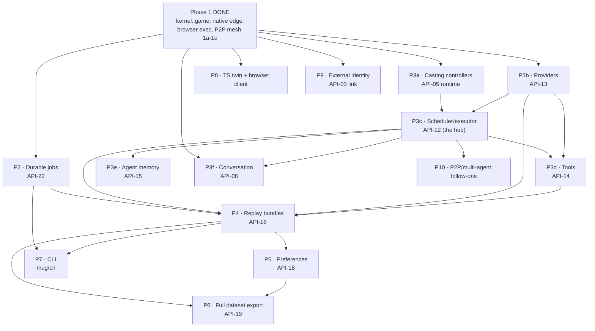

# MUG implementation plan and coding standard (working document)

| Field | Value |
| --- | --- |
| Status | Live v0.3 — Phase-1 native demo COMPLETE (single + multiplayer P2P); records-only foundation COMPLETE for all 22 families; **durable-jobs runtime BUILT (API-22 `mug/workers`)**; **agent stack BUILT through P3f** (P3a casting controllers, P3b providers, P3c scheduler, LLMAgent facade + episode/multi-seat/AEC runners + durable thought tape, **P3d tools, P3e memory, P3f conversation**), now **wired onto the websocket transport** (agent + turn-based game modes) with the **decision tape folded into a replay bundle**; **P4 replay COMPLETE** (`mug/replay/` bundle + safe player/branching + p2p evidence + experienced-stream, contract frozen); **P5 preferences BUILT** (`mug/preferences/runtime.py` annotation loop, contract frozen); **P6 dataset export, P7 CLI, P8 kernel-twin + TS client, P9 external identity, P10 P2P/multi-agent follow-ons all BUILT** — P10 = AEC mesh replica + WebRTC/DataChannel wire tier + bot authority + desync repair + server-authoritative multi-seat + concurrent mesh groups, all runtime over frozen contracts (1839 pass) |
| Date | 2026-07-22 |
| Purpose | Track the plan, the repo structure, the coding rules, and the current build state for the MUG runtime |
| Style | This document uses ASD-STE100 Simplified Technical English |

**How we work this document.** §1–§8 and §10 are the governing choices, principles,
and rules; they are settled and still bind the code. §0 is the living status: it
records what is built, what is a demo, and what a complete project still needs.
§3 (structure), §4 (layer graph), and §9 (increments) are kept current with the
landed code. §11 is historical (the Q-\* forks are long resolved). The coding
standard and the repo structure are folded into
`docs/architecture/implementation/` (`coding-standard.md`, `repo-structure.md`).

---

## 0. Where we are now (2026-07-22)

**One-line answer.** The Phase-1 native demo is complete and runnable end to end;
the full project is far from complete. We have a working research-study runtime
for one study shape, plus the frozen contracts for everything else -- but most of
the agent, annotation, replay, tooling, CLI, and browser-twin runtime is not yet
built.

### 0a. Demo vs. complete

**The demo (Phase-1 native slice) -- DONE and green (1542 tests, live Postgres).**
A real participant runs a whole study natively, with no legacy bridge:

- launch-ticket gate (opt-in) admits the participant and enrolls a durable
  pseudonymous identity;
- the flow presents a consent form, then a survey (API-17 content);
- the game activity runs in any of three execution modes over one websocket:
  **server-stepped** (the env steps on the server), **browser** (the env steps in
  the browser through Pyodide and the client reports its run, which the server
  re-executes and verifies), or **peer-to-peer mesh** (two participants rendezvous
  through matchmaking + mesh formation, each runs a deterministic rollback engine,
  and they play one shared, parity-verified episode);
- the flow reaches a debrief, a completion code, and a signed return link;
- the whole visit is durable on Postgres (a restart resumes it), the return link
  survives a restart with a stable signing key, and a researcher exports the
  visit's canonical lineage as JSONL.

This proves the hard cross-cutting shape once on a real slice: typed commands,
receipts, idempotency, the canonical ledger, fencing, privacy, determinism
verification, and durable resume.

**The complete project -- PARTIAL.** "Complete" means all 22 API families with
their runtime, plus the agent stack, the annotation/preference stack, replay
bundles, the CLI, the TypeScript kernel twin and browser client, and external
identity. Most of that runtime does not exist yet. What exists is the frozen
contract for all of it (records + conformance) and the runtime for the ~15
families the demo path needs.

### 0b. Family status (all 22 contracts frozen; runtime varies)

| Family | Contract (records + conformance) | Runtime built? |
| --- | --- | --- |
| Shared kernel (L0) | ✅ rev 0.2 | ✅ `mug/kernel` |
| API-11 storage / API-10 events (ledger, UoW, outbox) | ✅ | ✅ `mug/storage` (InMemory/SQLite/Postgres) + `mug/runtime.py` |
| API-22 durable jobs | ✅ records | ✅ runtime: `mug/workers` (idempotent submit + fenced lease + write-once result; `JobQueue` rediscovers queued work after a restart via `Store.scan_aggregates`; `WorkerPool` drains with N concurrent workers); `mug simulate` CLI + mid-flight-crash takeover + contract freeze deferred |
| API-01 authoring / API-02 platform | ✅ | ✅ `mug/authoring`, `mug/platform` |
| API-03 identity / API-04 visits | ✅ | ✅ `mug/identity`, `mug/visits` (+ launch/returns edge); **P9 external identity link built** (`mug/identity/linking.py` one-way blinding + `link_identity` handle-keyed token + `mug/linking.py` boundary: `provision_identity_link`/`resolve_enrollment` round-trip a Prolific/OIDC id to a pseudonymous enrollment with no raw id in any record/event) |
| API-05 casting / API-06 interactions / API-09 client | ✅ | ✅ interactions (incl. mesh formation); **P3a casting controllers built** (`mug/game/controllers.py`: local Heuristic/ONNX seat controllers + registry + seat binder over the game loop's `SeatActionSource` seam); client records consumed by the runtime |
| API-07 game | ✅ | ✅ `mug/game` (server + browser + P2P mesh, capture, determinism verify) |
| API-17 content | ✅ | ✅ `mug/content` (forms, presentation) |
| API-19 export | ✅ | ✅ **P6 COMPLETE** (`mug/export/dataset.py` `export_study_dataset`: reads the whole ledger once, sorts each canonical event into the kinds it belongs to (every event → `events`; api-07 → `trajectories`; api-18 → `preferences`; api-08 → `conversations`), stages one ndjson `ExportBundle` per non-empty kind + a `LineageRecord` naming its source streams + git provenance; rows are payload-free canonical envelopes (digest per row, no raw value), deterministically ordered (stream id then sequence) so the same ledger + injected ids reproduce byte-identical artifacts + digests; per-visit `export_visit` is the seed) |
| API-16 replay | ✅ records | ✅ **P4 COMPLETE** (`mug/replay/bundle.py` `build_replay_bundle`/`validate_replay_bundle`: canonical streams + decision tape + schema bundle as content-addressed artifacts through the `ArtifactStore` seam, pinned in a `ReplayManifest` with an integrity digest, re-read to refuse a divergent bundle; `experienced=ExperiencedInput` widens the scope to the client-side experienced stream + its lineage) + **safe player + branching** (`mug/replay/player.py` `replay_episode`: hermetic re-execution over a snapshot env + recorded actions → per-frame `StateHashCheck` chain + verdict, makes no external call; `fork_replay`: restore a frame + continue under alternate actions) + **p2p evidence** (`mug/replay/p2p.py` `build_p2p_replay_bundle`: closes over mesh membership + frame finalities + episode boundaries + bot authorities + decision results + tape, derives the `P2PFinalityOutcome`, emits a p2p `ReplayManifest`) + browser re-exec verify + `build_decision_tape`; contract frozen against the running code (conformance binds every model to the frozen fixtures) |
| API-08 conversation | ✅ | ✅ **P3f built** (`mug/conversation/runtime.py` `ConversationChannel`: per-channel sequence ordering + delivery + context snapshots through the command spine, the chat analog of the game loop; `mug/conversation/turns.py` pure `may_activate` turn policy; the scheduler/provider-driven agent reply is `mug/agents/chat.py` `ChatAgent`, above both) |
| API-12 scheduling / API-13 providers / API-14 tools / API-15 memory | ✅ | ✅ **P3b providers** (`mug/providers/runtime.py` `ModelProvider`) + **P3c scheduler** (`mug/scheduling/runtime.py` `Scheduler.decide` + `ScheduledSeat`) + **P3d tools** (`mug/tools/runtime.py` `ToolBroker`: request→approval→result lifecycle under the approval + egress gates over an injected executor, idempotent replay; `EnvironmentMailbox`) + **P3e memory** (`mug/memory/runtime.py` `MemoryLedger`: read + compare-and-swap with stale-base refusal + provenance) |
| API-18 preferences | ✅ records | ✅ **P5 built** (`mug/preferences/runtime.py` `PreferenceService`: the annotation loop over the command spine -- `assign` (blinded, seed-committed, deterministic display-order permutation) → `respond` (one choice over the presented order) → `attest_quality`, one aggregate per assignment, three-stage stream; idempotent + single-response over the store's fencing: a retry replays, a different second response is fenced, an attestation before the response is refused; `candidate_from_artifact` wires candidates from recorded evidence, e.g. a P4 replay bundle's artifact); contract frozen against the running code |
| API-20 / API-21 | tombstones (removed / retracted) | — |

### 0c. What "complete" still needs (not started, or records-only)

- **The agent stack:** BUILT through P3f (scheduling, providers, tools, memory,
  conversation, plus the LLMAgent facade and the episode / multi-seat / AEC runners
  and the durable thought tape). The two flagged wiring follow-ups are now DONE: an
  episode's model calls are collected (`LLMController.results`, exposed on each
  episode result) and folded into a `DecisionTape` inside a replay bundle, and the
  multi-seat and turn-based runtimes are wired onto the websocket transport (`mug/agents/game.py`
  `AgentGameSpec`/`TurnBasedGameSpec` + `mug/participant.py` `build_agent_on_game`/
  `build_turnbased_on_game` + `app.py` `agent_game`/`turnbased_game` modes). Chat
  transport wiring stays a smaller follow-up.
- **Annotation + adjudication:** API-18 preferences runtime.
- **Replay bundles:** BUILT for the canonical-only server/browser bundle
  (`mug/replay/bundle.py`). Still deferred: the safe player, branching, the p2p
  evidence a p2p bundle closes over, and the experienced-stream replay.
- **Durable jobs runtime:** the correctness core is built (`mug/workers`: fenced
  lease + work-key idempotency + write-once result). Still to add: the worker pool,
  the durable queue that discovers pending jobs, and `mug simulate` scaling.
- **The CLI:** ✅ built (`mug/cli`; `mug publish / deploy / export / replay /
  simulate`; `mug stop` reports a platform gap). See §12g.
- **The TypeScript kernel twin (`ts/`) and the browser participant client:** ✅
  built. The `@mug/kernel` twin is proven byte-identical by shared conformance
  vectors, and `ts/src/client/` is a full TypeScript participant client on top of
  it; a real participant completes a study in it (Chromium e2e). See §12h.
- **External identity linking** (Prolific / OIDC) for API-03: ✅ built
  (`mug/identity/linking.py` + `mug/linking.py`). See §12i.
- **Turn-based (AEC) multi-agent envs** and the follow-on P2P items (WebRTC wire
  tier, bot authority, desync repair, server-authoritative multi-seat, concurrent
  mesh groups): ✅ all built as runtime over the frozen contracts. See §12j.
  Remaining is production wiring only: a concrete `aiortc`/browser `PeerLink`
  adapter, and mounting the server session + formation pool on the websocket path.

### 0d. How the demo maps to the plan's increments

Increments 1–4 (§9) are done, and the build then went past the plan into a
**native realtime demo spine** (milestones M0–M8) plus **durable/deployable**,
**browser execution + verification**, **launch auth**, **signed return links**,
and **multiplayer P2P (Phases 1a–1c)**. §9 now tracks this.

---

## 1. Locked foundational choices (from your decisions, 2026-07-20)

| Choice | Decision | Consequence for this plan |
| --- | --- | --- |
| Typed objects + validation | **Pydantic v2 models; the frozen JSON-Schema corpus stays the authoritative contract** | Pydantic gives the FastAPI edge and (de)serialization for free. A conformance test binds the models to the frozen schemas, so the models never drift into a second source of truth. |
| Concurrency | **asyncio-native** | The server, the workers, and all I/O use `async`/`await`. `env.step()` and pure compile/validation stay synchronous. No monkeypatch. |
| Repo layout | **Fresh `mug/` package + a `ts/` workspace** | Build a clean Python package. Remove the legacy runtime; git keeps its history. Add a small TypeScript workspace for the browser kernel twin. |
| Transport framework | **FastAPI (edge only)** | FastAPI owns routing, websockets, dependency injection, and OpenAPI. It does not own domain modeling. |

### 1a. Pydantic with a schema-authority rule (no drift)

Pydantic pairs naturally with FastAPI, so the edge gets typed routing,
(de)serialization, and OpenAPI for free. The risk is that a Pydantic model
becomes a second, drifting copy of the contract. We remove that risk with one
rule: **the frozen JSON-Schema corpus stays the authority; the Pydantic models
serve it.** Concretely:

- One Pydantic v2 model per contract typed object. FastAPI uses these models
  directly at the edge.
- A conformance test binds the models to the frozen schemas: every frozen
  fixture that the schema accepts must parse into its model, and every model must
  reject what the schema rejects. This test fails the build on any drift.
- Canonicalization and digests never use Pydantic's serializer. Digested content
  passes through the kernel RFC 8785 canonicalizer on `model_dump(mode="json")`
  output. The schema corpus and `canonical.py` remain the only contract authority.
- Pydantic's model machinery (its metaclass and validators) is an accepted
  dependency at the data-definition layer. The "no magic" rule (P4) still binds
  our own code: no metaclasses or dynamic attribute tricks in domain or service
  logic.

This keeps the contract single-sourced in the schema, keeps digests independent
of Pydantic, and still gives us the FastAPI ergonomics.

---

## 2. Coding principles (the core of what you asked for)

These principles rank **simplicity, readability, and minimal abstraction** above
cleverness, reuse, and speculative flexibility. The legacy runtime shows the
failure mode we reject: `app.py` is 107 KB, `game_manager.py` is 76 KB, and
`gym_scene.py` is 50 KB. These are god-modules. The rules below prevent them.

### P1 — Write data and functions first; add a class only for real state

- Represent contract objects as frozen Pydantic models. They hold data, not
  behavior. Do not add methods that carry domain logic to a model.
- Write behavior as module-level functions that take data and return data.
- Add a stateful class only when an object owns mutable state and identity (for
  example a live interaction, a lease holder, a unit of work). Do not model these
  with Pydantic; they are runtime state, not wire data.
- Do not wrap a single function in a class. Do not build a "Manager" or
  "Service" class that only groups functions; a module already groups functions.

### P2 — Abstract only at proven seams; never speculatively

- Define an interface (a `typing.Protocol`) only at a true external seam:
  storage, object store, model provider, tool transport, clock, and the wire.
  These are the MUG-owned protocols the API standard already names.
- Do not define an interface for internal code. Call the function directly.
- Apply the rule of three: do not extract a shared abstraction until three real
  call sites need it. Two call sites duplicate; the third justifies the shape.
- A small amount of duplication is cheaper than the wrong abstraction.

### P3 — Keep a pure core and an imperative shell

- Domain logic (compile, validate, randomize, order, classify, fingerprint) is
  pure and synchronous. It takes data and returns data or a typed error.
- I/O lives at the edges (the server, the repositories, the adapters) and is
  `async`. The pure core never calls the network, the database, or the clock.
- This makes the core easy to test with plain values and no mocks.

### P4 — Make control flow explicit

- Do not use metaclasses, `__getattr__`/`__setattr__` magic, dynamic attribute
  injection, or import-time side effects.
- Do not hide control flow in decorators. A decorator may add a cross-cutting
  concern (tracing, retry at a seam). It must not change what a function returns.
- Prefer an explicit `if` to a registry lookup when the set of cases is small
  and closed. Closed vocabularies stay closed (ADR 0015).

### P5 — Keep modules and functions small

- A module has one clear responsibility. Soft cap: **400 lines**. Above it,
  split by responsibility, not by line count.
- A function does one thing. Soft cap: **40 lines**. A function above the cap
  usually hides two functions.
- A public function takes few arguments. Above four, pass a small frozen object.
  Use a Pydantic model for a wire or contract object; a plain frozen dataclass is
  fine for a purely internal parameter bundle.

### P6 — Let dependencies point inward, along the layer graph

- The kernel depends on nothing in MUG. Each family depends only on the kernel
  and on the families the layer graph (§4) allows.
- A family never imports a sibling that its contract does not list as a
  dependency. We enforce this with an import linter in CI (§9).
- A lower layer never imports a higher layer.

### P7 — Errors are typed values from the shared taxonomy

- Return or raise only the kernel `DomainError` taxonomy across a boundary.
- Never leak a provider stack trace, a credential, prompt text, or protected
  participant data into an error (API standard §Errors).
- Fail closed. An unknown state, an expired lease, or a stale generation rejects
  the effect.

### P8 — Name code after the contract vocabulary

- Use the glossary terms for types, functions, and files (enrollment, visit,
  seat, actor, controller, interaction, lease, receipt). One term, one meaning.
- Do not invent a synonym for a contract term. Consistent names make the code
  readable next to the contracts.

### P9 — Type everything; run the checker strict

- Every function has full type hints. `from __future__ import annotations` at
  the top of every module.
- The type checker runs in strict mode in CI. New code adds no `type: ignore`
  without a reason comment.

### P10 — Comments and docstrings state intent, in Simplified Technical English

- Write a docstring for every public function, class, and module. State what it
  does and the contract it serves. Keep sentences short and active.
- Do not comment on obvious code. Comment on a non-obvious decision or a
  contract rule the code enforces.

---

## 3. Repo and package structure

One repository. The domain packages live under `mug/`. Name a package after the
domain, not the API number. The legacy runtime stays in the tree under
`mug/server`, `mug/scenes`, `mug/configurations`, `mug/rendering`, `mug/utils`,
`mug/webclient`; the import linter forbids the new runtime from importing it, and
we port behavior, not code. The `mug/cli` package is built (§12g). The `ts/`
TypeScript workspace now holds the **kernel twin** (§12h); its browser
participant client half stays planned.

**Landed shape (2026-07-22).** The families keep the uniform §3a shape. Two things
differ from the original sketch:

1. The evidence-foundation runtime (the canonical ledger, the unit of work, the
   outbox, and the command/receipt spine) is centralized in **`mug/runtime.py`**
   plus **`mug/storage/`**, not spread into `events`/`jobs` service modules. The
   `events` and `jobs` packages hold their frozen records.
2. The ASGI edge is **not** one `mug/server` package. It is a set of top-level
   runtime modules that compose the demo: `app.py` (the composition root),
   `edge.py` (the HTTP command surface), `realtime.py` (the websocket transport),
   `gateway.py` (the one entropy + context boundary), `participant.py` (the flow +
   game + mesh glue), `launch.py` (launch tickets), `returns.py` (signed return
   links), and `runtime.py` (the command/ledger spine).

```text
mug/                          # Python package (the runtime)
  kernel/                     # L0 — ids, refs, canonical, schema, typed_object,
                              #      command(+types), errors, clock, privacy, _base
  storage/                    # API-11 — store.py, ports.py, InMemory/SQLite/PgStore
  events/  jobs/              # API-10 / API-22 — frozen records (ledger runtime is in runtime.py)
  runtime.py                  # the command + canonical-ledger spine (commit_command/commit_capture)
  authoring/  platform/       # API-01 / API-02 — compiler + publication; deploy + secrets
  identity/  visits/          # API-03 / API-04 — enroll + tickets; visit plan + flow lifecycle
  casting/  interactions/  client/   # API-05 / API-06 / API-09 — records; mesh-formation service
  game/                       # API-07 — env, surface, runtime(server loop), browser, capture,
                              #      determinism, mesh(rollback engine), multiagent, mesh_session, spec
  conversation/               # API-08 — frozen records (runtime not built)
  scheduling/ providers/ tools/ memory/   # API-12–15 — frozen records (agent runtime not built)
  replay/                     # API-16 — records + verify.py (browser re-exec); bundles deferred
  content/                    # API-17 — forms + presentation service
  preferences/                # API-18 — frozen records (annotation runtime not built)
  export/                     # API-19 — JSONL query/export/lineage service
  # the ASGI edge (top-level runtime modules, not a package):
  app.py  edge.py  realtime.py  gateway.py  participant.py  launch.py  returns.py
  webclient/                  # the static client shell the demo serves (index.html + assets)

  # legacy runtime (kept in tree, import-forbidden, ported by behavior only):
  server/  scenes/  configurations/  rendering/  utils/

examples/                     # study entrypoints (mountain_car native/browser demos,
                              #   cogrid overcooked, footsies, slime_volleyball)

ts/                           # ✅ P8 COMPLETE (§12h) — src/kernel = @mug/kernel twin
                              #   (canonical, digest, ids, typed-object) + src/client =
                              #   the participant client (wire, session, renderer,
                              #   browserGame, ui, client, bootstrap). tsc 5.9 on node 20;
                              #   CJS build (conformance) + ESM web build (build:web),
                              #   zero runtime deps. Cross-language conformance vectors +
                              #   client wire test + Chromium study-completion e2e.
mug/cli/                      # ✅ BUILT — mug publish/deploy/export/replay/simulate (§12g)

tests/
  architecture/              # the frozen contract corpus + conformance (per-API fixtures)
  unit/                      # per-module + per-family tests (kernel..app, game, mesh)
  e2e/  e2e_native/          # legacy parity e2e + native browser (playwright) slice
```

### 3a. Inside a family package (uniform shape)

Every family package uses the same internal shape. The shape makes any family
readable once you learn one.

```text
mug/<family>/
  __init__.py        # the public surface of the family (re-exports only)
  types.py           # frozen Pydantic models for the family's typed objects
  service.py         # the application command/query functions (async at the edge)
  <domain>.py        # pure domain logic modules, split by responsibility
  ports.py           # Protocols this family needs from lower layers (if any)
  errors.py          # family-specific error detail shapes (codes stay in kernel)
```

- `service.py` holds the command handlers. A handler validates, builds context,
  calls pure domain functions, and commits through a repository port.
- Pure domain logic never sits in `service.py`. It sits in a `<domain>.py`
  module and returns data.

---

## 4. The layer graph (as enforced by import-linter)

Dependencies point inward. This is the **actual** `import-linter` "Layered
architecture" contract in `pyproject.toml` (top = outermost), kept in sync with
the code. A `|` row lists independent siblings that do not import one another.

```text
mug.app                                   # composition root
mug.participant | mug.launch              # flow/game/mesh glue; launch tickets
mug.edge | mug.realtime                   # HTTP command surface; websocket transport
mug.gateway                               # the entropy + context boundary
mug.export                                # API-19
mug.replay | mug.content | mug.preferences
mug.scheduling | mug.providers | mug.tools | mug.memory
mug.game | mug.conversation               # API-07 / API-08
mug.casting | mug.interactions | mug.client
mug.identity | mug.visits
mug.authoring | mug.platform
mug.runtime                               # command + ledger spine
mug.storage | mug.events | mug.jobs | mug.returns
mug.kernel                                # depends on nothing in mug
```

A second contract, "New runtime does not import the legacy runtime," forbids every
new module from importing `mug.server`, `mug.scenes`, `mug.configurations`,
`mug.rendering`, or `mug.utils`. Both contracts are green.

Note the graph grew past the original L0–L8 sketch: the edge is now several
top-level layers (`app` > `participant|launch` > `edge|realtime` > `gateway`), and
`runtime`/`returns` were added as their own layers. The API-family → package
mapping in §0b still holds; the ordering here is the one CI enforces.

---

## 5. Implementation rules that bind to the contracts

These rules make the code match the API design standard and the shared kernel.

### 5a. Typed objects

- One frozen Pydantic v2 model per contract typed object
  (`model_config = ConfigDict(frozen=True, extra="forbid")`).
- The model field names match the schema property names exactly.
- The model parses and validates the payload. A conformance test binds the
  model to the frozen schema (§1a), so the schema stays the authority.

### 5b. The wire boundary

- Every inbound payload parses into its Pydantic model at the edge. The model
  and the frozen schema agree by the §1a conformance test.
- Every outbound object serializes with `model_dump(mode="json")`.
- A digest never uses the Pydantic serializer. Digested content passes through
  the kernel `canonical.py` (RFC 8785) on the dumped JSON. No other canonicalizer
  exists in the code.

### 5c. Commands and receipts

- A command handler returns a typed receipt (`IngressReceipt`, `CommitReceipt`,
  or `ArtifactCommitReceipt`) or a `DomainError`. It never returns a bare success.
- The gateway builds the trusted `CommandContext` from verified state. A handler
  never trusts a client-supplied scope.
- A `CommitReceipt` commits the aggregate, the idempotency record, the canonical
  event, and the outbox in one unit of work.

### 5d. Idempotency and concurrency

- Each command declares one retry policy from the kernel set.
- The unit of work checks the expected revision. A scientific decision
  (randomization, preference assignment) never silently retries on conflict.

### 5e. Async rules

- The server, the repositories, the workers, and the adapters are `async`.
- No code performs provider, tool, database, or object-store I/O while it holds
  an environment mutation lock (API standard §Async).
- A blocking call (a CPU-bound compile, a sync library) runs in a thread via
  `asyncio.to_thread`. The core stays pure and sync; the shell offloads it.

### 5f. Privacy and secrets

- Every persisted field carries or inherits a `DataHandlingRef`. The classifier
  lives in `kernel/privacy.py`.
- Secret material never enters a model, an event, an artifact, a log, or an
  export. Code references a secret only by `SecretRef`.

---

## 6. The kernel twin (Python and TypeScript)

- The Python `kernel` and the TypeScript `ts/kernel` implement the same wire
  behavior: canonicalization, digest, ID encoding, and typed-object envelopes.
- The two share one set of conformance vectors under `tests/conformance`. A CI
  job runs the vectors in both languages and asserts byte-identical output.
- The G5 work already proved this for canonicalization. We extend the same
  pattern to IDs and the typed-object envelope.
- The TypeScript side stays small. It holds only what the browser needs.

**Status (2026-07-23): BUILT.** The `ts/` workspace holds `@mug/kernel` — the twin
of canonicalization, digest, ID encoding, the shared scalar formats, and the
typed-object envelope. Shared conformance vectors under `tests/conformance/`
prove Python == TypeScript byte for byte (§12h). The twin is now the base of the
native TypeScript participant client under `ts/src/client/` (§12h): the client
mints its `RealtimeCommand` payload digests through the twin, so it digests a
value exactly as the server does, and a browser-free wire test asserts each
digest equals the Python digest byte for byte on a real wire payload.

---

## 7. Testing strategy

- **Contract fixtures are the acceptance tests.** Each family's frozen
  valid/invalid/duplicate/conflicting fixtures become the pass/fail gate for its
  `types.py` and `service.py` (backlog exit condition).
- **Unit tests** cover the pure domain modules with plain values. No mocks.
- **Integration tests** run a family against a real local backend (Postgres via
  `asyncpg`, local-filesystem object store) with fault injection from the failure
  matrix.
- **Conformance tests** run the kernel vectors in Python and TypeScript.
- **E2E tests** run the Phase-1 slice in a real browser with Playwright.
- Test files mirror the package path. `mug/identity/service.py` →
  `tests/integration/identity/test_service.py`.

---

## 8. Tooling

| Concern | Tool | Note |
| --- | --- | --- |
| Package + venv | **uv** | Already in use. |
| Lint + format + import sort | **ruff** | Replaces isort/pyupgrade/pycln. One tool, fast. |
| Type check | **pyright** (strict) | Native Pydantic v2 inference, no plugin. |
| Import boundaries | **import-linter** | Enforces the §4 layer graph in CI. |
| Tests | **pytest** + **pytest-asyncio** | asyncio mode. |
| TS toolchain | **tsc 5.x** on **node 20** (`ts/.nvmrc`, `engines: node>=18`) | Kernel twin built; zero runtime deps. Compile `target` stays ES2019 so the shipped browser twin and the conformance runner run on any modern browser or an old node. |
| Pre-commit | modernized | Replace the aging hook set with ruff + the type checker. |

---

## 9. Increments — status and roadmap

The plan built the smallest end-to-end vertical first, then scaled it. Increments
1–4 are done; the build then went past the plan into a runnable native demo.

### 9a. Done

- **Increment 1 — kernel + evidence foundation.** ✅ `kernel`, `storage`
  (InMemory + SQLite + Postgres/asyncpg, unit of work, outbox), the canonical
  ledger + command/receipt spine (`runtime.py`), errors, clocks, privacy. Every
  hard cross-cutting rule (idempotency, receipts, fencing, privacy) is proven.
- **Increment 2 — authoring + deploy.** ✅ `authoring` (compiler, git provenance,
  publication), `platform` (deploy/stop, deployment revisions, secret refs).
- **Increment 3 — identity + visits.** ✅ `identity` (enroll, launch ticket),
  `visits` (visit plan, flow, lifecycle).
- **Increment 4 — interaction fabric + game.** ✅ `casting`, `interactions`
  (incl. the mesh-formation runtime), `client`, `game` (server loop, browser
  exec, capture), `content` (forms), `export` (JSONL).
- **Native realtime demo spine (M0–M8, past the original plan).** ✅ The FastAPI
  edge + websocket transport + gateway + participant glue that runs one study end
  to end: forms → game → debrief → completion code. M5 canonical capture, M6
  completion + JSONL export, M8 browser/Pyodide execution.
- **Durable + deployable.** ✅ Non-destructive `PgStore.open`, `MUG_PG_DSN`-driven
  store selection, reconnect-resume, real-browser Playwright e2e.
- **Determinism verification.** ✅ The server re-executes a browser run and refuses
  a divergent one (shared state-hash hook + verifier).
- **Launch auth + signed return links.** ✅ Opt-in launch-ticket gate; HMAC-signed,
  restart-stable resume tokens.
- **Multiplayer P2P (Phases 1a–1c).** ✅ 1a: the deterministic GGPO rollback engine
  (`game/mesh.py`). 1b: the PettingZoo-parallel multi-agent replica adapter
  (`game/multiagent.py`, the CoGrid Overcooked shape) + the mesh-formation runtime
  (`interactions/service.py`). 1c: the end-to-end app-layer glue
  (`game/mesh_session.py` `MeshSession` + `participant.py` `MeshMatchmaker` +
  `app.py` `mesh_game` mode) -- two participants rendezvous, play one shared
  parity-verified episode, and complete.

State: **1803 tests pass** (166 skipped) on the maintained tree; ruff, pyright
strict, and both import-linter contracts green; the `ts/` kernel twin and the
participant client build under `tsc --strict` (CJS + ESM configs) and pass
cross-language conformance and the client wire test. (The demo-spine milestone above was
1542; the agent stack P3a–P3f took it to 1751; P4 replay bundles + the agent/turn-based
transport wiring took it to 1760; finishing P4 -- the safe player + branching, the
p2p evidence, the experienced-stream scope -- and P5 preferences with its
`Comparison` author facade added the last 16.)
The maintained tree excludes the legacy eventlet
modules and the `tests/e2e` suite, whose event-loop policy pollutes async collection
for the shared unit tree.

### 9b. Remaining (to a complete project)

The full, dependency-ordered roadmap -- every remaining phase, what it plugs into,
what it unblocks, and its definition of done -- is **§12**. The headline order is:
durable jobs (P2) → the agent stack (P3: casting controllers, providers,
scheduling, tools, memory, conversation) → replay bundles (P4) → preferences (P5)
→ full export (P6) → CLI (P7) → browser twin + client (P8) → external identity
(P9) → P2P follow-ons (P10). See §12 for the connection graph and the per-phase
detail.

Each family lands under the §9c definition of done and freezes its contract bytes
against the running code (deferred per-family G0–G8 from the Phase-0 close).

### 9c. Definition of done for a work item

A work item is done when:

1. Its package matches the §3a shape and the §2 principles.
2. Its contract fixtures pass as acceptance tests.
3. Its failure-matrix rows have fault-injection tests.
4. The type checker and the import linter pass.
5. **The family's contract bytes freeze against the running code** — this is the
   deferred per-family G0–G8 from the Phase-0 close. We freeze each family when
   its code proves the shape, not before.

---

## 10. What we remove and what we keep from the legacy runtime

- **Remove** the legacy `mug/server/app.py`, `game_manager.py`, the eventlet
  stack, and the flask-socketio edge. The rewrite does not port the god-modules.
- **Keep as reference** (in git history) the parity-audit intricacies register:
  the preserve/fix/do-not-port findings (RP-1..RP-10). We port behavior, not code.
- The parity fixtures become integration gates (backlog exit condition).

---

## 11. Open questions — RESOLVED (historical, 2026-07-20)

These forks were resolved before the build started. The resolutions all held: the
code runs on Postgres/asyncpg behind the storage port, pyright strict, ruff, and
import-linter. Kept for the record.

| ID | Question | Resolution |
| --- | --- | --- |
| **Q-1** | Database for the local backend in Increment 1. | **Postgres via `asyncpg`**, behind the storage Protocol. A lighter fake backs unit tests. |
| **Q-2** | Object store for artifacts in Increment 1. | **Local filesystem** behind the object-store Protocol. An S3/MinIO adapter drops in later at the same seam. |
| **Q-3** | Line-count caps in §5 (400 module / 40 function). | **Guidance only.** CI warns; it does not fail the build. A hard cap invites bad splits. |
| **Q-4** | Type checker — pyright or mypy, strict. | **pyright, strict.** Native Pydantic v2 inference, no plugin, fast. |
| **Q-5** | Where the coding standard lives. | **Both.** The full standard under `docs/architecture/implementation/`; a short pointer in `CONTRIBUTING.md`. |
| **Q-6** | Start Increment 1 now, or review first. | **Start now.** Fold the standard into `docs/`, then scaffold the `kernel` package (backlog item 1). Review as the code lands. |

---

*Status (2026-07-22): the standard and structure are folded into
`docs/architecture/implementation/`. Increments 1–4 and the native Phase-1 demo
(single + multiplayer P2P) are built and green (1542 tests, live Postgres). The
governing rules (§1–§8, §10) hold unchanged. §0 is the source of truth for
demo-vs-complete; §12 is the full roadmap to a complete project. Update §0b, §9a,
and §12 as each new family's runtime lands.*

---

## 12. Full remaining roadmap (every step to done)

This section lays out every phase from the Phase-1 demo to a complete project. It
is dependency-ordered. Each phase builds the runtime over an already-frozen
contract, plugs into named seams, and freezes its contract bytes against the
running code at the end (the deferred per-family G0–G8). Sizes are indicative
(S/M/L), not estimates.

The rule that shapes the order: build a family only after the families its
contract lists as dependencies (the api-catalog "referenced by" graph). The agent
stack is the center of gravity -- casting controllers and the scheduler are the
hub that providers, tools, memory, conversation, and replay all attach to.

**Sequencing decision (2026-07-22): build for the easiest integration, not to ship
a study.** There is no urgency to stand up a full agent study, so the order favors
the family that (a) depends only on what is built, (b) reuses the existing spine
instead of adding a new concept, and (c) unblocks the most downstream work. That is
**P2 (durable jobs)** -- so P2 is the first step taken, ahead of the agent stack.
Its correctness core is now **built** (see 12b). The agent stack (P3) still comes
next after P2, but it is sequenced as the integration path allows, not rushed to a
demo.

### 12a. The connection graph



**The critical path to a "full agent study" is:** DONE → ~~P3a + P3b → P3c → P3d, P3e,
P3f~~ (the whole agent stack BUILT 2026-07-22, now wired onto the transport) →
~~P4 (replay bundles)~~ (COMPLETE 2026-07-22: bundle + safe player/branching + p2p
evidence + experienced-stream, contract frozen) → ~~P5 (preferences)~~ (BUILT
2026-07-22, contract frozen) → ~~P6 (full dataset export)~~ (COMPLETE 2026-07-23:
`export_study_dataset` reads the whole ledger and produces one payload-free,
reproducible ndjson bundle + lineage per non-empty dataset kind) → ~~P7 (the
CLI)~~ (COMPLETE 2026-07-23: `mug/cli` = `mug publish/deploy/export/replay/simulate`
over a shared `dispatch_command`; `mug stop` reports a platform gap). **The agent-
study critical path is now DONE.** P2 runs in parallel and underpins P4/P7.
P8/P9/P10 are independent tracks that do not block the agent stack.

### 12b. P2 — Durable jobs runtime (API-22) · size M · BUILT (2026-07-22)

- **Built (the dispatch layer -- `mug/workers.py`, +7 tests).** `JobQueue` is a
  durable-backed index of jobs ready to claim: a live submit offers its job id, and
  a restart calls `rebuild(store)` to fold the store's committed state, so a worker
  rediscovers work that was accepted but never started. Rediscovery reads a new
  `Store.scan_aggregates` read (added to the port + all three backends) and covers a
  *queued* job -- one whose aggregate head is still its `JobRequest`, which still
  names the `work_key` the completion needs. `WorkerPool` drains the queue with N
  concurrent workers, each of which claims a lease, runs an injected handler, and
  completes the job; the fenced lease makes the whole pool safe (two workers that
  race one job resolve to one success). The pool owns no clock/entropy -- it takes a
  context factory that mints a fresh `CommandContext` per op, like every family
  service. Proven: a queued job drains to a recorded success; a fresh queue rebuilt
  from the store rediscovers it; a claimed/terminal job is not rediscovered; a
  duplicate offer is ignored; a job that lost its queued head is skipped (no
  double-run); four concurrent workers each take a distinct job; the loops drain
  between `start`/`aclose`.
- **Built earlier (the correctness core -- `mug/workers.py`, +9 tests).** `JobRunner`
  drives
  the three frozen records through the shared command spine, so a job's lineage is a
  canonical event stream. It reuses the store's own generation fencing rather than
  adding a durability primitive: a job's id is its aggregate/stream; the caller
  content-addresses the `job_id` from the `work_key`, so a duplicate work key
  coalesces on the store's existence guard; a claim carries a fencing generation
  equal to its attempt, so the store installs a strictly greater generation and
  refuses a superseded worker's completion (`lease.stale_generation`), with the
  revision guard as a second refusal. Proven: submit records a queued job; a
  duplicate work key is coalesced; an identical submit replays (NS-10); a second
  worker is refused a held lease; an expired lease is taken over and the stale worker
  is fenced; a success binds the result digest on the lineage; a failure names no
  artifact. New module sits on the `authoring | platform | workers` layer (imports
  only downward: jobs, runtime, storage, kernel).
- **Deferred.** Mid-flight-crash takeover after a *cold* restart: a job a worker had
  already claimed carries a `JobRun` head that does not retain the `work_key`, so
  re-completing it needs the request retained beside the run (a dual-head or a
  request-retaining projection) -- the same-process live pool still takes over an
  expired lease when the caller holds the key. The headless `mug simulate` batch
  runner (P7 CLI territory); compile-at-publish as a wired first job kind; contract
  freeze API-22.
- **Plugs into.** `mug/runtime.py` (command spine), `mug/storage` (UoW + the fencing
  claim already in `kernel/clock.py`; the new `scan_aggregates` read).
- **Depends on.** DONE (kernel, storage, ledger). **Unblocks.** Offline replay at
  scale (P4), agent batch/simulation, the CLI's `simulate`/`replay` (P7).
- **DoD.** ✅ fault-injection tests for lease expiry + duplicate work key + take-over
  fencing; ✅ a restarted worker *rediscovers* queued work (`JobQueue.rebuild`);
  ⚠️ remaining: mid-flight-crash takeover across a cold restart; contract freeze
  API-22.

### 12c. P3 — The agent stack (the largest body of work)

The whole point is to let a non-human controller occupy a seat or a chat turn,
decide with a model and tools, and record every decision as canonical evidence.
It is six sub-phases around one hub (P3c).

**P3a — Casting controllers (API-05 runtime) · size M · BUILT (2026-07-22).** The
seat-authority seam, in `mug/game/controllers.py` (+13 tests). The game loop's seat
input is now a `SeatActionSource` seam (`decide(observation) -> int`, added to
`mug/game/runtime.py`); a human `InputState` satisfies it (it ignores the
observation and maps keys), so the loop drives a bot exactly as it drives a person.
The local controllers: `HeuristicController` (defers to a study decision function)
and `OnnxController` (owns the typed action selection an `OnnxPolicy` declares --
argmax, or a temperature-scaled softmax sample from an injected random draw -- while
the study injects the observation-to-scores `infer`, so the core imports no ONNX
runtime and holds no environment detail). `ControllerRegistry.resolve` maps a
`ControllerBinding` to its local controller and refuses one it cannot drive (a
human-input binding, or an `llm` kind that needs P3b/P3c); `bind_seat_controllers`
joins bindings to seats through `SeatAgentBinding` and keys the result by seat;
`agent_seats` reads a `CastDeclaration`'s `AgentActorSpec` slots to name the
software seats. Environment-agnostic throughout (the heuristic function and the ONNX
inference are study-injected -- see [[core-is-env-agnostic]]).
- **Deferred.** Driving *mesh* seats (the P2P `SeatAction` seam) and the multi-seat
  server-authoritative loop that seats bots *beside* humans in one interaction (the
  single-seat `run_episode` seam is done; the shared multi-seat loop is P3c/later).
- Plugs into: `mug/casting` (records, done) + `mug/game/runtime.py` seat input.
  Depends on DONE. Unblocks: P3c drives these bindings.

**P3b — Model providers (API-13) · size M · BUILT (2026-07-22).**
`mug/providers/runtime.py` `ModelProvider`: drives one model call through the
command spine (records `ProviderRequest` -> calls an injected adapter -> records
`ProviderResponse`/`ProviderError` with `Usage`). The vendor stays out of the core:
the study injects a `ProviderAdapter` (`ModelCall -> ModelCompletion`), so the core
imports no vendor SDK; a deterministic `FakeProvider` covers tests + `mug simulate`.
The secret never enters a record -- a record names it by `secret_name`, the runtime
resolves the value through an injected `SecretResolver` at call time and passes it
to the adapter alone. Idempotent: a retry that finds a terminal head replays the
recorded outcome without a second (paid) call. +6 tests.
- Plugs into: `mug/platform` secrets (done -- `SecretRef` pass-at-deploy) +
  `mug/runtime.py`. Depends on DONE (secrets ready). Unblocks: P3c, P3d, P4.
- Deferred: real OpenAI-compatible + direct adapters (a study writes these behind
  the seam); cost accounting beyond raw `Usage`.

**P3c — Scheduler / executor (API-12) · size M · THE HUB · BUILT (2026-07-22).**
`mug/scheduling/runtime.py` `Scheduler.decide`: awaits a bound
`AsyncController` (`DecisionContext -> action`) under the request deadline, records
`DecisionRequest` + `DecisionResult`, and applies the seat `FallbackRule` when a
decision misses the deadline (`repeat-last`/`default-action`) or fails. The
scheduler is controller-agnostic -- it never imports the provider; the study
composes an LLM controller (render obs -> payload, call `ModelProvider`, parse
output -> action) above both families, which are siblings in the layer graph. The
bridge to the game loop is `mug/game/controllers.py` `ScheduledSeat`: a held-action
`SeatActionSource` the scheduler updates off the frame clock and the loop samples
each frame, so a slow model never blocks a fast frame. Proven end to end
(`test_llm_seat.py`: a `FakeProvider` model call becomes a scheduled action that
steps `run_episode`). +9 tests. Skeleton for study authors:
`scratch/impl/llm-provider-integration.md`.
- Plugs into: P3a bindings, P3b providers, the game channel, the ledger. Depends on
  P3a + P3b. Unblocks: P3d, P3e, P3f, P4, and P10's bot authority.
- Deferred: `execution_mode="p2p"` `P2PBotAuthority` runtime (lands with the mesh
  phase); persisting `SchedulerState` per-seat lifecycle; the exact-action replay of
  a recorded decision (the API-16 decision tape holds the applied action).

**P3 author facade (LLMAgent) · BUILT (2026-07-22).** The junior-friendly surface a
study author uses, turning P3b + P3c into one small class. Definition in
`mug/authoring/agents.py` (`LLMAgent`: subclass + `get_prompt(env, agent_id, history,
chat, thoughts)` returns the whole prompt, plus `reflect`/`parse_reply`/
`available_actions`; pure, import-light, stays in the authoring layer). Runtime in NEW
`mug/agents/` (a layer above `scheduling|providers`): `LLMController.decide` is the
`AsyncController` the scheduler awaits -- it builds the prompt, calls the built
`ModelProvider`, carries the model's own reasoning forward (`thoughts`/`reflect`), and
reads the reply into an action; `compile_agent` pins the definition into an
`AgentVersion`; a decode miss becomes the scheduler fallback. The author sees no
provider, scheduler, key, or digest. +7 tests. Quickstart:
`scratch/impl/llm-agent-quickstart.md`.
- Deferred: freezing `PromptTemplateVersion` (the prompt lives in `get_prompt`, so it
  is not needed for this path).

**P3 episode runner (`AgentEpisode`) · BUILT (2026-07-22).** Joins the three earlier
pieces into a full server-mode episode with one LLM seat. `mug/agents/episode.py`
`AgentEpisode` drives `run_episode` with a `ScheduledSeat` as the seat; a new generic,
env-agnostic `on_step` observer on `run_episode` (with `StepInfo`, and a `SteppableEnv`
Protocol so the loop types to a seam, not `GymEnv`) fires per frame. Each frame the
runner records one `Step` into the agent's history (the action name, reward, and an
optional text view); at `frame % decides_every == 0` it starts a decision as a
non-blocking `asyncio.create_task` (the scheduler awaits `LLMController.decide`), so a
slow model never stalls the frame, and lands the decided action on the seat when the
model returns. One decision runs at a time; a pending one is drained at the episode's
end so no model call is recorded without its outcome. The loop steps a single study
env that both the loop steps and the controller reads, unifying the earlier
`GymEnv`-vs-rich-env split. `post_message(...)` is the transport's chat feed into the
agent. It is a producer boundary: the caller injects the clock, the decision-id mint,
the context factory, and the deadline. +3 tests, 1051 pass.
  Now the one-seat facade over the multi-seat runner (see below), so a solo run and
  a many-seat run share one loop and one runtime.
- Deferred: render / human-watching integration (the runner passes a no-op render +
  sink today); the rich-state (`env.get_state()`) source-observation digest; the
  durable thought tape (API-16) for exact cross-step replay.

**P3 real provider adapters · BUILT (2026-07-22).** The concrete adapters behind the
P3b seam, so a study no longer writes one. `mug/agents/adapters.py` ships
`OllamaAdapter` (a free local runner at `http://localhost:11434`, no key),
`AnthropicAdapter` (Messages API, `x-api-key`), and `OpenAIAdapter` (Chat Completions,
bearer). Each speaks its provider's chat-completion API with plain `httpx` -- **no
vendor SDK** -- so one dependency covers all three and the core provider runtime still
imports no HTTP library (`httpx` is imported lazily inside the default transport). The
adapters share one injected `HttpTransport` seam: the default sends over `httpx`, a
test injects a fake transport, so the whole path runs offline. The base `ChatAdapter`
maps every fault to a `ModelCompletion` (never an exception): a 429 -> retryable
rate-limit, a 5xx -> retryable provider-error, a 4xx -> non-retryable, a timeout ->
retryable timeout, a content filter -> refused, an unreadable body -> provider-error;
so a provider outage degrades to the seat fallback. `adapter_for(provider_name)` picks
one by the name an `AgentVersion` carries, realising the minimal author surface (the
author sets `provider = Provider.OLLAMA/ANTHROPIC/OPENAI` and nothing else). The
author's `temperature` now flows through the payload to the adapter. The credential
goes only into the request header for the single call, never recorded. +17 tests
(fake-transport request/response/fault mapping + through `ModelProvider`) + a live
Ollama smoke test (skipped when no runner answers; proven green against a real local
model). New optional extra `llm = ["httpx"]`. 1068 pass.

**Key-free local run (Ollama) · BUILT (2026-07-22).** Closes the author-surface
wrinkle so a local run names no credential. `LLMAgent.secret` is now optional
(`str | None = None`). `compile_agent` supplies a well-known `LOCAL_NO_KEY`
(`"local-no-key"`) secret name for a keyless provider (`OSS`/`HTTP`), so the frozen
`ProviderRequest.secret_name` stays satisfied and honest; a hosted provider
(`anthropic`/`openai`) with no `secret` is refused at compile time with a clear
message (`_secret_name`). `LLMController.decide` passes no resolver for a keyless
agent, so the runtime resolves no value and the adapter receives `secret=None`
(Ollama ignores it anyway). The author writes `provider = Provider.OLLAMA` + `model`
and omits `secret`. +3 tests (keyless compile default, hosted-needs-key raise, a
keyless decide end to end through `OllamaAdapter` with no resolver). 1071 pass.
- Deferred: a generic `HTTP` provider adapter (OpenAI-compatible proxies map to
  `OpenAIAdapter` today by base_url); streaming; cost accounting beyond raw token
  `Usage`.

**P3 multi-seat loop (an LLM beside a human, or two agents) · BUILT (2026-07-22).**
Answers "why differentiate single- and multi-seat?" -- a single-seat run is the
one-actor case of a multi-seat one, so there is now **one** stepping loop and **one**
agent runtime; `AgentEpisode` is a thin one-seat facade over them. New
`mug/game/multiseat.py` `run_multiseat_episode`: the server-authoritative loop for a
multi-agent env (`MultiSeatEnv`: `reset`/`step(actions)` -> `MultiStepResult` keyed
by agent id). Each frame it reads every seat through the shared `SeatActionSource`
seam, steps the whole action set at once, records one shared `GameTransition`
(action digest over the whole set, `applied_decisions=[]` as the single-seat loop
does -- the per-seat decisions record on their own streams), and runs an optional
`on_step` observer. A `solo_env(env, agent_id)` lift makes a single-seat
`SteppableEnv` the one-agent case with no special path. New
`mug/agents/multiseat_episode.py` `MultiAgentEpisode`: one `AgentSeat` per LLM seat
(its own `LLMController`, `ScheduledSeat`, history/thoughts) and one `HumanSeat` per
person (its `SeatActionSource`, transport-updated); each LLM seat decides at its own
cadence without blocking the frame, and each agent records the **whole** frame -- so
an agent reads what its partner just did. A posted chat message reaches every agent
seat. Shared scheduler/store/clock/episode; a study multi-agent env satisfies both
the `MultiSeatEnv` step seam and the controller reads, so the loop steps the same
live object the models read. Proven: two agents share one env (each reads the
other's moves), a human seat plays beside an LLM, a message reaches both seats, and
the `solo_env` lift; the existing `AgentEpisode` tests stay green through the facade.
+6 tests, 1715 pass (maintained tree; e2e/browser + `[pg]` parity are env-gated).
- Deferred (unchanged): P2P bot authority / server-authoritative multi-seat over the
  mesh.

**P3 fold `run_episode` into the one loop · BUILT (2026-07-22).** Closes the last
split: the human-play render loop is now the one-seat case of the shared loop too,
so there is literally one stepping-and-recording implementation. New
`mug/game/seams.py` holds the shared seams (`Clock`, `SeatActionSource`,
`SteppableEnv`) below both loops, breaking the cycle that blocked the fold (the
core `multiseat` loop can no longer import the `runtime` facade); `runtime`
re-exports them, so the four importers need no edit. `run_multiseat_episode` gains
one post-reset `on_start` hook; `run_episode` is now a facade that lifts the env
with `solo_env`, drives the one seat through the shared loop, and keeps the render
path here -- it draws the opening keyframe and holds the pre-roll in `on_start`, and
draws each frame in `on_step`. The re-baseline the fold implies (the recorded
`action_digest`/`state_digest` shift from scalar to the `{seat: ...}` dict form the
multi-seat loop uses) was **safe and self-absorbing**: the server-mode capture path
never touches the browser-mode `replay/verify.py` (that path is client-authored and
untouched), and every server-mode test recomputes its digests from the summary
(none hardcode a golden hex; the on-disk API-07 fixtures use placeholder digests).
A new test proves `run_episode` and `run_multiseat_episode` record byte-identical
transitions for the one-seat case. +1 test.

**P3 turn-based (AEC) adapter · BUILT (2026-07-22).** The turn-based discipline
beside the simultaneous one. New `mug/game/aec.py`: `AecEnv` duck-types the
PettingZoo AEC API (never imports it) onto a `TurnBasedEnv` seam (`reset`/`step` ->
`TurnState`), hiding the AEC lifecycle -- it lands on the next live seat each turn
and clears a finished seat with the `step(None)` the contract requires, so the loop
only ever reads a live seat; it wraps a **live** env instance, so the same object
the controllers read is the object the loop steps. `run_turnbased_episode`: one seat
acts per turn, and -- unlike the simultaneous loop -- it **waits** for the active
seat (the `on_turn` hook), because a turn-based game genuinely waits for the player
in turn; it records one `GameTransition` per turn (`action_digest` over
`{mover: move}`) in the same normalized contract. New
`mug/agents/turnbased_episode.py` `TurnBasedAgentEpisode`: reuses the `AgentSeat` /
`HumanSeat` parts; on a seat's turn it awaits that LLM's decision and applies it to
the held seat (so the first move is already the decided move, not a default), and
records each turn into every seat's history (so a seat reads the move the other just
played). A single-seat turn-based game is the one-agent case. Proven: two LLMs
alternate and read each other, a human takes turns beside an LLM, a posted message
reaches every seat, AEC dead-agent clearing, single-seat degenerate, step-cap
truncation. +8 tests. **1725 pass** (maintained tree; +10 over the multi-seat
baseline). Docs: `aec-turn-based-lifecycle.md` (the lifecycle, with diagrams) and
`turn-based-agent-example.md` (an author's turn-based agent, start to finish).
- Deferred: wiring the turn-based runtime onto the websocket transport
  (`participant.py` app-layer glue, the analog of `build_on_game`); a render path for
  a human watching a turn-based game; P2P/mesh turn authority.

**P3 durable thought tape (API-16) · BUILT (2026-07-22).** Closes the replay gap the
whole agent stack shared. Root cause (traced): the provider records a model output by
digest only -- the raw output is a privacy boundary, "never persisted here" -- so on
replay `ModelProvider._replay` returned `output=None`, and `LLMController.decide` then
read `_reply_text(None)="None"`, carried the wrong thought, and hit a decode miss ->
fallback. So a crash-retry lost both the carried thought and the action. Fix, without
weakening the by-digest default: an **opt-in durable output tape**. New
`mug/providers/tape.py` `OutputTape` (a content-addressed seam, `put`/`get` by the
output's digest) + `InMemoryOutputTape`. `ModelProvider` gains an opt-in `output_tape`:
a completed output is persisted keyed by its digest, and a replay rehydrates it, so
the caller re-derives the reply and the action exactly. New `mug/replay/tape.py`
`build_decision_tape(interaction_id, results)` assembles the frozen API-16
`DecisionTape` (one `ModelOutputTapeEntry` per completed call) for a replay bundle; it
lives in `mug.replay` (above the provider in the layer graph), built at export/replay
time. Proven: a fresh controller sharing the same store and tape (a crash-and-retry)
replays the byte-identical thought and the same action with the model called once; a
contrast test pins the bug without the tape; the tape validates against the frozen
schema. +7 tests, **1732 pass**.
- Deferred: a store-backed `OutputTape` for cross-process crash durability (the
  in-memory tape covers in-process replay and idempotent retry; a store-backed drop-in
  behind the seam is the follow-up, since the artifact store is UUID-keyed, not
  digest-keyed); wiring the episode runner to collect the model calls and emit a
  `DecisionTape` into an export bundle (the builder is proven standalone); tool-call
  ids on the tape (with P3d).

**P3d — Tools (API-14) · size M · BUILT (2026-07-22).** `mug/tools/runtime.py`
`ToolBroker` drives one call's lifecycle through the command spine: `request` records
the `ToolCall` (create), `approve` records a human `ToolApproval`, and `execute` runs
an injected `ToolExecutor` and records the terminal `ToolResult` under three gates.
**Approval:** a gated call with no approval raises `ApprovalPending`; a denied approval
records a denied result and runs no tool. **Egress:** a target host outside the tool
version's `egress_allowlist` records a failed result and runs no tool (no side effect).
**Idempotency:** a retry that finds a terminal result replays it without re-running.
`EnvironmentMailbox` queues an `EnvironmentCommandMailbox` command to an interaction and
tracks delivery. The executor is study-injected (no tool SDK in core); a deterministic
`FakeExecutor` covers tests. +6 tests.
- Plugs into: P3c (a controller calls a tool) + P3b. Depends on P3b, P3c. **Fills in**
  the `DecisionTape` `tool_call_ids` (stubbed `[]` before this).
- Deferred: MCP transport + a real approval workflow UI; wiring a tool into the game
  loop via the mailbox.

**P3e — Agent memory (API-15) · size M · BUILT (2026-07-22).**
`mug/memory/runtime.py` `MemoryLedger`: `current`/`read` project the committed value,
`propose` builds a keyed `MemoryProposal`, and `commit` applies the compare-and-swap.
The base a proposal read must still be the current version or the swap is refused with
`StaleMemoryVersion` — a scientific record never silently retries — and the store's own
revision guard enforces the swap a second way under a race. Provenance (the decision
that produced the value) travels on the proposal and the commit. `declare_scope`
records a `MemoryScope`'s treatment mode. A revision is a positive integer, so the empty
base is revision 1 and the first value is revision 2. +4 tests.
- Plugs into: P3c (a controller reads/commits memory). Depends on P3c.
- Deferred: a content store for the value bytes behind the digest (the ledger records
  the value by digest); cross-episode longitudinal-scope lifecycle.

**P3f — Conversation runtime (API-08) · size L · BUILT (2026-07-22).** The chat
channel, the analog of the game loop. `mug/conversation/runtime.py`
`ConversationChannel` is a live stateful object per `(interaction, channel)`: `post`
records a `ChatMessage` at the next per-channel sequence (monotonic ordering);
`deliver` records a `DeliveryReceipt`; `snapshot` records a `ContextSnapshot` pinning
the request digest and the messages a model saw (the chat analog of a decision's
source-observation digest); `segment` projects a contiguous run; `rebuild` restores the
sequence counter from recorded messages after a restart (no gap, no reuse). Each message
is its own aggregate, so a duplicate post coalesces (send idempotency).
`mug/conversation/turns.py` holds the pure `may_activate` turn-policy decision
(free / mention / round-robin / moderated, under the activation cap). The
scheduler/provider-driven agent reply is `mug/agents/chat.py` `ChatAgent` (in the layer
above both): on an admitted turn it calls the `ModelProvider`, posts the reply whose
content digest **is** the model output digest (so the durable output tape rehydrates the
verbatim reply on replay), and records the context snapshot; a refused turn or a
non-completing model call stays silent. +9 tests (6 channel/policy + 3 chat agent).
- Plugs into: `mug/interactions` + `mug/realtime` + P3b/P3c. The channel sits below
  scheduling/providers and imports neither (like the game loop); `ChatAgent` composes
  them above. A human-only chat needs only the channel.
- Deferred: `CandidateReplySet` adjudication (ties to P5 preferences); recording a
  `DecisionResult` around a chat turn; wiring the channel onto the websocket transport.

### 12d. P4 — Replay bundles (API-16) · size L · COMPLETE (2026-07-22)

- **Built (`mug/replay/bundle.py`, +4 tests).** `build_replay_bundle` assembles one
  bundle from an interaction's recorded data alone (so it runs at export/replay time,
  not during the run): it reads each canonical stream through `read_ledger`,
  serializes it to newline-delimited JSON, and persists it -- plus the `DecisionTape`
  (folded from the run's model calls) and a schema-bundle sidecar -- as
  content-addressed artifacts through a new `mug/storage/ports.py` `ArtifactStore`
  seam (the three backends already satisfy it via `finalize_artifact`/`read_artifact`).
  The `ReplayManifest` pins every artifact by digest, declares its capabilities
  (visual always, deterministic when a `DeterminismDeclaration` is supplied), and
  binds the set with an integrity digest. `validate_replay_bundle` re-reads every
  artifact and recomputes its digest, so it proves the bundle replays byte-identically
  and refuses one whose bytes have diverged. A `p2p` mode fails closed (its evidence
  is deferred). Wired onto the real path: `mug/participant.py` `_bundle_agent_run`
  builds the bundle for every agent/turn-based episode over `/ws`, so an agent run
  yields the same durable, replayable artifact a human run does (proven end to end in
  `tests/unit/app/test_agent_game_flow.py` + `test_turnbased_game_flow.py`).
- **Built (remaining deliverables, 2026-07-22).** The **safe player + branching**
  (`mug/replay/player.py`): `replay_episode` re-executes a recorded episode in a
  hermetic player over the snapshot env seam (`reset`/`step`/`snapshot`/`restore`)
  and the recorded action sequence, checks every re-executed state hash against the
  record (a per-frame `StateHashCheck` chain), and makes no external call -- a
  model/bot seat's action was recorded, so a replay applies it and never calls a
  model; `fork_replay` restores a chosen frame and continues under alternate
  actions (branching needs the deterministic snapshot capability). The
  **experienced-stream scope** (`build_replay_bundle(experienced=ExperiencedInput)`):
  persists the client-side experienced stream and its lineage back to the canonical
  events, scope `canonical-and-experienced`. The **p2p evidence**
  (`mug/replay/p2p.py` `build_p2p_replay_bundle`): closes a mesh episode's evidence
  -- mesh membership, per-frame finalities, episode boundaries, bot authorities,
  decision results, decision tape -- into a `P2PReplayEvidence`, derives the one
  `P2PFinalityOutcome` from the per-frame finalities, and emits a p2p
  `ReplayManifest` (mesh digest binds the membership artifact; every evidence
  artifact closes over the manifest set). **Contract frozen** against the running
  code: the conformance suite binds every API-16 model to the frozen fixtures, and
  the runtime builds those same records (proven schema-valid in the bundle/p2p
  tests). +11 tests (5 player, 1 experienced, 1 p2p, prior 4).
- **Plugs into.** `mug/events`/`mug/runtime` (ledger), `mug/storage` (object store),
  `mug/game` (episodes + mesh engine), `mug/interactions` (mesh membership),
  `mug/scheduling` (bot authority + decision result), P3b/P3c/P3d.
- **Depends on.** P2 (batch), P3b, P3c, P3d. **Unblocks.** P5 (preferences read
  bundles), P6 (export reads lineage), P7 (`mug replay`).
- **DoD.** ✅ a bundle replays byte-identically offline; ✅ a divergent bundle is
  refused; ✅ the safe player re-executes and the fork branches; ✅ the p2p and
  experienced scopes assemble and validate; ✅ contract frozen (conformance binds
  models to fixtures).

### 12e. P5 — Preferences / annotation (API-18) · size M · BUILT (2026-07-22)

- **Built (`mug/preferences/runtime.py`, +6 tests).** `PreferenceService` drives
  the annotation loop through the command spine: `assign` mints one participant's
  blinded assignment (the display order is a deterministic, seed-committed
  permutation of the candidate keys -- `display_order` -- so the shown order is
  reproducible from the revealed seed yet blinded), `respond` records the choice
  over the presented order, and `attest_quality` attaches the per-response quality
  signals. One aggregate per assignment: its stream is the ordered lineage
  (assignment → response → quality), and each stage commits against a fixed stage
  revision, so the family gets its idempotency and single-response rule for free
  over the store's fencing -- an identical retry replays with no second effect, a
  *different* second response is fenced, and an attestation before the response is
  refused. `candidate_from_artifact` builds a candidate over any recorded artifact,
  wiring candidates from a P4 replay bundle. Contract frozen against the running
  code (conformance binds every API-18 model to the frozen fixtures). **Author facade**
  (mirrors `LLMAgent`): `mug.authoring.Comparison` is the whole author surface -- one
  defaulted object `Comparison(key, ask, options={label: recorded_run})`, no ids,
  seeds, handles, or protocol objects -- and `mug.preferences.compile_comparison`
  compiles it into the blinded protocol + candidate refs the loop drives (the pure
  facade sits in the authoring layer; compile sits one layer up, exactly as
  `compile_agent` reads `LLMAgent`). Author doc:
  `scratch/impl/preference-annotation-quickstart.md`.
- **Plugs into.** P4 (candidates come from replay bundles), `mug/content` (forms,
  done) for the annotation UI, `mug/visits` treatment.
- **Depends on.** P4, content (done). **Unblocks.** P6.
- **DoD.** ✅ an assignment → response → quality flow with idempotency; ✅ contract
  frozen. Deferred: the seed reveal + receipt flow, the adjudication of a
  `CandidateReplySet`, and the annotation UI wiring onto the transport.

### 12f. P6 — Full dataset export (API-19) · size M · ✅ COMPLETE (2026-07-23)

- **Deliverables.** Generalize the demo's per-visit JSONL lineage to the full
  dataset query/export/lineage: across visits, streams, agent decisions, and
  preference responses, with the lineage graph. **BUILT** as
  `mug/export/dataset.py`:
  - `export_study_dataset(*, store, artifacts, study_version, git_provenance,
    new_artifact_id, new_upload_id, now, kinds=DATASET_KINDS,
    export_key="dataset")` → `DatasetExport(bundles, lineage, bindings)`. Reads
    the whole ledger once (`collect_dataset_rows` over `discover_streams` =
    `scan_aggregates` → stream ids), sorts each canonical event by
    `dataset_kinds_of` (event-schema family: every event → `events`; `mug.api-07.`
    → `trajectories`; `mug.api-18.` → `preferences`; `mug.api-08.` →
    `conversations`), and stages one ndjson `ExportBundle` + `LineageRecord` per
    NON-EMPTY kind (an empty kind yields no bundle — a lineage record must name a
    source).
  - **Payload-safe.** A row IS one `mug.api-10.event-envelope` (stream/producer
    position, event schema, payload digest, recorded time, data-handling) — never
    a raw observation, answer, or secret. `row_schema` names the envelope.
  - **Reproducible (the DoD).** Row order is deterministic (source stream id, then
    the store's per-stream sequence) and every id/timestamp is injected, so the
    same ledger + same injected ids → byte-identical artifacts + identical
    `bundle_digest`/`lineage_digest`. Proven by a two-export equality test.
  - **Author surface.** The one call is the minimal surface; the everyday
    `mug export` command wires it in P7. Author doc =
    `scratch/impl/dataset-export-quickstart.md`.
- **Plugs into.** `mug/export` (the demo's `export_visit` is the seed) + P4 + P5.
- **Depends on.** P4, P5. **Unblocks.** Researcher analysis tooling; `mug export` (P7).
- **DoD.** ✅ A dataset export is reproducible from the ledger. Contract freeze:
  no schema change — the runtime builds already-frozen API-19 records; the
  existing `test_export_conformance` binds every model to the frozen fixtures.
  +5 tests (`tests/unit/export/test_dataset_export.py`), **1781 pass**, ruff +
  pyright + import-linter green.

### 12g. P7 — The CLI (`mug/cli`) · size M · ✅ **COMPLETE (2026-07-23, 1793 pass)**

- **Deliverables.** `mug publish` (over authoring), `mug deploy` (over platform),
  `mug export` (over P6), `mug replay` (over P4), `mug simulate` (over P2 jobs). A
  thin command layer above the families; it wires, it holds no domain logic.
- **Plugs into.** `mug/authoring`, `mug/platform`, P2, P4, P6. Depends on P2, P4,
  P6 (for simulate/replay/export; publish/deploy can land earlier).
- **DoD.** Each command drives its family through the same command spine the edge
  uses; no second code path. **MET.**
- **What was built.** `mug/cli` (top layer, above `mug.app`; stdlib `argparse`, no
  new dependency; `[project.scripts] mug = "mug.cli:main"` + `python -m mug.cli`):
  - `session.py` `CliSession` — the one boundary: opens the deployment store
    (`store_from_env`, synchronous, before `asyncio.run`, so a Postgres open never
    nests loops), holds one `Gateway`, acts as a fixed `service` principal, mints
    job contexts through the gateway, and reads git provenance from the working
    tree (a dirty tree also digests its `git diff HEAD`). `DurableStore` Protocol =
    `Store & ArtifactStore` (every backend is both).
  - `commands.py` — `run_publish`/`run_deploy` load a prepared `WireCommandEnvelope`
    (the compiler's output) and drive **`mug.edge.dispatch_command`**, the SAME
    mint→route→handler path the HTTP edge drives (extracted in this phase so the two
    transports share one code path). `run_export` discovers the single published
    study version (else `--study-version`), reads git provenance, runs
    `export_study_dataset`, and writes one ndjson per kind + `manifest.json`.
    `run_replay` builds a `build_replay_bundle` and writes its manifest. `run_simulate`
    composes `JobRunner`+`JobQueue`+`WorkerPool`, rebuilds the queue from the store
    (rediscovers queued work after a restart), and drains over a study-provided
    `module:function` handler. `run_stop` reports the platform gap (no stop handler:
    a deployment is an append-only chain of revisions) rather than inventing one.
  - `main.py` — the `argparse` parser + the one `asyncio.run` boundary; maps a
    `CliError` to a non-zero exit with a safe message (no stack trace, no input).
  - **Edge refactor.** `mug/edge.py` now exposes `dispatch_command(command_type,
    envelope, *, gateway, store, principal, data_handling)` + `UnknownCommandType`;
    the HTTP `submit` handler calls it, so HTTP and CLI cannot drift.
  - +12 tests (`tests/unit/cli/test_cli.py`): publish + deploy return the same
    commit receipt the edge does; export discovers the published version, writes
    payload-free ndjson, and reproduces byte-identically from the ledger; simulate
    drains a rediscovered job; replay assembles a bundle from a captured episode;
    stop reports the gap; git provenance reads the tree; the entry point maps the
    gap to exit 1. **1793 pass**, ruff + pyright + import-linter (2 kept/0 broken,
    `mug.cli` added as the top layer) green. Author doc =
    `scratch/impl/cli-quickstart.md`.
  - **Open follow-ons.** `mug stop` awaits a platform stop command; `mug simulate`
    wires the queue-drain mechanism but the concrete simulation job-kind + handler
    land with a study; `mug publish`/`deploy` take a prepared envelope (the future
    `mug compile` emits it). None block the DoD.

### 12h. P8 — TypeScript kernel twin + browser client · size L

- **Deliverables.** The `ts/` workspace: the kernel twin (canonicalization, digest,
  ID encoding, typed-object envelope) with cross-language conformance vectors
  (§6), then the full participant browser client beyond the Pyodide game slice
  (forms, chat, uploads, the realtime protocol in TS).
- **Plugs into.** `mug/client` protocol (done), `mug/kernel` vectors, the realtime
  transport. Depends on DONE. Independent of the agent stack.
- **DoD.** Byte-identical kernel vectors Python == TS in CI; a real participant
  completes a study in the TS client.
- **Status (2026-07-23): COMPLETE (both halves).**
  - **Kernel twin BUILT.** `ts/` is a real `tsc` workspace (TypeScript 5.9 on
    node 20 — pinned by `ts/.nvmrc` + `engines: node>=18` — zero runtime
    dependencies; compile `target` is ES2019 so the shipped twin AND the
    conformance runner still run on any modern browser or an old node).
    `@mug/kernel` = `src/kernel/`:
    `canonical.ts` (RFC 8785, the vetted MIT reference algorithm ported with
    types), `digest.ts` (SHA-256 over canonical bytes with an injected hasher;
    `browserSha256` uses Web Crypto), `ids.ts` (the 55-kind registry mirrored row
    for row, `isRegisteredId`/`parseId`/reserved set), `scalars.ts`
    (schema-name/semver/UTC-instant/handle/hex guards), `typedObject.ts`
    (`isSchemaRef`/`isTypedObject` structural guards). `tsc --strict` clean.
  - **Cross-language conformance = the DoD gate.** The Python kernel is the source
    of truth: `tests/conformance/generate_vectors.py` emits three shared vector
    sets (`vectors/canonicalization.json`, `ids.json`, `typed-object.json`, 41
    vectors) from the live kernel. `ts/conformance/run.ts` compiles and reads the
    same files; a mismatch exits non-zero.
    `tests/conformance/test_kernel_twin_conformance.py` (5 tests) asserts (a) the
    on-disk vectors equal a fresh Python build (no drift), (b) the Python kernel
    reproduces every vector, and (c) the built TS runner reproduces every vector
    (byte-identical, exit 0) — skipping cleanly only when `node`/the build is
    absent. There is no CI in the repo yet, so the pytest cross-check IS the gate;
    a future CI job runs `cd ts && npm ci && npm run build` then the pytest set.
  - **Browser participant client BUILT.** `ts/src/client/` is a TypeScript port
    of the reference JavaScript client, built on `@mug/kernel`: `wire.ts` (the
    `RealtimeCommand` minter -- uuid7, idempotency key, and a real payload digest
    through the twin, with the clock, random source, and hasher injected),
    `session.ts` (the `/ws` lifecycle: handshake, cursor, signed resume token,
    reconnect, over injected socket/store/schedule seams), `renderer.ts` (the
    canvas 2D backend), `browserGame.ts` (the Pyodide execution slice), `ui.ts`
    (form/content/completion), `client.ts` (the driver), and `bootstrap.ts` (the
    browser entry that wires the real globals). It reaches parity with the
    reference client (form -> content -> server game -> browser game -> completion
    + resume/reconnect); uploads and chat stay net-new (no browser front-end
    exists in either client). The web build (`tsconfig.web.json`, `npm run
    build:web`) emits browser-native ES modules with `.js`-extension imports and
    ZERO runtime dependencies -- no bundler; the existing CJS conformance build
    keeps `moduleResolution: node`, which tolerates the same `.js` extensions.
  - **The client's protocol is proven two ways.** (1) A browser-free wire test:
    `ts/conformance/client_wire.ts` drives the session with a fake socket and
    deterministic inputs and prints every frame it sends;
    `tests/conformance/test_client_wire.py` validates each command against the
    live `RealtimeCommand` model AND asserts each `payload_digest` equals the
    Python digest of the same payload byte for byte. (2) The DoD end-to-end:
    `tests/e2e_native/test_ts_client_browser.py` builds the client, serves it
    through a new `web_root` seam on `build_demo_app`, and drives a headless
    Chromium through consent -> survey -> server game -> debrief -- a real
    participant completing a study in the TypeScript client.

### 12i. P9 — External identity (API-03 link) · size S–M · ✅ COMPLETE (2026-07-23)

- **Deliverables.** `ExternalIdentityLink` for Prolific / OIDC: a blinded link
  from an external participant id to the pseudonymous enrollment, so a real
  recruitment platform admits participants without leaking identity into the data.
- **Plugs into.** `mug/identity` + `mug/launch` (both done). Depends on DONE.
- **DoD.** A blinded link round-trips; no external id enters a model/event/export;
  contract freeze the API-03 link.
- **BUILT.** The one-way blinding is `mug/identity/linking.py` `blind_external_id`
  (`(provider, external_id)` → a `PublicHandle` via a keyed HMAC-SHA256, first 16
  bytes as base64url; deterministic, one-way, provider-scoped; the server key is
  supplied by the caller and never read from the environment here). The record is
  written by `mug/identity/service.py` `link_identity` — a handle-keyed token like
  a launch ticket (no revision), keyed by the blinded handle, refusing a command
  whose handle differs from its token handle. The boundary is `mug/linking.py`
  (sibling of `mug/launch.py`, above the gateway): `provision_identity_link` blinds
  the external id, issues the link through the real gateway + handler, and returns
  only the handle + enrollment; `resolve_enrollment` blinds the same id and reads
  the link back by its handle to recover the enrollment (the round-trip). The one
  additive gateway change is `Gateway.mint(..., handle=...)`, so a caller keys a
  token by its own deterministic handle rather than a gateway-minted one.
- **DoD met.** The blinded link round-trips (`resolve_enrollment` recovers the
  enrollment from the same external id; a different id resolves to None); the raw
  external id lands in no stored record or event (a full store-dump scan asserts
  absence); the link record reuses the frozen `mug.api-03.external-identity-link`
  schema as both its state and its receipt result — **no new schema**. Proven by
  `tests/unit/identity/test_identity_linking.py` (blinding + handler, 10) and
  `tests/unit/app/test_identity_link_provision.py` (round-trip + no-leak, 4).
- **Gate.** Maintained tree **1817 pass** (was 1803, +14), 166 skip; ruff + pyright
  strict clean on the changed Python.

### 12j. P10 — P2P and multi-agent follow-ons · size L (spread) · ✅ COMPLETE (2026-07-23)

The tracked follow-ons from the multiplayer phase, each independent, now all BUILT.
Every track keeps the deterministic, injected-seam discipline the mesh already has:
no vendor SDK, no socket, no wall clock; each is proven in-process.

- **Turn-based (AEC) multi-agent adapter · BUILT.** `mug/game/multiagent.py`
  `AecReplica` adapts a PettingZoo agent-environment-cycle env onto the same P2P
  replica seam (`step`/`snapshot`/`restore` → `ReplicaFrame`) `MultiAgentReplica`
  gives the parallel API. One mesh frame = one turn of the selected agent: it reads
  the whole confirmed action set, applies the *selected* seat's action, and clears
  finished agents with the `step(None)` the contract requires. The snapshot covers
  the env + both global generators, so a rollback replay is exact. Proven: a mesh of
  AEC replicas over the real `PeerEngine` reaches byte-identical trajectories under
  latency (`tests/unit/game/test_aec_replica.py`, 7).
- **WebRTC / DataChannel wire tier · BUILT.** `mug/game/wire.py`: a packet codec
  (`encode_input`/`encode_hash`/`encode_end`/`decode`, json-able messages) plus
  `PeerNode`, which drives one `PeerEngine` over an injected duplex `PeerLink` (a
  data channel in production). Now the round trip is real, so the engine predicts
  and rolls back on its own schedule. `PeerEngine.all_ends_known` is the additive
  accessor a node reads to close the barrier. Proven: a mesh of nodes over in-process
  latency-and-loss links reaches byte-identical trajectories and the latency forces
  rollbacks (`tests/unit/game/test_p2p_wire.py`, 4).
- **P2P bot authority + desync repair · BUILT.** Bot authority:
  `mug/game/bot_authority.py` `BotSeat` + the additive `PeerEngine.submit_for` — the
  one designated peer (the `P2PBotAuthority` record's highest eligible peer) sources
  the bot's input and broadcasts it; every other peer applies it, so the bot stays
  single-sourced. Desync repair: `mug/game/desync_repair.py` `resync_peer` +
  additive `PeerEngine.disputed_frames`/`repair_snapshot`/`apply_repair` — a diverged
  peer adopts an authority snapshot at an anchor, rewinds, and re-derives forward
  with the agreed inputs, so the dispute clears. Proven:
  `tests/unit/game/test_p2p_bot_authority.py` (3).
- **Server-authoritative multi-seat mode (`ExecutionMode.server`) · BUILT.**
  `mug/game/server_session.py` `ServerSeatSession` is the server counterpart of
  `MeshSession`: one authoritative env stepped once per frame through the shared
  `run_multiseat_episode` loop, seating a bot controller *beside* a human input over
  the one `SeatActionSource` seam, and reporting one `EpisodeSummary` per seat over
  the shared timeline (the same per-seat shape the mesh reports, so the capture and
  matchmaker paths are symmetric). `server_execution_mode()` declares the
  single-writer `ExecutionMode.server` contract. Proven:
  `tests/unit/game/test_server_session.py` (4).
- **Concurrent mesh groups · BUILT.** `mug/interactions/pool.py` `MeshFormationPool`
  holds one `MeshFormationService` per group key and `poll_all` drains them all in
  one sweep, so six waiting for a two-seat game form three meshes at once and two
  games form side by side. Each service keeps its own poisoned-pair memory and lease
  fencing, so the concurrency adds no shared mutable state.
  Proven: `tests/unit/interactions/test_mesh_formation_pool.py` (4).
- **DoD met.** No new schema on any track (the frozen API-06/07/12 records already
  cover the runtime). All five follow-ons are runtime over the frozen contracts,
  each byte-identical / single-sourced / deterministic as its track requires.
- **Gate.** Maintained tree **1839 pass** (was 1817, +22), 166 skip; ruff + pyright
  strict clean on the changed Python.
- **Open (production wiring, not runtime).** A concrete `aiortc` `PeerLink` adapter
  and the browser DataChannel bootstrap (the wire tier's `PeerLink` seam is ready
  for both); mounting `ServerSeatSession` and `MeshFormationPool` on the participant
  websocket path beside the existing `MeshMatchmaker`.

### 12k. Cross-cutting tracks (run alongside, not a phase)

- **Per-family contract freeze (G0–G8).** Each phase above ends by freezing its
  contract bytes against the running code -- the deferred Phase-0 close, one
  family at a time.
- **Production hardening.** Observability, deployment topology, backpressure, and
  scaling the durable workers (API-22 "durable scaling") -- folded into each phase,
  not deferred to the end.
- **Legacy removal.** As each native family reaches parity, retire the matching
  legacy module under `mug/server` etc. (import-forbidden already); the parity
  fixtures are the gate.

### 12l. What "done" means for the whole project

The project is complete when: all non-tombstoned API families (01–19, 22) have
runtime frozen against their contracts; a researcher authors, deploys, and runs a
study with human and agent participants, over game and chat channels, single- and
multi-player; every decision (human, model, tool, bot) is canonical evidence; the
run replays byte-identically; the data exports as reproducible JSONL; and the
participant runs it in a real browser through the TS client. The demo (Phase 1)
already proves the spine end to end for the human-game slice; the phases above
extend that same spine to the rest.
