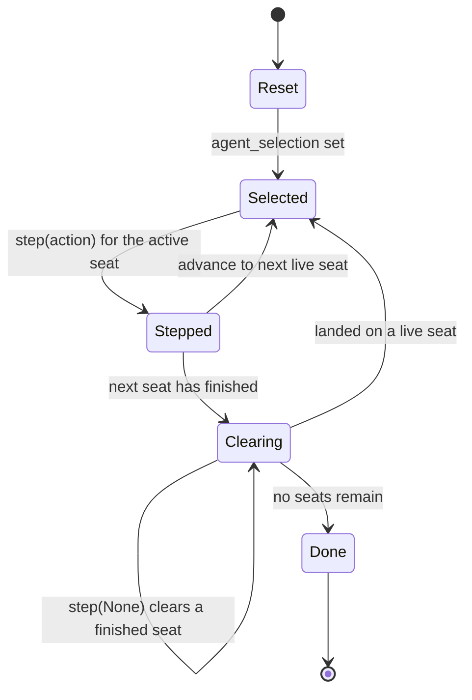

# The turn-based (AEC) lifecycle

*How a turn-based game runs on MUG. This is the companion discipline to the
simultaneous-move loop: there, every seat acts each frame and one step resolves
them together; here, the seats act one at a time, in a cycle, and each seat sees
the moves made before its own. PettingZoo calls this shape the
agent-environment-cycle (AEC) API.*

> Status: **built.** `mug.game.aec` ships the adapter (`AecEnv`), the turn-based
> seam (`TurnBasedEnv` / `TurnState`), and the loop (`run_turnbased_episode`).
> `mug.agents.TurnBasedAgentEpisode` drives LLM and human seats over it: one LLM
> against another, or an LLM against a human, takes turns over one shared,
> server-authoritative game. Proven by `tests/unit/game/test_aec_loop.py` and
> `tests/unit/agents/test_turnbased_episode.py`. PettingZoo is never imported --
> the adapter duck-types the API.

---

## The two disciplines, side by side

The single loop the platform used to have was for *simultaneous* moves. Turn-based
is a genuinely different discipline, and one difference drives all the others: in a
real-time game a slow model must never block the frame, so its seat holds a stale
action; in a turn-based game the game **waits for the player in turn**, so the loop
gives the active seat the time to decide before it reads and steps.

| | Simultaneous (`multiseat`) | Turn-based (`aec`) |
|---|---|---|
| Who acts per step | every seat | the one seat whose turn it is |
| One env step resolves | the whole action set | one seat's move |
| The loop on a slow seat | never blocks (held action) | **waits** for the active seat |
| First move of an LLM seat | the default (decision is in flight) | already its decided move |
| The recorded transition | `action_digest` of the action set | `action_digest` of `{mover: move}` |
| PettingZoo shape | parallel API | AEC API |

A single-seat turn-based game is the one-agent case of the turn-based loop, the same
way a single-seat real-time game is the one-agent case of the simultaneous loop.

---

## The AEC turn cycle

The AEC API exposes one seat at a time. Its lifecycle is a cycle: the environment
names whose turn it is (`agent_selection`), you read that seat's observation
(`observe`), you apply its action (`step`), and the environment advances the
selection to the next seat. A seat that finishes stays in the cycle for exactly one
more visit, which takes the `step(None)` the AEC contract requires, and then leaves
`agents`.



The **`AecEnv` adapter hides the `Clearing` state entirely**. Between one live turn
and the next it drains every finished seat with `step(None)`, so the loop above it
only ever sees a live seat's turn. That is the whole point of the adapter: the loop
stays a clean "read the active seat, step one move" loop, and the AEC bookkeeping
lives in one place.

---

## One turn, end to end

This is a single turn of a two-LLM game (seats `a` and `b`), from the loop down
through the adapter and back. The `on_turn` hook is where a turn-based LLM seat
*waits* for its model; a human seat needs no preparation, because its held key is
already set.

```mermaid
sequenceDiagram
    participant Loop as run_turnbased_episode
    participant Ep as TurnBasedAgentEpisode
    participant Seat as active seat (a)
    participant Adapter as AecEnv
    participant Env as study AEC env

    Loop->>Adapter: reset()
    Adapter->>Env: reset(seed) + land on first live seat
    Adapter-->>Loop: TurnState(agent="a", observation, ...)

    Note over Loop: it is a's turn
    Loop->>Ep: on_turn(state)  — let a decide
    Ep->>Seat: await scheduler.decide(...)  (the game waits)
    Seat-->>Ep: action
    Ep->>Seat: ScheduledSeat.apply(action)

    Loop->>Seat: source.decide(observation)
    Seat-->>Loop: action (the fresh, applied move)
    Loop->>Adapter: step(action)
    Adapter->>Env: step(action) + clear any finished seats
    Adapter-->>Loop: TurnState(agent="b", ...)

    Loop->>Loop: record GameTransition({a: action})
    Loop->>Ep: on_step(info)  — record the move
    Ep->>Ep: append the move to every seat's history
    Note over Loop: now it is b's turn — the cycle repeats
```

Two consequences follow from the wait at `on_turn`:

- an LLM seat's **first** move is already its decided move, not a default -- the
  loop held the turn open until the model answered;
- each seat records **every** turn (its own and the others') into its own history at
  `on_step`, so when a seat's next turn comes it reads the moves the others just
  played (`history.actions_of("b")`).

---

## What each part owns

- **`AecEnv`** -- adapts a *live* study AEC environment instance to the
  `TurnBasedEnv` seam. It wraps the same instance the controllers read, so the model
  always sees the live board. It lands on the next live seat each turn, clears
  finished seats with `step(None)`, and accumulates the per-seat rewards over the
  real step and any clearing steps, so a seat that finishes on a turn is still
  credited. It never imports PettingZoo -- it duck-types `reset`, `agent_selection`,
  `agents`, `observe`, `step`, `rewards`, `terminations`, `truncations`.
- **`run_turnbased_episode`** -- the loop. Each turn it reads whose turn it is, runs
  `on_turn` (the seat decides), reads the seat through the shared `SeatActionSource`
  seam, steps the one move, records one `GameTransition`, and runs `on_step`. It
  ends on the episode terminal or the step cap and closes with an `EpisodeBoundary`.
  The server owns authority: a seat supplies an action, never a state.
- **`TurnBasedAgentEpisode`** -- the agent runtime. It composes the same `AgentSeat`
  and `HumanSeat` the simultaneous runner uses, and wires `on_turn` (await the
  active LLM seat, apply to its held seat) and `on_step` (record the move into every
  seat's history). The scheduler, store context, clock, and episode identity are
  shared, because the seats share one interaction and one episode.

---

## The recorded timeline

A turn-based episode records the **same normalized contract** as every other
runtime: one `GameTransition` per turn, then one `EpisodeBoundary`. The only
turn-based particulars are inside the digest inputs, and both are self-describing:

- `action_digest = compute_digest({mover: move})` -- the transition commits to the
  one seat that moved, so a replay knows whose turn it was;
- `state_digest = compute_digest(observations)` -- the whole per-seat observation set
  after the move, the same shape the simultaneous loop commits to.

So a study that mixes real-time and turn-based games still exports one record type
against the one frozen API-07 schema. Nothing downstream -- capture, export, replay
-- needs to know which discipline produced a transition.

---

## Seams a study plugs into

Everything env-specific stays in the study, behind the seams the loop reads:

- the **AEC environment** (any object that duck-types the AEC API) -- the study
  supplies it; MUG names no environment;
- **`legal_actions(agent_id)`** and **`text_view(agent_id)`** -- the controller
  reads these for the prompt; the study answers them;
- the **seat source** -- a person's `InputState`, a local controller, or an LLM
  seat's `ScheduledSeat`, all behind the one `SeatActionSource` seam.

See [turn-based-agent-example.md](turn-based-agent-example.md) for a worked example:
a study author writing an LLM that plays a turn-based game, start to finish.
